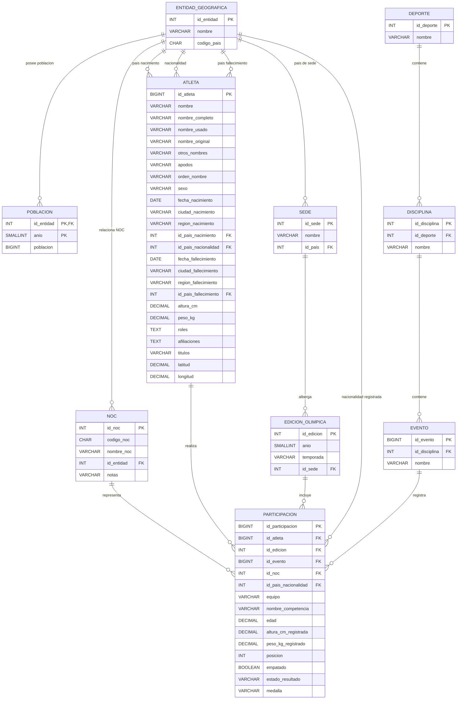

# Modelo Entidad-Relación Final
## Proyecto Fase 1 — Base de Datos Unificada de Juegos Olímpicos

---

# 1. Objetivo del modelo

El objetivo es construir una **única base de datos relacional unificada** utilizando y enriqueciendo la información proveniente de las cuatro fuentes proporcionadas en el proyecto.

Las fuentes originales se utilizarán durante las etapas de:

- extracción;
- limpieza;
- homologación;
- matching;
- deduplicación;
- enriquecimiento;
- validación.

Una vez terminada la integración, la base de datos final no manejará conceptos como `Fuente 1`, `Fuente 2`, `Fuente 3` o `Fuente 4`, ni utilizará los identificadores originales de los datasets como identificadores definitivos.

Cada entidad tendrá su propio identificador dentro de la base unificada.

## Criterio para conservar información

Se utilizará el siguiente criterio:

> Si una fuente aporta información útil, aunque las demás fuentes no la posean, el atributo será conservado. Si el dato no existe para determinado registro, se almacenará `NULL`.

Solo se descartan:

- columnas técnicas;
- índices de exportación;
- columnas completamente vacías;
- campos que ya fueron descompuestos sin pérdida de información.

---

# 2. Tablas del modelo

El modelo final está compuesto por las siguientes entidades:

1. `ENTIDAD_GEOGRAFICA`
2. `POBLACION`
3. `NOC`
4. `ATLETA`
5. `SEDE`
6. `EDICION_OLIMPICA`
7. `DEPORTE`
8. `DISCIPLINA`
9. `EVENTO`
10. `PARTICIPACION`

No se crearán tablas independientes para:

- `FUENTE`
- `RESULTADO`
- `TIPO_MEDALLA`
- `MEDALLA`

---

# 3. ENTIDAD_GEOGRAFICA

Representa las entidades geográficas o estadísticas contenidas en los datasets.

```text
ENTIDAD_GEOGRAFICA
---------------------------------------------
id_entidad            INT PK
nombre                VARCHAR(150) NOT NULL
codigo_pais           CHAR(3) NULL
```

## Atributos

| Atributo | Tipo | NULL | Descripción |
|---|---|---:|---|
| `id_entidad` | `INT` | No | Identificador único dentro de la base de datos. |
| `nombre` | `VARCHAR(150)` | No | Nombre de la entidad geográfica o estadística. |
| `codigo_pais` | `CHAR(3)` | Sí | Código utilizado por el dataset de población. |

## Ejemplos

```text
Guatemala                  | GTM
Germany                    | DEU
Arab World                 | ARB
High income                | HIC
Africa Eastern and Southern| AFE
```

## Justificación

El archivo `populations.csv` no contiene únicamente países.

También aparecen registros como:

```text
Arab World
High income
Africa Eastern and Southern
```

El ingeniero indicó que estos registros deben tomarse en cuenta.

Por ello no se utiliza una entidad llamada únicamente `PAIS`, ya que obligaría a considerar estos agregados como países cuando realmente no lo son.

Se utiliza el concepto más general:

```text
ENTIDAD_GEOGRAFICA
```

Por el momento **no se agrega un atributo `tipo`**, porque esa clasificación no está disponible directamente en los CSV proporcionados.

Durante el proceso ETL se deberá controlar que las relaciones específicamente olímpicas como:

- país de nacimiento;
- nacionalidad;
- país de sede;
- país de fallecimiento;

se realicen únicamente contra registros previamente homologados como países.

---

# 4. POBLACION

Contiene la población histórica de las entidades encontradas en `populations.csv`.

```text
POBLACION
---------------------------------------------
id_entidad            INT PK, FK
anio                  SMALLINT PK
poblacion             BIGINT NULL
```

## Atributos

| Atributo | Tipo | NULL | Descripción |
|---|---|---:|---|
| `id_entidad` | `INT` | No | Entidad a la que corresponde el dato poblacional. |
| `anio` | `SMALLINT` | No | Año de la medición. |
| `poblacion` | `BIGINT` | Sí | Cantidad de habitantes registrada. |

## Clave primaria

```text
PK (id_entidad, anio)
```

## Justificación

El dataset original utiliza una columna por año:

```text
Country Name | Country Code | 1960 | 1961 | ... | 2023
```

Esto se transforma a una estructura relacional:

```text
Entidad | Año | Población
```

Ejemplo:

```text
Guatemala | 2020 | ...
Guatemala | 2021 | ...
Guatemala | 2022 | ...

Arab World | 2020 | ...
Arab World | 2021 | ...
```

## Relación

```text
ENTIDAD_GEOGRAFICA 1 ───── N POBLACION
```

---

# 5. NOC

Representa los códigos y nombres utilizados por los Comités Olímpicos Nacionales y otras delegaciones olímpicas.

```text
NOC
---------------------------------------------
id_noc                INT PK
codigo_noc            CHAR(3) NULL
nombre_noc            VARCHAR(150) NULL
id_entidad            INT FK NULL
notas                 VARCHAR(500) NULL
```

## Atributos

| Atributo | Tipo | NULL | Descripción |
|---|---|---:|---|
| `id_noc` | `INT` | No | Identificador interno del NOC. |
| `codigo_noc` | `CHAR(3)` | Sí | Código olímpico de tres letras. |
| `nombre_noc` | `VARCHAR(150)` | Sí | Nombre descriptivo asociado al NOC. |
| `id_entidad` | `INT` | Sí | Entidad geográfica asociada cuando exista correspondencia. |
| `notas` | `VARCHAR(500)` | Sí | Información histórica o aclaraciones especiales. |

## Justificación de nombre y código NOC

En las fuentes aparece el concepto NOC de diferente manera.

Por ejemplo:

```text
bios.csv

NOC = France
```

mientras que:

```text
results.csv

NOC = FRA
```

Por indicación del ingeniero deben conservarse ambos valores:

```text
nombre_noc = France
codigo_noc = FRA
```

---

## Diferencia entre código de país y código NOC

No debe asumirse:

```text
codigo_pais = codigo_noc
```

porque pertenecen a esquemas diferentes.

Ejemplo donde coinciden:

```text
France

codigo_pais = FRA
codigo_noc  = FRA
```

Ejemplo donde difieren:

```text
Germany

codigo_pais = DEU
codigo_noc  = GER
```

Por esta razón la correspondencia se realiza explícitamente:

```text
ENTIDAD_GEOGRAFICA
        ↓
       NOC
```

---

## NOC históricos

Un mismo país puede tener diferentes códigos NOC históricos.

Ejemplo:

```text
Germany

GER
GDR
FRG
SAA
```

También existen delegaciones que no representan directamente un país.

Ejemplo:

```text
ROT = Refugee Olympic Team
```

En esos casos:

```text
id_entidad = NULL
```

puede ser válido.

---

## Justificación de `notas`

`noc_regions.csv` proporciona una columna `notes` con aclaraciones especiales.

Ejemplos:

```text
BOH -> Bohemia
HKG -> Hong Kong
SCG -> Serbia and Montenegro
ROT -> Refugee Olympic Team
```

Aunque muchos registros tengan `NULL`, el atributo se conserva porque contiene información válida.

## Relación

```text
ENTIDAD_GEOGRAFICA 1 ───── N NOC
```

---

# 6. ATLETA

Contiene la información biográfica consolidada del atleta.

```text
ATLETA
---------------------------------------------------------
id_atleta                  BIGINT PK

nombre                     VARCHAR(250) NOT NULL
nombre_completo            VARCHAR(300) NULL
nombre_usado               VARCHAR(300) NULL
nombre_original            VARCHAR(300) NULL
otros_nombres              VARCHAR(500) NULL
apodos                     VARCHAR(500) NULL
orden_nombre               VARCHAR(50) NULL

sexo                       VARCHAR(20) NULL

fecha_nacimiento           DATE NULL
ciudad_nacimiento          VARCHAR(150) NULL
region_nacimiento          VARCHAR(150) NULL
id_pais_nacimiento         INT FK NULL

id_pais_nacionalidad       INT FK NULL

fecha_fallecimiento        DATE NULL
ciudad_fallecimiento       VARCHAR(150) NULL
region_fallecimiento       VARCHAR(150) NULL
id_pais_fallecimiento      INT FK NULL

altura_cm                  DECIMAL(5,2) NULL
peso_kg                    DECIMAL(5,2) NULL

roles                      TEXT NULL
afiliaciones               TEXT NULL
titulos                    VARCHAR(500) NULL

latitud                    DECIMAL(9,6) NULL
longitud                   DECIMAL(9,6) NULL
```

## Atributos

| Atributo | Tipo | NULL | Descripción |
|---|---|---:|---|
| `id_atleta` | `BIGINT` | No | Identificador único del atleta. |
| `nombre` | `VARCHAR(250)` | No | Nombre principal homologado. |
| `nombre_completo` | `VARCHAR(300)` | Sí | Nombre completo del atleta. |
| `nombre_usado` | `VARCHAR(300)` | Sí | Nombre habitual o deportivo. |
| `nombre_original` | `VARCHAR(300)` | Sí | Nombre registrado en su forma original. |
| `otros_nombres` | `VARCHAR(500)` | Sí | Nombres alternativos. |
| `apodos` | `VARCHAR(500)` | Sí | Apodos o sobrenombres. |
| `orden_nombre` | `VARCHAR(50)` | Sí | Orden cultural del nombre. |
| `sexo` | `VARCHAR(20)` | Sí | Sexo homologado entre datasets. |
| `fecha_nacimiento` | `DATE` | Sí | Fecha de nacimiento. |
| `ciudad_nacimiento` | `VARCHAR(150)` | Sí | Ciudad de nacimiento. |
| `region_nacimiento` | `VARCHAR(150)` | Sí | Región, provincia o estado de nacimiento. |
| `id_pais_nacimiento` | `INT` | Sí | País de nacimiento. |
| `id_pais_nacionalidad` | `INT` | Sí | Nacionalidad biográfica. |
| `fecha_fallecimiento` | `DATE` | Sí | Fecha de fallecimiento. |
| `ciudad_fallecimiento` | `VARCHAR(150)` | Sí | Ciudad de fallecimiento cuando pueda obtenerse. |
| `region_fallecimiento` | `VARCHAR(150)` | Sí | Región de fallecimiento. |
| `id_pais_fallecimiento` | `INT` | Sí | País de fallecimiento. |
| `altura_cm` | `DECIMAL(5,2)` | Sí | Altura consolidada del atleta. |
| `peso_kg` | `DECIMAL(5,2)` | Sí | Peso consolidado del atleta. |
| `roles` | `TEXT` | Sí | Roles deportivos u olímpicos. |
| `afiliaciones` | `TEXT` | Sí | Clubes, universidades, instituciones u organizaciones asociadas. |
| `titulos` | `VARCHAR(500)` | Sí | Títulos honoríficos registrados. |
| `latitud` | `DECIMAL(9,6)` | Sí | Latitud disponible en los datos enriquecidos. |
| `longitud` | `DECIMAL(9,6)` | Sí | Longitud disponible en los datos enriquecidos. |

## Justificación

Los atributos adicionales provenientes de `bios.csv` RAW se conservan aunque otras fuentes no los posean.

También se mantienen separados:

```text
id_pais_nacimiento
id_pais_nacionalidad
id_pais_fallecimiento
```

porque representan conceptos diferentes.

Las tres claves foráneas apuntan técnicamente hacia:

```text
ENTIDAD_GEOGRAFICA.id_entidad
```

pero durante la carga únicamente deben utilizarse entidades homologadas como países.

---

# 7. SEDE

Representa una ciudad sede olímpica y el país al que pertenece.

```text
SEDE
---------------------------------------------
id_sede               INT PK
nombre                VARCHAR(150) NOT NULL
id_pais               INT FK NOT NULL
```

## Atributos

| Atributo | Tipo | NULL | Descripción |
|---|---|---:|---|
| `id_sede` | `INT` | No | Identificador único de la sede. |
| `nombre` | `VARCHAR(150)` | No | Nombre de la ciudad sede. |
| `id_pais` | `INT` | No | País donde se encuentra la sede. |

## Justificación

La sede y el país representan conceptos distintos.

Ejemplo:

```text
Sede = Atenas
País = Grecia
```

Esto permite consultar:

- qué ciudades han sido sede;
- qué países han sido sede;
- en qué años fue sede una ciudad;
- cuántas veces un país ha organizado los Juegos.

Una ciudad puede repetirse en diferentes ediciones.

Ejemplo:

```text
Paris

1900
1924
2024
```

## Restricción recomendada

```text
UNIQUE (nombre, id_pais)
```

## Relación

```text
ENTIDAD_GEOGRAFICA 1 ───── N SEDE
```

`id_pais` referencia `ENTIDAD_GEOGRAFICA.id_entidad`.

Durante ETL debe garantizarse que corresponda a un país real.

---

# 8. EDICION_OLIMPICA

Representa una edición concreta de los Juegos Olímpicos.

```text
EDICION_OLIMPICA
---------------------------------------------
id_edicion            INT PK
anio                  SMALLINT NOT NULL
temporada             VARCHAR(10) NOT NULL
id_sede               INT FK NULL
```

## Atributos

| Atributo | Tipo | NULL | Descripción |
|---|---|---:|---|
| `id_edicion` | `INT` | No | Identificador de la edición. |
| `anio` | `SMALLINT` | No | Año de celebración. |
| `temporada` | `VARCHAR(10)` | No | `Summer` o `Winter`. |
| `id_sede` | `INT` | Sí | Sede principal de la edición. |

## Justificación

El campo original:

```text
Games
```

puede obtenerse a partir de:

```text
anio + temporada
```

Por ejemplo:

```text
2016 + Summer
```

por lo que no es necesario mantenerlo nuevamente como texto.

## Restricción

```text
UNIQUE (anio, temporada)
```

## Relación

```text
SEDE 1 ───── N EDICION_OLIMPICA
```

---

# 9. DEPORTE

Representa el nivel superior de la jerarquía deportiva.

```text
DEPORTE
---------------------------------------------
id_deporte            INT PK
nombre                VARCHAR(150) NOT NULL
```

## Atributos

| Atributo | Tipo | NULL | Descripción |
|---|---|---:|---|
| `id_deporte` | `INT` | No | Identificador único. |
| `nombre` | `VARCHAR(150)` | No | Nombre oficial u homologado del deporte. |

## Restricción

```text
UNIQUE (nombre)
```

---

# 10. DISCIPLINA

Representa una disciplina perteneciente a un deporte.

```text
DISCIPLINA
---------------------------------------------
id_disciplina         INT PK
id_deporte            INT FK NOT NULL
nombre                VARCHAR(150) NOT NULL
```

## Atributos

| Atributo | Tipo | NULL | Descripción |
|---|---|---:|---|
| `id_disciplina` | `INT` | No | Identificador único de la disciplina. |
| `id_deporte` | `INT` | No | Deporte al que pertenece. |
| `nombre` | `VARCHAR(150)` | No | Nombre de la disciplina. |

## Justificación

El ingeniero indicó que:

```text
DEPORTE != DISCIPLINA
```

y recomendó construir correctamente la estructura jerárquica utilizando información oficial.

La jerarquía será:

```text
DEPORTE
   ↓
DISCIPLINA
   ↓
EVENTO
```

## Relación

```text
DEPORTE 1 ───── N DISCIPLINA
```

---

# 11. EVENTO

Representa la prueba olímpica específica.

```text
EVENTO
---------------------------------------------
id_evento             BIGINT PK
id_disciplina         INT FK NOT NULL
nombre                VARCHAR(300) NOT NULL
```

## Atributos

| Atributo | Tipo | NULL | Descripción |
|---|---|---:|---|
| `id_evento` | `BIGINT` | No | Identificador único del evento. |
| `id_disciplina` | `INT` | No | Disciplina correspondiente. |
| `nombre` | `VARCHAR(300)` | No | Nombre del evento. |

## Relación

```text
DISCIPLINA 1 ───── N EVENTO
```

---

# 12. PARTICIPACION

Es la entidad central del modelo.

Cada registro representa la participación de un atleta en un evento determinado dentro de una edición olímpica.

```text
PARTICIPACION
---------------------------------------------------------
id_participacion              BIGINT PK

id_atleta                     BIGINT FK NOT NULL
id_edicion                    INT FK NOT NULL
id_evento                     BIGINT FK NOT NULL

id_noc                        INT FK NULL
id_pais_nacionalidad          INT FK NULL

equipo                        VARCHAR(250) NULL
nombre_competencia            VARCHAR(300) NULL

edad                          DECIMAL(5,2) NULL
altura_cm_registrada          DECIMAL(5,2) NULL
peso_kg_registrado            DECIMAL(5,2) NULL

posicion                      INT NULL
empatado                      BOOLEAN NULL
estado_resultado              VARCHAR(30) NULL
medalla                       VARCHAR(20) NULL
```

## Atributos

| Atributo | Tipo | NULL | Descripción |
|---|---|---:|---|
| `id_participacion` | `BIGINT` | No | Identificador único de la participación. |
| `id_atleta` | `BIGINT` | No | Atleta participante. |
| `id_edicion` | `INT` | No | Edición olímpica. |
| `id_evento` | `BIGINT` | No | Evento disputado. |
| `id_noc` | `INT` | Sí | Delegación o NOC representado. |
| `id_pais_nacionalidad` | `INT` | Sí | Nacionalidad registrada en esa participación. |
| `equipo` | `VARCHAR(250)` | Sí | Equipo, representación o compañero registrado. |
| `nombre_competencia` | `VARCHAR(300)` | Sí | Nombre bajo el que aparece el atleta en esa participación (`As`). |
| `edad` | `DECIMAL(5,2)` | Sí | Edad del atleta en esa participación. |
| `altura_cm_registrada` | `DECIMAL(5,2)` | Sí | Altura registrada para esa participación. |
| `peso_kg_registrado` | `DECIMAL(5,2)` | Sí | Peso registrado para esa participación. |
| `posicion` | `INT` | Sí | Posición numérica obtenida. |
| `empatado` | `BOOLEAN` | Sí | Indica si compartió posición. |
| `estado_resultado` | `VARCHAR(30)` | Sí | Estado especial como `DNS`, `DNF`, `DSQ`, etc. |
| `medalla` | `VARCHAR(20)` | Sí | `Gold`, `Silver`, `Bronze` o `NULL`. |

---

# 13. Nacionalidad y NOC

No se consideran equivalentes:

```text
ATLETA.id_pais_nacionalidad
PARTICIPACION.id_pais_nacionalidad
PARTICIPACION.id_noc
```

Un atleta puede:

- haber nacido en un país;
- poseer una nacionalidad distinta;
- representar un NOC diferente durante una edición determinada.

Por ello los conceptos permanecen separados.

---

# 14. Edad, altura y peso

## Edad

La edad se almacena en `PARTICIPACION` porque cambia según la edición.

Ejemplo:

```text
2008 -> 19 años
2012 -> 23 años
2016 -> 27 años
```

## Altura y peso

En `ATLETA`:

```text
altura_cm
peso_kg
```

se mantienen como valores biográficos consolidados.

En `PARTICIPACION`:

```text
altura_cm_registrada
peso_kg_registrado
```

se pueden conservar valores encontrados específicamente en determinada participación.

Esto evita perder información histórica.

---

# 15. Resultado dentro de PARTICIPACION

No se crea una entidad `RESULTADO` independiente.

Los datos:

```text
posicion
empatado
estado_resultado
medalla
```

describen directamente el resultado de una participación.

Ejemplo de resultado normal:

```text
posicion = 3
empatado = false
estado_resultado = NULL
medalla = Bronze
```

Ejemplo de estado especial:

```text
posicion = NULL
empatado = false
estado_resultado = DNS
medalla = NULL
```

`estado_resultado` se utiliza únicamente cuando existe una condición especial.

No es necesario almacenar:

```text
FINISHED
```

para participaciones normales.

## Justificación

Separar `RESULTADO` produciría prácticamente una relación:

```text
PARTICIPACION 1 ───── 1 RESULTADO
```

y obligaría a hacer un `JOIN` adicional para prácticamente todas las consultas relacionadas con:

- posición;
- medallas;
- resultados;
- atleta;
- país;
- año.

Para los requerimientos actuales es más práctico mantenerlos en `PARTICIPACION`.

---

# 16. Medalla como atributo

No se crea una tabla:

```text
TIPO_MEDALLA
```

ni una entidad:

```text
MEDALLA
```

Para los datasets actuales basta con:

```text
PARTICIPACION.medalla
```

con valores:

```text
Gold
Silver
Bronze
NULL
```

## Participaciones grupales

Cuando un equipo obtiene una medalla, los atletas correspondientes pueden registrar individualmente:

```text
Atleta A -> Gold
Atleta B -> Gold
Atleta C -> Gold
```

Esto facilita consultas como:

- medallas de un atleta;
- medallas por país;
- atletas con medalla de oro;
- medallas obtenidas en determinado año;
- medallas por deporte o evento.

## Restricción recomendada

```sql
CHECK (
    medalla IN ('Gold', 'Silver', 'Bronze')
    OR medalla IS NULL
)
```

---

# 17. Relaciones y cardinalidades

## ENTIDAD_GEOGRAFICA — POBLACION

```text
ENTIDAD_GEOGRAFICA 1 ───── N POBLACION
```

---

## ENTIDAD_GEOGRAFICA — NOC

```text
ENTIDAD_GEOGRAFICA 1 ───── N NOC
```

---

## ENTIDAD_GEOGRAFICA — ATLETA

Existen tres relaciones diferentes:

```text
ENTIDAD_GEOGRAFICA 1 ───── N ATLETA
    país de nacimiento
```

```text
ENTIDAD_GEOGRAFICA 1 ───── N ATLETA
    nacionalidad
```

```text
ENTIDAD_GEOGRAFICA 1 ───── N ATLETA
    país de fallecimiento
```

---

## ENTIDAD_GEOGRAFICA — SEDE

```text
ENTIDAD_GEOGRAFICA 1 ───── N SEDE
```

---

## ENTIDAD_GEOGRAFICA — PARTICIPACION

```text
ENTIDAD_GEOGRAFICA 1 ───── N PARTICIPACION
```

Representa la nacionalidad registrada durante la participación.

---

## SEDE — EDICION_OLIMPICA

```text
SEDE 1 ───── N EDICION_OLIMPICA
```

---

## DEPORTE — DISCIPLINA

```text
DEPORTE 1 ───── N DISCIPLINA
```

---

## DISCIPLINA — EVENTO

```text
DISCIPLINA 1 ───── N EVENTO
```

---

## ATLETA — PARTICIPACION

```text
ATLETA 1 ───── N PARTICIPACION
```

---

## EDICION_OLIMPICA — PARTICIPACION

```text
EDICION_OLIMPICA 1 ───── N PARTICIPACION
```

---

## EVENTO — PARTICIPACION

```text
EVENTO 1 ───── N PARTICIPACION
```

---

## NOC — PARTICIPACION

```text
NOC 1 ───── N PARTICIPACION
```

---

# 18. Columnas originales no almacenadas directamente

| Columna original | Tratamiento | Justificación |
|---|---|---|
| `index` | Eliminar | Índice técnico de exportación. |
| `Unnamed: 7` | Eliminar | Columna accidental y vacía. |
| IDs originales (`athlete_id`, `ID`, `player_id`, etc.) | Utilizar durante ETL | Sirven para matching, pero no forman parte de la base unificada final. |
| `Born` | Descomponer | Se convierte en fecha, ciudad, región y país. |
| `Died` | Descomponer | Se convierte en fecha y lugar cuando sea posible. |
| `Measurements` | Descomponer | Se transforma en altura y peso. |
| `Games` | Descomponer | Se representa mediante año y temporada. |
| `Pos` | Descomponer | Se transforma en posición, empate y estado especial. |
| `No medal` | Normalizar | Se convierte a `NULL`. |

---

# 19. Índices recomendados

```sql
CREATE INDEX idx_entidad_nombre
ON entidad_geografica(nombre);

CREATE INDEX idx_entidad_codigo
ON entidad_geografica(codigo_pais);

CREATE INDEX idx_noc_codigo
ON noc(codigo_noc);

CREATE INDEX idx_noc_nombre
ON noc(nombre_noc);

CREATE INDEX idx_atleta_nombre
ON atleta(nombre);

CREATE INDEX idx_atleta_fecha_nacimiento
ON atleta(fecha_nacimiento);

CREATE INDEX idx_sede_nombre
ON sede(nombre);

CREATE INDEX idx_edicion_anio_temporada
ON edicion_olimpica(anio, temporada);

CREATE INDEX idx_deporte_nombre
ON deporte(nombre);

CREATE INDEX idx_disciplina_nombre
ON disciplina(nombre);

CREATE INDEX idx_evento_nombre
ON evento(nombre);

CREATE INDEX idx_participacion_atleta
ON participacion(id_atleta);

CREATE INDEX idx_participacion_edicion
ON participacion(id_edicion);

CREATE INDEX idx_participacion_evento
ON participacion(id_evento);

CREATE INDEX idx_participacion_noc
ON participacion(id_noc);
```

---

# 20. Resumen conceptual

El núcleo del modelo queda:

```text
                       ENTIDAD_GEOGRAFICA
                      /       |        \
                     /        |         \
              POBLACION      NOC        SEDE
                               \          |
                                \      EDICION
                                 \        |
                                  \       |
ATLETA ----------------------- PARTICIPACION
                                  |
                                EVENTO
                                  |
                              DISCIPLINA
                                  |
                               DEPORTE
```

La tabla `PARTICIPACION` conecta:

```text
ATLETA
+
EDICION OLIMPICA
+
EVENTO
+
NOC
+
NACIONALIDAD
+
RESULTADO
```

---

# 21. Código Mermaid — Diagrama Entidad-Relación

