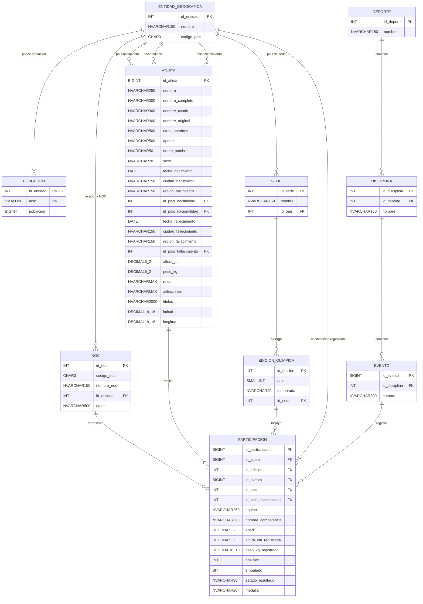

# Modelo Entidad–Relación Final Actualizado
## Proyecto Fase 1 — Base de Datos Unificada de Juegos Olímpicos

---

# 1. Objetivo del modelo

El objetivo es construir una única base de datos relacional unificada utilizando y enriqueciendo la información proveniente de las cuatro fuentes del proyecto.

Las fuentes originales se utilizan durante las etapas de:

- extracción;
- limpieza;
- homologación;
- matching;
- deduplicación;
- enriquecimiento;
- validación.

Una vez finalizada la integración, la base de datos no conserva conceptos de procedencia como `Fuente 1`, `Fuente 2`, `Fuente 3` o `Fuente 4`, ni utiliza los identificadores originales de los datasets como identificadores definitivos.

Cada entidad utiliza identificadores globales propios del modelo unificado.

## Criterio para conservar información

Se conserva toda información útil aportada por cualquiera de las fuentes, aunque las demás fuentes no contengan el mismo atributo. Cuando el dato no existe para un registro, se almacena `NULL`.

Solo se eliminan o dejan fuera del modelo final:

- columnas técnicas;
- índices de exportación;
- columnas accidentales;
- identificadores originales utilizados únicamente para matching;
- campos que fueron descompuestos sin pérdida de información;
- información fuera del alcance final debidamente auditada.

---

# 2. Entidades del modelo final

El modelo final está compuesto por diez entidades lógicas:

1. `ENTIDAD_GEOGRAFICA`
2. `POBLACION`
3. `NOC`
4. `ATLETA`
5. `SEDE`
6. `EDICION_OLIMPICA`
7. `DEPORTE`
8. `DISCIPLINA`
9. `EVENTO`
10. `PARTICIPACION`

No se crean entidades independientes para:

- `FUENTE`
- `RESULTADO`
- `TIPO_MEDALLA`
- `MEDALLA`

El schema `stg` utilizado durante la carga es infraestructura ETL y no forma parte del modelo lógico final.

---

# 3. ENTIDAD_GEOGRAFICA

Representa países, regiones, agregados o grupos estadísticos presentes en los datasets.

```text
ENTIDAD_GEOGRAFICA
---------------------------------------------
id_entidad            INT PK
nombre                NVARCHAR(150) NOT NULL
codigo_pais           CHAR(3) NULL
```

## Atributos

| Atributo | Tipo físico | NULL | Descripción |
|---|---|---:|---|
| `id_entidad` | `INT` | No | Identificador global de la entidad. |
| `nombre` | `NVARCHAR(150)` | No | Nombre de la entidad geográfica o estadística. |
| `codigo_pais` | `CHAR(3)` | Sí | Código de tres caracteres usado por el dataset de población cuando existe. |

## Justificación

El archivo de población contiene tanto países como agregados:

```text
Guatemala
Germany
Arab World
High income
Africa Eastern and Southern
```

Por ello se utiliza `ENTIDAD_GEOGRAFICA` y no una entidad limitada a `PAIS`.

No se agrega un atributo `tipo` porque esa clasificación no proviene directamente de las fuentes y no se inventa información.

Las relaciones específicamente olímpicas se establecen únicamente cuando existe una correspondencia segura con una entidad que representa un país.

---

# 4. POBLACION

Contiene la población histórica de cada entidad geográfica disponible.

```text
POBLACION
---------------------------------------------
id_entidad            INT PK, FK
anio                  SMALLINT PK
poblacion             BIGINT NULL
```

## Clave primaria

```text
PK (id_entidad, anio)
```

## Transformación

El formato original:

```text
Country Name | Country Code | 1960 | 1961 | ... | 2023
```

se transforma a:

```text
Entidad | Año | Población
```

## Relación

```text
ENTIDAD_GEOGRAFICA 1 ───── N POBLACION
```

---

# 5. NOC

Representa códigos olímpicos, nombres descriptivos y asociaciones históricas de NOC/delegaciones.

```text
NOC
---------------------------------------------
id_noc                INT PK
codigo_noc            CHAR(3) NOT NULL
nombre_noc            NVARCHAR(150) NULL
id_entidad            INT FK NULL
notas                 NVARCHAR(500) NULL
```

## Restricción

```text
UNIQUE (codigo_noc)
```

## Justificación

Las fuentes representan NOC de formas distintas.

Ejemplo:

```text
nombre_noc = France
codigo_noc = FRA
```

No debe asumirse:

```text
codigo_pais = codigo_noc
```

porque pertenecen a sistemas diferentes.

Ejemplo:

```text
Germany:
codigo_pais = DEU
codigo_noc  = GER
```

Además, existen NOC históricos:

```text
GER
GDR
FRG
SAA
```

y delegaciones sin correspondencia segura con un país:

```text
ROT
```

En esos casos:

```text
id_entidad = NULL
```

es válido.

---

# 6. ATLETA

Contiene la información biográfica consolidada.

```text
ATLETA
---------------------------------------------------------
id_atleta                  BIGINT PK

nombre                     NVARCHAR(250) NOT NULL
nombre_completo            NVARCHAR(300) NULL
nombre_usado               NVARCHAR(300) NULL
nombre_original            NVARCHAR(300) NULL
otros_nombres              NVARCHAR(500) NULL
apodos                     NVARCHAR(500) NULL
orden_nombre               NVARCHAR(50) NULL

sexo                       NVARCHAR(20) NULL

fecha_nacimiento           DATE NULL
ciudad_nacimiento          NVARCHAR(150) NULL
region_nacimiento          NVARCHAR(150) NULL
id_pais_nacimiento         INT FK NULL

id_pais_nacionalidad       INT FK NULL

fecha_fallecimiento        DATE NULL
ciudad_fallecimiento       NVARCHAR(150) NULL
region_fallecimiento       NVARCHAR(150) NULL
id_pais_fallecimiento      INT FK NULL

altura_cm                  DECIMAL(5,2) NULL
peso_kg                    DECIMAL(5,2) NULL

roles                      NVARCHAR(MAX) NULL
afiliaciones               NVARCHAR(MAX) NULL
titulos                    NVARCHAR(2000) NULL

latitud                    DECIMAL(19,16) NULL
longitud                   DECIMAL(19,16) NULL
```

## Justificación

Los atributos biográficos enriquecidos se conservan aunque otras fuentes no los contengan.

Se mantienen separados:

```text
id_pais_nacimiento
id_pais_nacionalidad
id_pais_fallecimiento
```

porque representan conceptos distintos.

Las coordenadas se almacenan como `DECIMAL(19,16)` para conservar la precisión observada sin redondeo.

`títulos` utiliza `NVARCHAR(2000)` porque el valor máximo observado supera 500 caracteres.

`NVARCHAR` se utiliza para preservar correctamente caracteres Unicode.

---

# 7. SEDE

Representa una ciudad sede y su país asociado.

```text
SEDE
---------------------------------------------
id_sede               INT PK
nombre                NVARCHAR(150) NOT NULL
id_pais               INT FK NOT NULL
```

## Restricción

```text
UNIQUE (nombre, id_pais)
```

## Relación

```text
ENTIDAD_GEOGRAFICA 1 ───── N SEDE
```

Una misma ciudad puede albergar distintas ediciones en años diferentes.

---

# 8. EDICION_OLIMPICA

Representa una edición olímpica o una categoría histórica/juvenil conservada dentro del alcance integrado.

```text
EDICION_OLIMPICA
---------------------------------------------
id_edicion            INT PK
anio                  SMALLINT NOT NULL
temporada             NVARCHAR(20) NOT NULL
id_sede               INT FK NULL
```

## Valores permitidos de temporada

```text
Summer
Winter
Intercalated Games
Summer Youth
Winter Youth
```

## Restricción

```text
UNIQUE (anio, temporada)
```

## Casos homologados

```text
1906 = Intercalated Games
```

No existe simultáneamente:

```text
1906 | Summer
```

Las pruebas ecuestres de 1956 fueron homologadas a:

```text
1956 | Summer
```

Por lo tanto, `Equestrian` no existe como temporada final independiente.

Las categorías Youth se conservan porque forman parte de la información útil contenida en las fuentes.

## Relación

```text
SEDE 1 ───── N EDICION_OLIMPICA
```

---

# 9. DEPORTE

Representa el nivel superior de la jerarquía deportiva.

```text
DEPORTE
---------------------------------------------
id_deporte            INT PK
nombre                NVARCHAR(150) NOT NULL
```

## Restricción

```text
UNIQUE (nombre)
```

---

# 10. DISCIPLINA

Representa una disciplina perteneciente a un deporte.

```text
DISCIPLINA
---------------------------------------------
id_disciplina         INT PK
id_deporte            INT FK NOT NULL
nombre                NVARCHAR(150) NOT NULL
```

## Restricción

```text
UNIQUE (id_deporte, nombre)
```

## Jerarquía

```text
DEPORTE
   ↓
DISCIPLINA
   ↓
EVENTO
```

## Relación

```text
DEPORTE 1 ───── N DISCIPLINA
```

---

# 11. EVENTO

Representa una prueba olímpica específica.

```text
EVENTO
---------------------------------------------
id_evento             BIGINT PK
id_disciplina         INT FK NOT NULL
nombre                NVARCHAR(300) NOT NULL
```

## Restricción

```text
UNIQUE (id_disciplina, nombre)
```

## Relación

```text
DISCIPLINA 1 ───── N EVENTO
```

---

# 12. PARTICIPACION

Es la entidad central del modelo.

Cada fila representa la participación de un atleta en un evento dentro de una edición.

```text
PARTICIPACION
---------------------------------------------------------
id_participacion              BIGINT PK

id_atleta                     BIGINT FK NOT NULL
id_edicion                    INT FK NOT NULL
id_evento                     BIGINT FK NOT NULL

id_noc                        INT FK NULL
id_pais_nacionalidad          INT FK NULL

equipo                        NVARCHAR(250) NULL
nombre_competencia            NVARCHAR(300) NULL

edad                          DECIMAL(5,2) NULL
altura_cm_registrada          DECIMAL(5,2) NULL
peso_kg_registrado            DECIMAL(16,13) NULL

posicion                      INT NULL
empatado                      BIT NULL
estado_resultado              NVARCHAR(30) NULL
medalla                       NVARCHAR(20) NULL
```

## Semántica

`id_noc`, `id_pais_nacionalidad` y la nacionalidad biográfica del atleta no se consideran equivalentes.

Un atleta puede:

- nacer en un país;
- tener una nacionalidad biográfica;
- registrar otra nacionalidad en una participación;
- competir bajo un NOC diferente.

## Resultado

No existe una entidad `RESULTADO`.

Los atributos:

```text
posicion
empatado
estado_resultado
medalla
```

describen directamente el resultado de la participación.

Ejemplo normal:

```text
posicion = 3
empatado = 0
estado_resultado = NULL
medalla = Bronze
```

Ejemplo especial:

```text
posicion = NULL
empatado = 0
estado_resultado = DNS
medalla = NULL
```

No se inventa el estado:

```text
FINISHED
```

para participaciones normales.

## Estados especiales

Pueden existir valores como:

```text
DNS
DNF
DQ
DSQ
```

según lo preservado en los datos.

## Medalla

Valores permitidos:

```text
Gold
Silver
Bronze
NULL
```

## CHECK recomendados/implementados

```sql
CHECK (
    medalla IN (N'Gold', N'Silver', N'Bronze')
    OR medalla IS NULL
)
```

```sql
CHECK (
    posicion > 0
    OR posicion IS NULL
)
```

`empatado` se representa físicamente mediante `BIT`.

---

# 13. Edad, altura y peso

La edad se conserva a nivel `PARTICIPACION` porque depende de la edición.

En `ATLETA`:

```text
altura_cm
peso_kg
```

representan los valores biográficos consolidados.

En `PARTICIPACION`:

```text
altura_cm_registrada
peso_kg_registrado
```

se conservan valores disponibles específicamente en una participación.

Esto evita perder información histórica.

---

# 14. Relaciones y cardinalidades

```text
ENTIDAD_GEOGRAFICA 1 ───── N POBLACION
ENTIDAD_GEOGRAFICA 1 ───── N NOC
ENTIDAD_GEOGRAFICA 1 ───── N ATLETA      [país nacimiento]
ENTIDAD_GEOGRAFICA 1 ───── N ATLETA      [nacionalidad]
ENTIDAD_GEOGRAFICA 1 ───── N ATLETA      [país fallecimiento]
ENTIDAD_GEOGRAFICA 1 ───── N SEDE
ENTIDAD_GEOGRAFICA 1 ───── N PARTICIPACION [nacionalidad registrada]

SEDE 1 ───── N EDICION_OLIMPICA

DEPORTE 1 ───── N DISCIPLINA
DISCIPLINA 1 ───── N EVENTO

ATLETA 1 ───── N PARTICIPACION
EDICION_OLIMPICA 1 ───── N PARTICIPACION
EVENTO 1 ───── N PARTICIPACION
NOC 1 ───── N PARTICIPACION
```

---

# 15. Columnas originales no almacenadas directamente

| Columna original | Tratamiento | Justificación |
|---|---|---|
| `index` | Eliminar | Índice técnico de exportación. |
| `Unnamed: 7` | Eliminar | Columna accidental. |
| IDs originales (`athlete_id`, `ID`, `player_id`, etc.) | ETL/matching | No forman parte del modelo final. |
| `Born` | Descomponer | Fecha, ciudad, región y país. |
| `Died` | Descomponer | Fecha y ubicación cuando es posible. |
| `Measurements` | Descomponer | Altura y peso. |
| `Games` | Descomponer | Año y categoría/temporada. |
| `Pos` | Descomponer | Posición, empate y estado especial. |
| `No medal` | Normalizar | Se convierte a `NULL`. |

La exclusión de casos fuera del alcance final se documenta en los reportes de consolidación y no elimina la trazabilidad de los archivos fuente.

---

# 16. Restricciones finales

## Primary Keys

```text
ENTIDAD_GEOGRAFICA(id_entidad)
POBLACION(id_entidad, anio)
NOC(id_noc)
ATLETA(id_atleta)
SEDE(id_sede)
EDICION_OLIMPICA(id_edicion)
DEPORTE(id_deporte)
DISCIPLINA(id_disciplina)
EVENTO(id_evento)
PARTICIPACION(id_participacion)
```

Total:

```text
10 PK
```

## UNIQUE

```text
NOC(codigo_noc)
SEDE(nombre, id_pais)
EDICION_OLIMPICA(anio, temporada)
DEPORTE(nombre)
DISCIPLINA(id_deporte, nombre)
EVENTO(id_disciplina, nombre)
```

Total:

```text
6 UNIQUE
```

## Foreign Keys

Total:

```text
14 FK
```

## CHECK

```text
EDICION_OLIMPICA.temporada
PARTICIPACION.medalla
PARTICIPACION.posicion
```

Total:

```text
3 CHECK
```

---

# 17. Índices adicionales implementados

Los índices adicionales reales del modelo físico son:

```text
IX_PARTICIPACION_id_atleta
IX_PARTICIPACION_id_edicion
IX_PARTICIPACION_id_evento
IX_PARTICIPACION_id_noc
IX_PARTICIPACION_id_pais_nacionalidad
IX_ATLETA_id_pais_nacionalidad
IX_NOC_id_entidad
IX_SEDE_id_pais
```

Estos índices apoyan principalmente:

- consultas por atleta;
- consultas por edición;
- joins por evento;
- consultas por NOC;
- búsquedas por país/nacionalidad;
- relaciones geográficas.

No se duplican índices ya generados por PK o `UNIQUE`.

---

# 18. Magnitudes finales validadas

```text
ENTIDAD_GEOGRAFICA       282
POBLACION             17,024
NOC                      236
ATLETA               338,772
SEDE                      42
EDICION_OLIMPICA          61
DEPORTE                    65
DISCIPLINA                117
EVENTO                  3,106
PARTICIPACION         826,605
```

Total:

```text
1,186,310 filas
```

---

# 19. Resumen conceptual

```text
                       ENTIDAD_GEOGRAFICA
                     /       |        \
                    /        |         \
             POBLACION      NOC        SEDE
                              \          |
                               \      EDICION
                                \        |
                                 \       |
ATLETA ----------------------- PARTICIPACION
                                 |
                               EVENTO
                                 |
                             DISCIPLINA
                                 |
                              DEPORTE
```

`PARTICIPACION` conecta:

```text
ATLETA
+
EDICION_OLIMPICA
+
EVENTO
+
NOC
+
NACIONALIDAD REGISTRADA
+
RESULTADO
```

---

# 20. Código Mermaid actualizado



---

# 21. Decisiones finales que deben respetarse al actualizar el diagrama ER

Al reconstruir el diagrama visual, respetar obligatoriamente:

```text
10 entidades lógicas
61 ediciones finales
826,605 participaciones
NOC separado de codigo_pais/ISO3
ENTIDAD_GEOGRAFICA incluye agregados
SEDE es entidad propia
DEPORTE → DISCIPLINA → EVENTO
RESULTADO permanece dentro de PARTICIPACION
MEDALLA permanece como atributo
1906 = Intercalated Games
1956 Equestrian → Summer
Youth se conserva
BIT para empatado en SQL Server
NVARCHAR para texto Unicode
```

No agregar al diagrama:

```text
FUENTE
RESULTADO
MEDALLA
TIPO_MEDALLA
stg
IDs de las fuentes originales
```

---

# 22. Estado final

Este documento corresponde al modelo final consolidado después de las validaciones de los Bloques 4, 5, 6 y 7.

El modelo físico validado contiene:

```text
10 tablas
66 columnas
10 PK
6 UNIQUE
14 FK
3 CHECK
8 índices adicionales
```

Los tipos y relaciones descritos en este documento deben utilizarse como referencia para actualizar el diagrama ER final.
