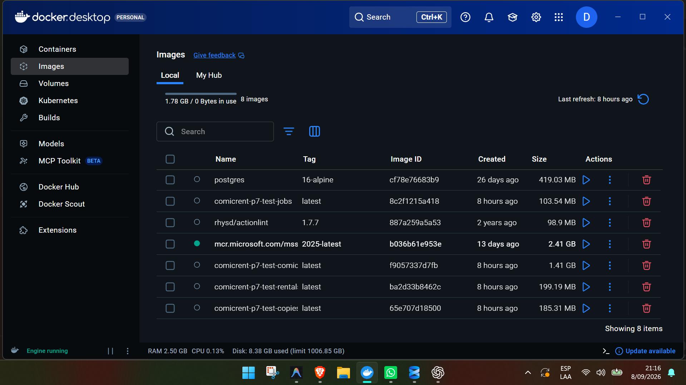
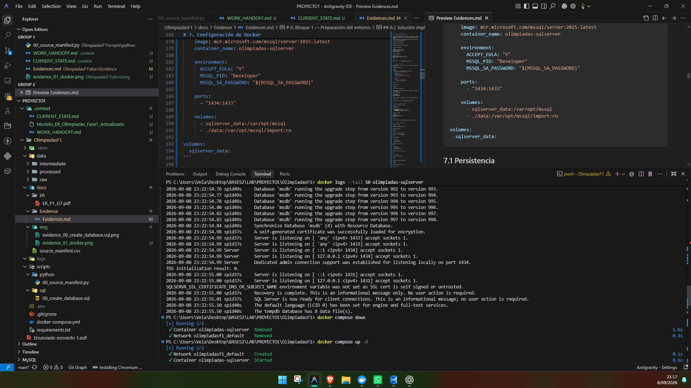
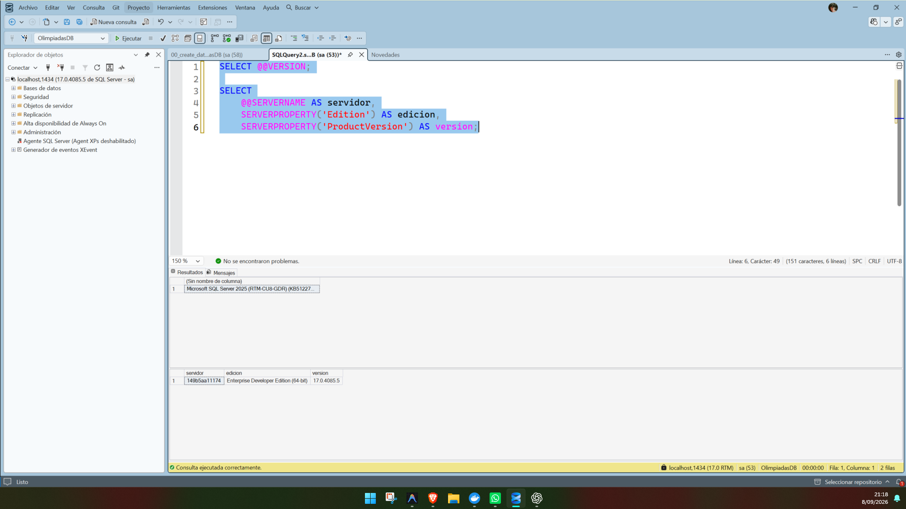
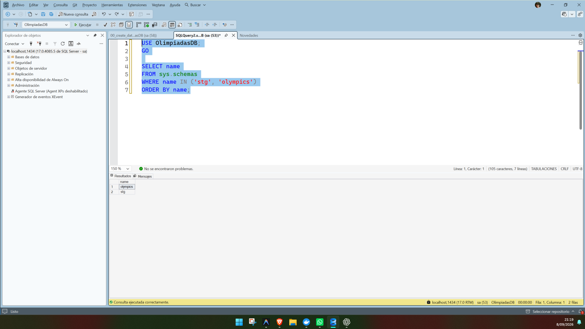
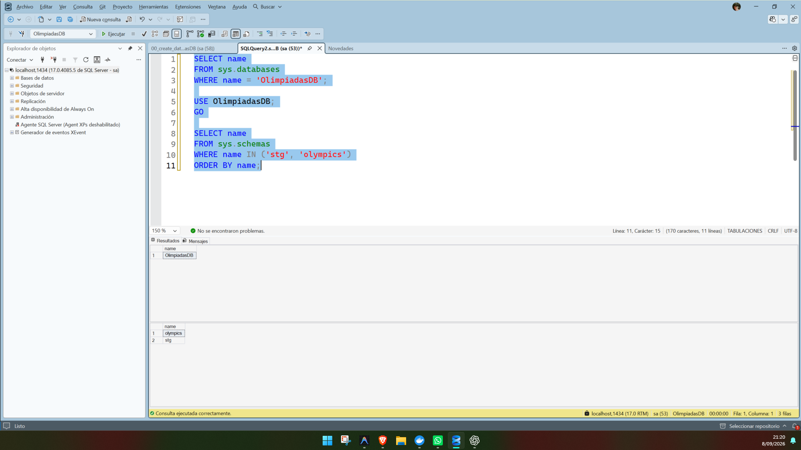
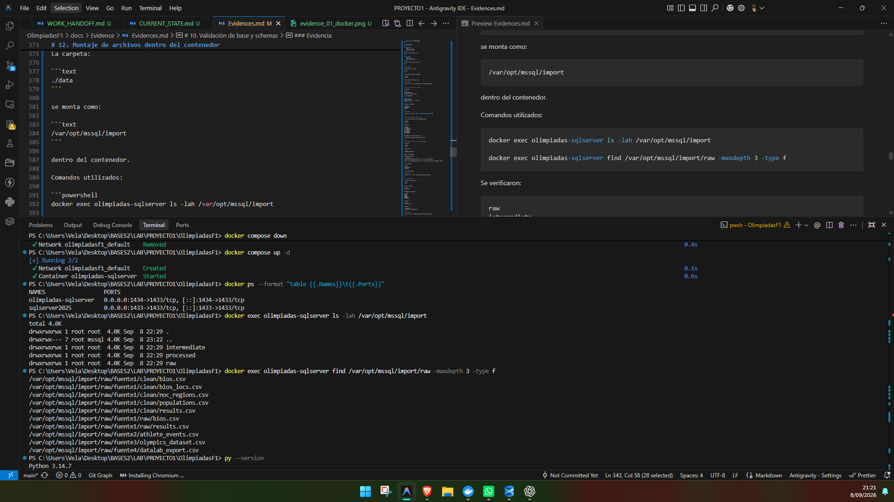
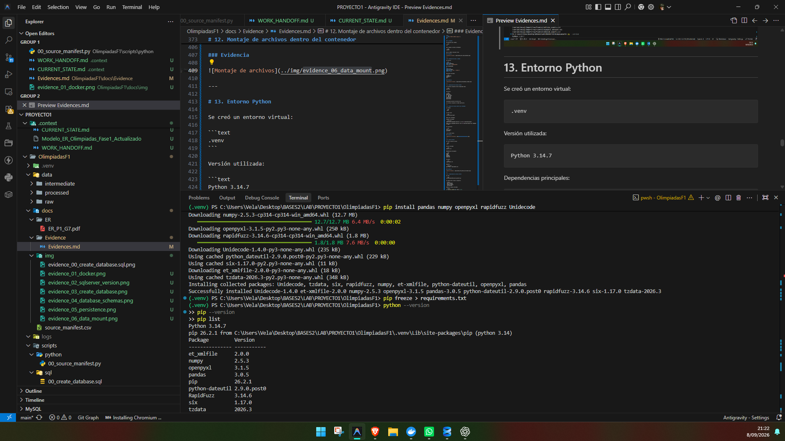
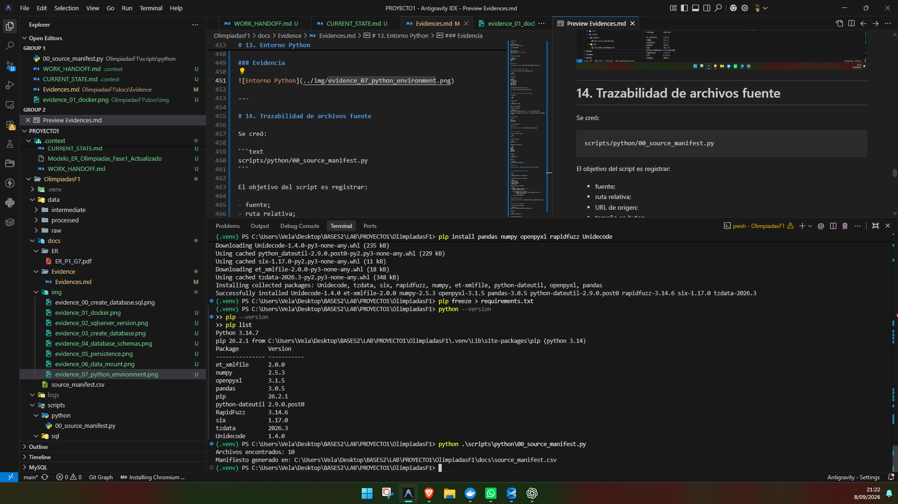
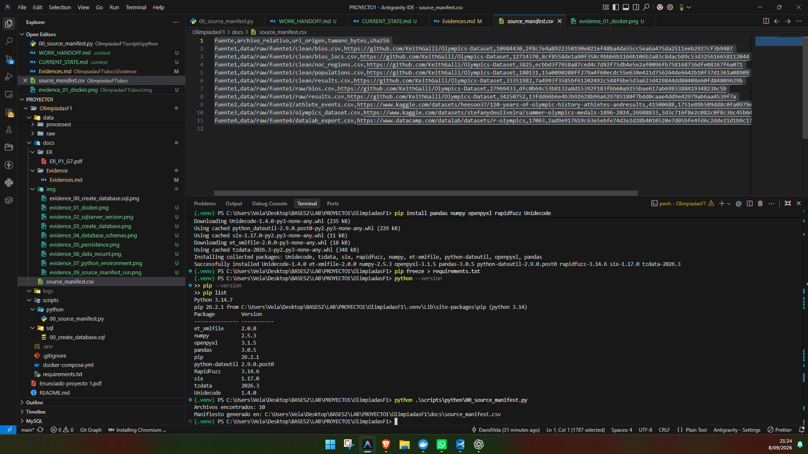

# Manual Técnico — Proyecto Olimpiadas Fase 1

## 1. Información general

### 1.1 Proyecto
Base de Datos Unificada de Información Olímpica.

### 1.2 Objetivo
Construir una base de datos relacional unificada a partir de cuatro fuentes de información relacionadas con los Juegos Olímpicos, realizando extracción, análisis, limpieza, homologación, consolidación y carga mediante procesos reproducibles.

### 1.3 Alcance de este manual
Este manual documenta únicamente los incisos:

- a) Modelo de datos y diagrama entidad-relación.
- b) Extracción, limpieza, homologación y carga de los datos.
- c) Scripts SQL para creación de base, tablas, llaves, índices y carga.

Los procedimientos almacenados de los incisos d) y e) serán desarrollados por otros integrantes del grupo.

---

# 2. Tecnologías utilizadas

| Tecnología | Uso |
|---|---|
| SQL Server 2025 Developer Edition | Motor de base de datos |
| Docker Desktop | Ejecución de SQL Server |
| SQL Server Management Studio 22 | Administración y ejecución de scripts SQL |
| Python 3.14.7 | Profiling, limpieza, homologación y preparación de datos |
| pandas | Manipulación de datasets |
| NumPy | Tratamiento numérico |
| RapidFuzz | Matching aproximado en etapas posteriores |
| Unidecode | Normalización de nombres |
| Git | Versionamiento del proyecto |

---

# 3. Estructura del proyecto

```text
OlimpiadasF1/
│
├── data/
│   ├── raw/
│   │   ├── fuente1/
│   │   ├── fuente2/
│   │   ├── fuente3/
│   │   └── fuente4/
│   ├── intermediate/
│   └── processed/
│
├── scripts/
│   ├── python/
│   └── sql/
│
├── docs/
│   ├── ER/
│   ├── Evidence/
│   │   └── Evidences.md
│   ├── img/
│   └── source_manifest.csv
│
├── docker-compose.yml
├── requirements.txt
└── README.md
```

---

# 4. Fuentes de datos

Se utilizaron las siguientes fuentes:

1. Keith Galli Olympics Dataset  
   https://github.com/KeithGalli/Olympics-Dataset

2. Kaggle — 120 Years of Olympic History  
   Archivo principal: `athlete_events.csv`

3. Kaggle — Summer Olympics Medals 1896–2024  
   Archivo principal: `olympics_dataset.csv`

4. DataCamp — R Olympics  
   Archivo principal: `datalab_export.csv`

Además, se utilizará Olympics.com como fuente oficial para validaciones de calidad relacionadas con información olímpica.

---

# 5. Principios de trabajo

Durante el proyecto se definieron las siguientes reglas:

- No utilizar Wizards.
- Todo proceso debe ser reproducible mediante scripts.
- Los archivos de `data/raw` no deben modificarse.
- Los identificadores originales de las fuentes se utilizan únicamente durante ETL.
- Los datos útiles se conservan aunque solo aparezcan en una fuente.
- Los valores faltantes se almacenan como `NULL`.
- Las transformaciones se generan en `data/intermediate`.
- Los datasets consolidados finales se generan en `data/processed`.
- La carga final se realiza mediante scripts SQL.

Flujo general:

```text
Fuentes originales
        ↓
Data Profiling
        ↓
Limpieza
        ↓
Homologación
        ↓
Matching
        ↓
Deduplicación
        ↓
Consolidación
        ↓
CSV procesados
        ↓
Scripts SQL
        ↓
SQL Server
```

---

# 6. Bloque 1 — Preparación del entorno

## 6.1 Problema encontrado con SQL Server

Durante la instalación nativa de SQL Server 2025 Developer se presentaron inconvenientes relacionados con la configuración regional del sistema operativo.

Para evitar modificar la configuración regional del sistema se decidió utilizar SQL Server mediante Docker.

## 6.2 Solución implementada

Se utilizó la imagen oficial:

```text
mcr.microsoft.com/mssql/server:2025-latest
```

Configuración utilizada:

```text
Contenedor: olimpiadas-sqlserver
Puerto host: 1434
Puerto interno SQL Server: 1433
Edición: Developer
```

Conexión desde SSMS:

```text
Servidor: localhost,1434
Autenticación: SQL Server Authentication
Usuario: sa
```

### Evidencia



---

# 7. Configuración de Docker

Se creó un archivo `docker-compose.yml` para mantener la configuración reproducible.

Configuración relevante:

```yaml
services:
  sqlserver:
    image: mcr.microsoft.com/mssql/server:2025-latest
    container_name: olimpiadas-sqlserver

    environment:
      ACCEPT_EULA: "Y"
      MSSQL_PID: "Developer"
      MSSQL_SA_PASSWORD: "${MSSQL_SA_PASSWORD}"

    ports:
      - "1434:1433"

    volumes:
      - sqlserver_data:/var/opt/mssql
      - ./data:/var/opt/mssql/import:ro

volumes:
  sqlserver_data:
```

## 7.1 Persistencia

El volumen:

```text
sqlserver_data:/var/opt/mssql
```

permite mantener la base de datos aunque el contenedor sea eliminado y creado nuevamente.

Se verificó mediante:

```powershell
docker compose down
docker compose up -d
```

Después de recrear el contenedor, `OlimpiadasDB` continuó existiendo.

### Evidencia



---

# 8. Conexión y versión de SQL Server

Se verificó la versión utilizando:

```sql
SELECT @@VERSION;

SELECT
    @@SERVERNAME AS servidor,
    SERVERPROPERTY('Edition') AS edicion,
    SERVERPROPERTY('ProductVersion') AS version;
```

Resultado verificado:

```text
SQL Server 2025
Enterprise Developer Edition
Versión 17.x
```

### Evidencia



---

# 9. Creación de la base de datos

Se creó el archivo:

```text
scripts/sql/00_create_database.sql
```

Contenido principal:

```sql
USE master;
GO

IF DB_ID('OlimpiadasDB') IS NULL
BEGIN
    CREATE DATABASE OlimpiadasDB;
END;
GO

USE OlimpiadasDB;
GO

IF NOT EXISTS (
    SELECT 1
    FROM sys.schemas
    WHERE name = 'stg'
)
BEGIN
    EXEC('CREATE SCHEMA stg');
END;
GO

IF NOT EXISTS (
    SELECT 1
    FROM sys.schemas
    WHERE name = 'olympics'
)
BEGIN
    EXEC('CREATE SCHEMA olympics');
END;
GO
```

## 9.1 Esquemas

Se definieron dos schemas:

```text
stg
```

para staging y procesos intermedios.

```text
olympics
```

para el modelo relacional final.

### Evidencia



---

# 10. Validación de base y schemas

Se verificó:

```sql
SELECT name
FROM sys.databases
WHERE name = 'OlimpiadasDB';

USE OlimpiadasDB;
GO

SELECT name
FROM sys.schemas
WHERE name IN ('stg', 'olympics')
ORDER BY name;
```

Resultado verificado:

```text
OlimpiadasDB
olympics
stg
```

### Evidencia



---

# 11. Organización de archivos fuente

Los archivos originales fueron organizados bajo:

```text
data/raw/
```

Estructura:

```text
data/raw/
├── fuente1/
│   ├── clean/
│   └── raw/
├── fuente2/
├── fuente3/
└── fuente4/
```

Actualmente existen 10 archivos CSV.

Los archivos originales no deben modificarse.

---

# 12. Montaje de archivos dentro del contenedor

La carpeta:

```text
./data
```

se monta como:

```text
/var/opt/mssql/import
```

dentro del contenedor.

Comandos utilizados:

```powershell
docker exec olimpiadas-sqlserver ls -lah /var/opt/mssql/import

docker exec olimpiadas-sqlserver find /var/opt/mssql/import/raw -maxdepth 3 -type f
```

Se verificaron:

```text
raw
intermediate
processed
```

y los 10 CSV fuente.

### Evidencia



---

# 13. Entorno Python

Se creó un entorno virtual:

```text
.venv
```

Versión utilizada:

```text
Python 3.14.7
```

Dependencias principales:

```text
pandas
numpy
openpyxl
RapidFuzz
Unidecode
```

Se generó:

```text
requirements.txt
```

mediante:

```powershell
pip freeze > requirements.txt
```

### Evidencia



---

# 14. Trazabilidad de archivos fuente

Se creó:

```text
scripts/python/00_source_manifest.py
```

El objetivo del script es registrar:

- fuente;
- ruta relativa;
- URL de origen;
- tamaño en bytes;
- hash SHA-256.

Ejemplo de lógica utilizada:

```python
def calcular_sha256(ruta: Path) -> str:
    sha256 = hashlib.sha256()

    with ruta.open("rb") as archivo:
        for bloque in iter(lambda: archivo.read(1024 * 1024), b""):
            sha256.update(bloque)

    return sha256.hexdigest()
```

---

# 15. Ejecución del manifiesto

El script se ejecutó mediante:

```powershell
python .\scripts\python\00_source_manifest.py
```

Resultado:

```text
Archivos encontrados: 10
```

El archivo generado fue:

```text
docs/source_manifest.csv
```

### Evidencia



---

# 16. Resultado del manifiesto

El archivo generado contiene las columnas:

```text
fuente
archivo_relativo
url_origen
tamano_bytes
sha256
```

Esto permite verificar que los archivos originales utilizados durante el proyecto no fueron modificados posteriormente.

### Evidencia



---

# 17. Siguiente etapa

El siguiente bloque corresponde al:

## Bloque 2 — Data Profiling

En esta etapa se analizarán los 10 CSV sin modificar la información.

Se deberá obtener:

- cantidad de filas;
- columnas;
- tipos inferidos;
- valores nulos;
- porcentaje de nulos;
- duplicados;
- cardinalidades;
- valores únicos;
- rangos;
- inconsistencias;
- valores especiales;
- ejemplos representativos.

No se realizará limpieza antes de terminar el profiling.
