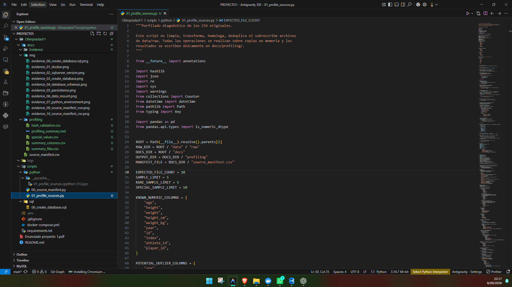
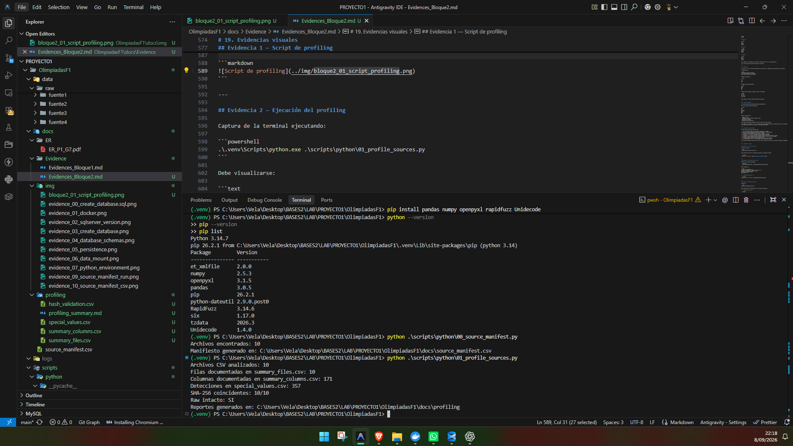
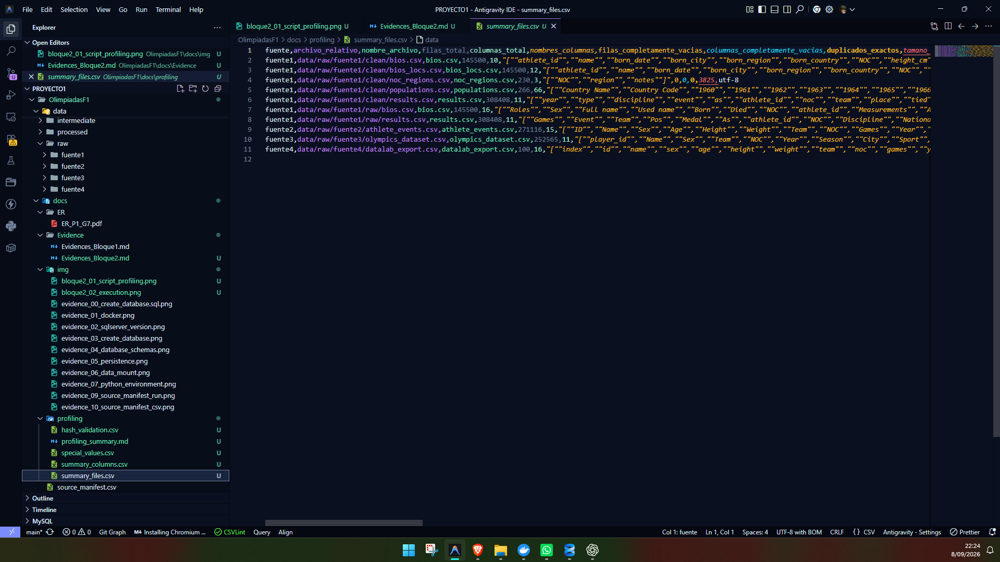
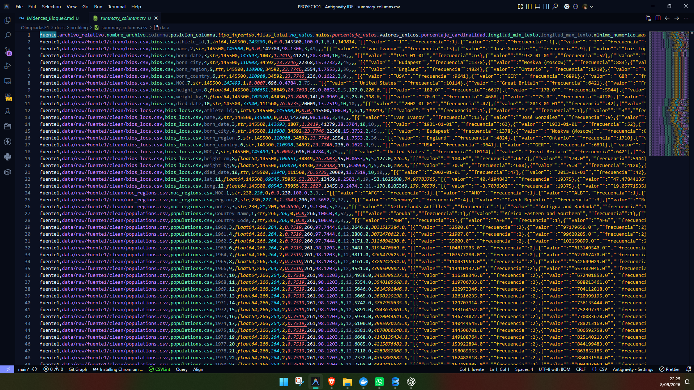
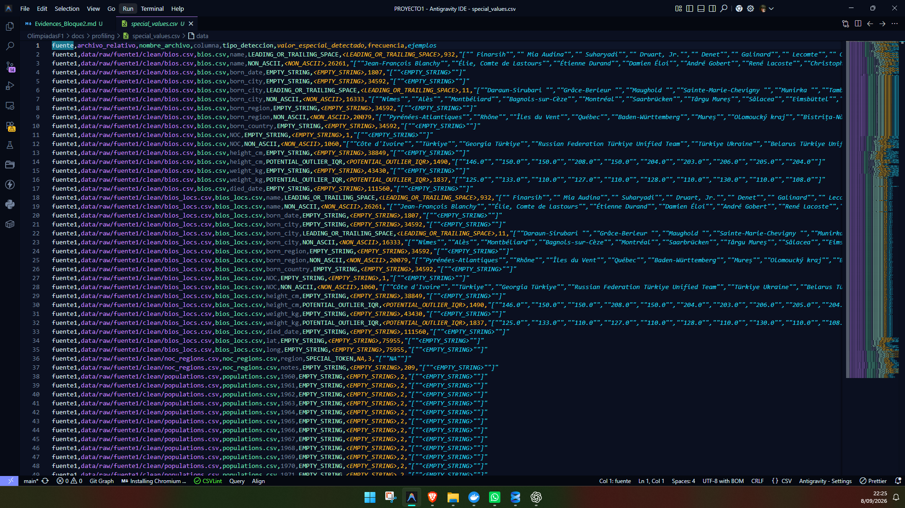

# Manual Técnico — Bloque 2: Data Profiling

## 1. Estado del bloque

El **Bloque 2 — Data Profiling** fue ejecutado correctamente como un análisis diagnóstico reproducible sobre los archivos fuente originales.

Durante este bloque:

- no se limpiaron datos;
- no se transformaron valores;
- no se homologaron nombres;
- no se eliminaron duplicados;
- no se realizó matching entre atletas;
- no se modificó ningún archivo dentro de `data/raw`.

El objetivo fue conocer la estructura, cobertura y calidad inicial de los datos antes de definir las reglas de limpieza y homologación del siguiente bloque.

**Estado técnico del Bloque 2: COMPLETADO.**

---

# 2. Objetivo

Analizar los 10 archivos CSV originales para identificar su estructura y características de calidad antes de realizar cualquier transformación.

El profiling permite conocer:

- cantidad de filas y columnas;
- tipos de datos inferidos;
- valores nulos;
- cardinalidad;
- duplicados exactos;
- columnas completamente vacías;
- rangos numéricos y temporales;
- valores especiales;
- diferencias de representación entre fuentes;
- posibles valores atípicos;
- formatos que requieren tratamiento posterior.

---

# 3. Metodología

Se desarrolló un script genérico capaz de descubrir y analizar automáticamente todos los archivos `.csv` ubicados dentro de:

```text
data/raw/
```

El proceso ejecutado por el script es el siguiente:

1. Descubre recursivamente todos los archivos CSV dentro de `data/raw`.
2. Verifica que existan exactamente 10 archivos fuente.
3. Detecta la codificación utilizada por cada archivo.
4. Lee cada CSV de dos formas:
   - una copia con tipos inferidos por pandas;
   - una copia textual para conservar la representación literal de los valores.
5. Calcula métricas generales por archivo.
6. Calcula métricas específicas por columna.
7. Detecta valores especiales sin modificarlos.
8. Analiza columnas de fechas, años, valores numéricos, identificadores, NOC, medallas y posiciones.
9. Compara los hashes SHA-256 actuales con `docs/source_manifest.csv`.
10. Vuelve a comprobar los hashes al finalizar para garantizar que `data/raw` permaneció intacto.
11. Genera los reportes del profiling en `docs/profiling/`.

---

# 4. Script utilizado

El profiling fue implementado mediante:

```text
scripts/python/01_profile_sources.py
```

El script fue diseñado para ser reproducible y reutilizable sobre todos los CSV originales.

Comando utilizado desde la raíz del proyecto:

```powershell
.\.venv\Scripts\python.exe .\scripts\python\01_profile_sources.py
```

---

# 5. Resultado de la ejecución

La ejecución produjo el siguiente resultado:

```text
Archivos CSV analizados: 10
Filas documentadas en summary_files.csv: 10
Columnas documentadas en summary_columns.csv: 171
Detecciones en special_values.csv: 357
SHA-256 coincidentes: 10/10
Raw intacto: SI
Reportes generados en: ...\OlimpiadasF1\docs\profiling
```

Entorno utilizado:

```text
Python: 3.14.7
pandas: 3.0.5
```

Las **357 detecciones** corresponden a registros diagnósticos generados en `special_values.csv`; no representan 357 filas erróneas. Una detección puede representar múltiples ocurrencias de un mismo patrón o valor especial.

---

# 6. Archivos analizados

| Fuente | Archivo | Filas | Columnas | Duplicados exactos | Columnas completamente vacías |
|---|---|---:|---:|---:|---:|
| Fuente 1 | `data/raw/fuente1/clean/bios.csv` | 145,500 | 10 | 0 | 0 |
| Fuente 1 | `data/raw/fuente1/clean/bios_locs.csv` | 145,500 | 12 | 0 | 0 |
| Fuente 1 | `data/raw/fuente1/clean/noc_regions.csv` | 230 | 3 | 0 | 0 |
| Fuente 1 | `data/raw/fuente1/clean/populations.csv` | 266 | 66 | 0 | 0 |
| Fuente 1 | `data/raw/fuente1/clean/results.csv` | 308,408 | 11 | 126 | 0 |
| Fuente 1 | `data/raw/fuente1/raw/bios.csv` | 145,500 | 16 | 0 | 0 |
| Fuente 1 | `data/raw/fuente1/raw/results.csv` | 308,408 | 11 | 110 | 1 (`Unnamed: 7`) |
| Fuente 2 | `data/raw/fuente2/athlete_events.csv` | 271,116 | 15 | 1,385 | 0 |
| Fuente 3 | `data/raw/fuente3/olympics_dataset.csv` | 252,565 | 11 | 0 | 0 |
| Fuente 4 | `data/raw/fuente4/datalab_export.csv` | 100 | 16 | 0 | 0 |

En total se perfilaron **171 columnas** distribuidas entre los 10 archivos.

---

# 7. Reportes generados

El script generó los siguientes archivos dentro de:

```text
docs/profiling/
```

### `summary_files.csv`

Contiene una fila por archivo con información general como:

- cantidad de filas;
- cantidad de columnas;
- nombres de columnas;
- duplicados exactos;
- filas completamente vacías;
- columnas completamente vacías;
- tamaño del archivo;
- codificación detectada.

### `summary_columns.csv`

Contiene una fila por cada columna analizada e incluye:

- tipo inferido;
- valores no nulos;
- valores nulos;
- porcentaje de nulos;
- cantidad de valores únicos;
- porcentaje de cardinalidad;
- longitud mínima y máxima;
- mínimos y máximos numéricos cuando aplica;
- ejemplos frecuentes;
- ejemplos poco frecuentes.

### `special_values.csv`

Contiene detecciones diagnósticas como:

- cadenas vacías;
- tokens especiales;
- valores con espacios al inicio o final;
- caracteres no ASCII;
- posiciones con prefijo `=`;
- valores no numéricos en columnas numéricas;
- posibles atípicos detectados mediante IQR;
- valores de medalla;
- categorías de posición.

### `hash_validation.csv`

Registra la comparación entre:

- SHA-256 almacenado originalmente;
- SHA-256 actual;
- estado de la comparación.

### `profiling_summary.md`

Contiene un resumen técnico automático de los principales resultados del profiling.

---

# 8. Integridad de los archivos fuente

Antes de iniciar el profiling se compararon los hashes SHA-256 de los 10 archivos originales contra:

```text
docs/source_manifest.csv
```

Resultado:

```text
10/10 MATCH
```

La misma comprobación fue ejecutada nuevamente después del profiling.

Resultado final:

```text
10/10 MATCH
Raw intacto: SI
```

Esto confirma que el proceso de profiling fue únicamente de lectura y que ningún archivo fuente fue modificado.

---

# 9. Duplicados exactos

Se detectaron duplicados exactos en tres archivos:

| Archivo | Duplicados exactos |
|---|---:|
| `clean/results.csv` | 126 |
| `raw/results.csv` | 110 |
| `athlete_events.csv` | 1,385 |

En este bloque **no se eliminaron** estos registros.

La presencia de duplicados exactos se conserva como hallazgo para determinar posteriormente si corresponden a duplicación real o a observaciones legítimamente repetidas.

---

# 10. Columnas completamente vacías

Se encontró una columna completamente vacía:

```text
data/raw/fuente1/raw/results.csv
```

Columna:

```text
Unnamed: 7
```

Esta observación confirma que la columna no aporta información útil y deberá ser considerada durante la definición de reglas de limpieza.

---

# 11. Fechas y años

## Fuente 1 — bios limpios

En `clean/bios.csv` y `clean/bios_locs.csv`:

```text
born_date:
mínimo = 1828-10-25
máximo = 2009-01-01

died_date:
mínimo = 1900-04-23
máximo = 2023-12-28
```

Los valores disponibles en estas columnas pudieron ser interpretados como fechas.

## Fuente 1 — bios RAW

Los campos:

```text
Born
Died
```

presentan formatos narrativos y contienen información adicional.

Bajo un intento directo de interpretación como fecha se detectaron:

```text
Born:
121,005 valores no parseables

Died:
29,089 valores no parseables
```

Esto no significa que los valores estén corruptos. Indica que su estructura contiene información que requiere un análisis específico durante la etapa de transformación.

## Cobertura temporal

| Archivo | Columna | Rango |
|---|---|---|
| `clean/results.csv` | `year` | 1896–2022 |
| `athlete_events.csv` | `Year` | 1896–2016 |
| `olympics_dataset.csv` | `Year` | 1896–2024 |
| `datalab_export.csv` | `year` | 1900–2016 |

La Fuente 3 proporciona cobertura hasta el año 2024.

---

# 12. Valores numéricos

Se revisaron las principales columnas numéricas relacionadas con información física de los atletas.

## `athlete_events.csv`

```text
Age
mínimo: 10
máximo: 97
nulos: 9,474

Height
mínimo: 127
máximo: 226
nulos: 60,171

Weight
mínimo: 25
máximo: 214
nulos: 62,875
```

## Bios limpios de Fuente 1

```text
height_cm
mínimo: 127
máximo: 226
nulos: 38,849

weight_kg
mínimo: 25
máximo: 198
nulos: 43,430
```

También se identificaron posibles valores atípicos mediante el criterio estadístico IQR.

Estos registros se conservaron sin modificación porque un valor estadísticamente atípico no implica necesariamente un error.

---

# 13. Identificadores

Se analizaron los identificadores originales de cada fuente únicamente dentro de su propio dataset.

Los identificadores observados incluyen:

```text
athlete_id
ID
player_id
id
```

Resultados relevantes:

```text
athlete_events.csv:
135,571 ID distintos

olympics_dataset.csv:
235,903 player_id distintos

datalab_export.csv:
35 id distintos
```

Los identificadores de distintas fuentes **no se consideran equivalentes**.

Su posible correspondencia será estudiada posteriormente durante el proceso de matching y consolidación.

---

# 14. NOC

El profiling confirmó diferencias importantes en la representación de NOC.

## Bios de Fuente 1

Se encontraron:

```text
696 valores distintos
```

La mayoría corresponden a nombres descriptivos como:

```text
United States
Great Britain
France
Canada
Italy
```

## Resultados y otras fuentes

Los archivos de resultados y `noc_regions.csv` utilizan principalmente códigos de tres letras.

Ejemplos:

```text
USA
FRA
GBR
ITA
CAN
GER
```

Cantidad de NOC distintos:

| Fuente/archivo | NOC distintos |
|---|---:|
| `noc_regions.csv` | 230 |
| `clean/results.csv` | 230 |
| `raw/results.csv` | 230 |
| `athlete_events.csv` | 230 |
| `olympics_dataset.csv` | 234 |
| `datalab_export.csv` | 9 |

Estas diferencias se registraron únicamente como hallazgo. No se realizó homologación durante este bloque.

---

# 15. Medallas

Se detectaron distintas formas de representar la ausencia de medalla.

## Fuente 1

```text
<celda vacía>
Gold
Silver
Bronze
```

## Fuente 2

```text
NA
Gold
Silver
Bronze
```

## Fuente 3

```text
No medal
Gold
Silver
Bronze
```

## Fuente 4

```text
null
Gold
Silver
Bronze
```

Esto evidencia la necesidad de una regla de normalización común en la etapa posterior.

No se realizó ninguna sustitución durante el profiling.

---

# 16. Posiciones

La columna `Pos` de la Fuente 1 RAW presenta una estructura más compleja que una posición numérica simple.

Se identificaron:

```text
330 valores numéricos distintos
167 valores distintos con prefijo =
2,071 valores distintos adicionales
```

Ejemplos con prefijo `=`:

```text
=9
=5
=17
=33
```

Ejemplos de estados especiales:

```text
DNS
DNF
DQ
AC
```

También existen formatos asociados a rondas, por ejemplo:

```text
AC r1/2
AC r2/2
5 h1 r2/3
4 h1 r2/3
```

Estos valores no fueron convertidos durante este bloque.

---

# 17. Valores especiales

El profiling identificó diferentes categorías diagnósticas.

Entre los valores encontrados aparecen:

```text
NA
N/A
null
No medal
DNS
DNF
DQ
```

También se encontraron:

- cadenas vacías;
- espacios al inicio o final de algunos textos;
- caracteres no ASCII;
- posiciones con prefijo `=`;
- posibles atípicos numéricos.

Estas detecciones deben interpretarse según el contexto de cada columna.

Por ejemplo, un texto como `Nan` o `DQ` puede tener un significado diferente si aparece dentro de una columna de nombres o apodos, por lo que no debe aplicarse una normalización global sin considerar el atributo donde aparece.

---

# 18. Conclusiones del profiling

El Data Profiling permitió establecer que:

1. Los 10 archivos originales se encuentran disponibles e íntegros.
2. Las cuatro fuentes presentan diferencias de estructura y representación.
3. Existen distintas convenciones para valores faltantes.
4. Los NOC no se representan de la misma forma en todos los archivos.
5. Los campos `Born` y `Died` RAW requieren procesamiento específico.
6. La columna `Pos` contiene posiciones, empates, estados y formatos asociados a rondas.
7. Se encontraron duplicados exactos que requieren evaluación antes de ser eliminados.
8. La Fuente 3 amplía la cobertura temporal hasta 2024.
9. Los valores potencialmente atípicos no deben eliminarse automáticamente.
10. La integridad de `data/raw` fue comprobada antes y después del proceso.

Los resultados obtenidos proporcionan la base técnica necesaria para definir las reglas de limpieza y homologación en la siguiente etapa.

---

# 19. Evidencias visuales


## Evidencia 1 — Script de profiling

Captura del archivo:

```text
scripts/python/01_profile_sources.py
```

Debe visualizarse parte de la lógica de profiling y validación de hashes.





---

## Evidencia 2 — Ejecución del profiling

Captura de la terminal ejecutando:

```powershell
.\.venv\Scripts\python.exe .\scripts\python\01_profile_sources.py
```

Debe visualizarse:

```text
Archivos CSV analizados: 10
Columnas documentadas en summary_columns.csv: 171
Detecciones en special_values.csv: 357
SHA-256 coincidentes: 10/10
Raw intacto: SI
```





---

## Evidencia 3 — Resumen por archivo

Captura de:

```text
docs/profiling/summary_files.csv
```

Debe visualizarse la información de los 10 archivos analizados.





---

## Evidencia 4 — Resumen por columna

Captura de:

```text
docs/profiling/summary_columns.csv
```

Debe visualizarse información como:

- tipo inferido;
- nulos;
- porcentaje de nulos;
- cardinalidad;
- mínimos y máximos.





---

## Evidencia 5 — Valores especiales

Captura de:

```text
docs/profiling/special_values.csv
```

Debe visualizarse una muestra de detecciones como:

```text
DNS
DNF
No medal
POSITION_EQUALS_PREFIX
LEADING_OR_TRAILING_SPACE
```




---

# 20. Estado final del Bloque 2

**Estado técnico: COMPLETADO**

Se completó el análisis diagnóstico de las cuatro fuentes sin modificar los archivos originales.

Los resultados del profiling quedan disponibles en:

```text
docs/profiling/
```

y serán utilizados como fundamento para el siguiente bloque:

```text
Bloque 3 — Reglas de limpieza y homologación
```
