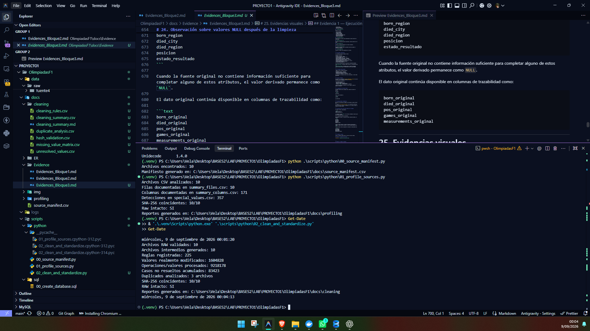
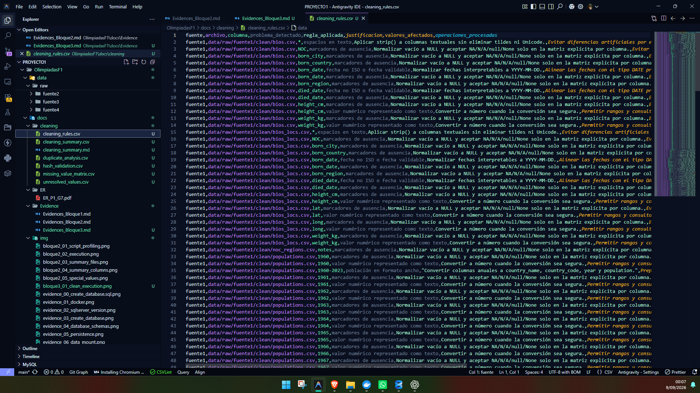
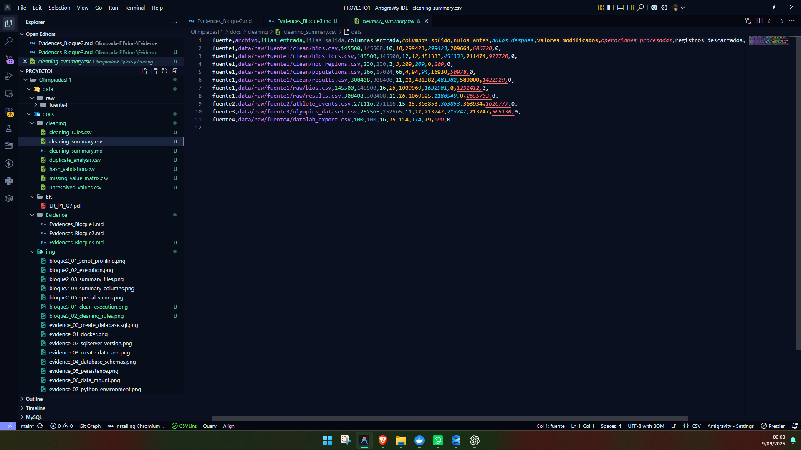
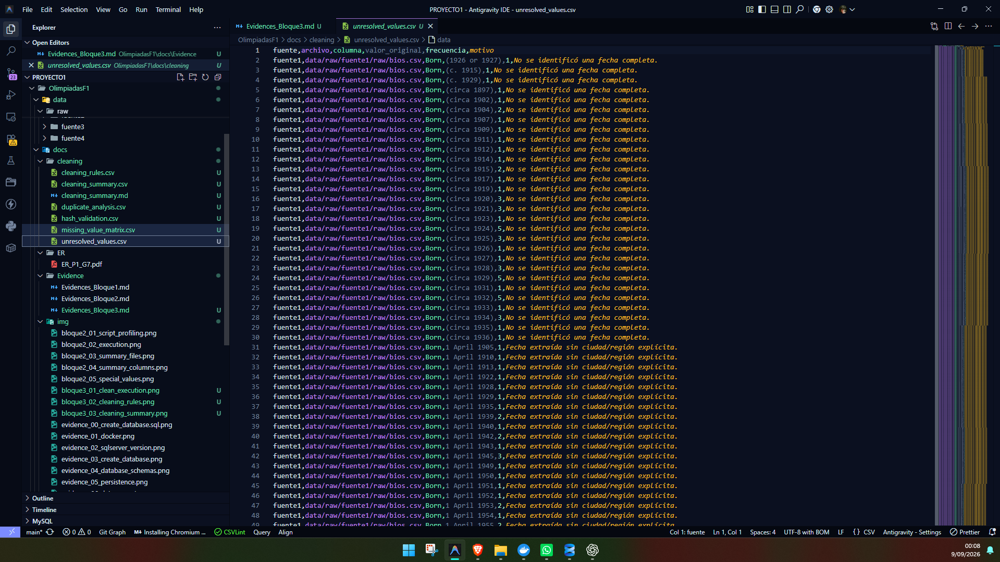
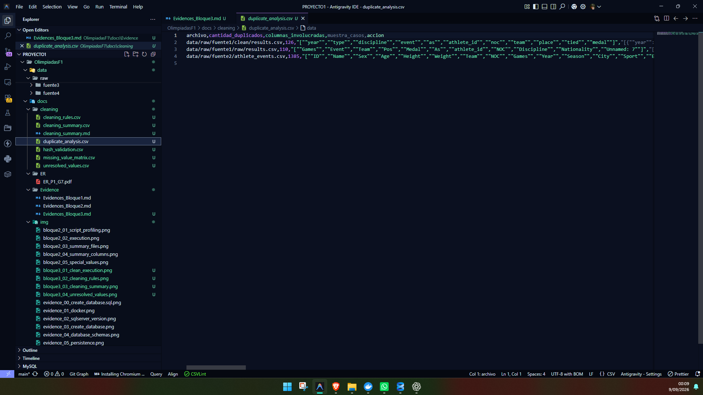
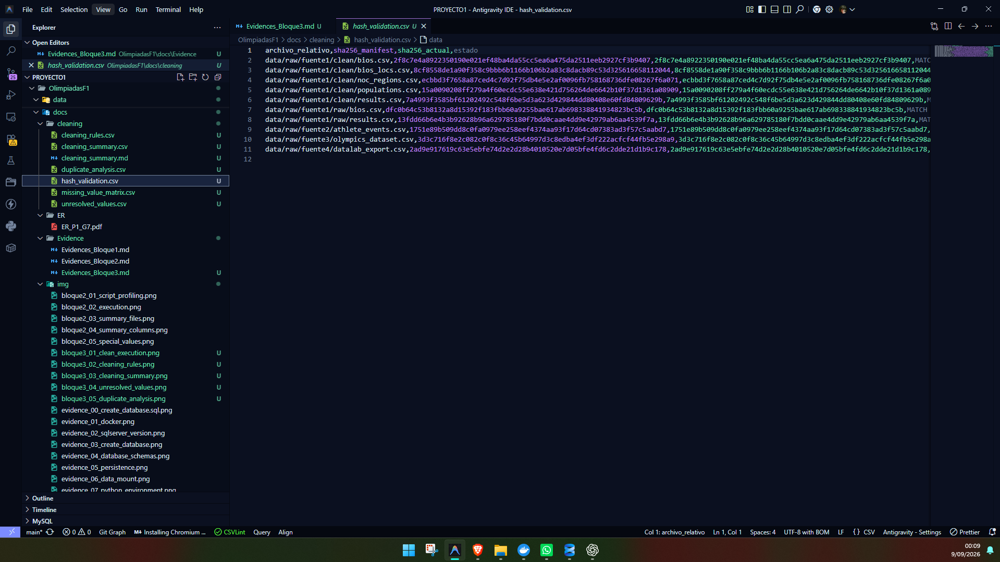

# Manual Técnico — Bloque 3: Limpieza y Homologación

## 1. Estado del bloque

El **Bloque 3 — Reglas de limpieza y homologación** fue ejecutado correctamente sobre las diez fuentes originales.

El proceso generó archivos intermedios limpios y homologados por fuente, sin modificar los archivos originales almacenados en `data/raw`.

Durante este bloque:

- no se realizó matching entre atletas de distintas fuentes;
- no se realizó consolidación final;
- no se generaron identificadores globales;
- no se eliminaron duplicados entre fuentes;
- no se generaron archivos finales en `data/processed`;
- no se realizó carga a SQL Server.

**Estado técnico del Bloque 3: COMPLETADO Y APROBADO.**

---

# 2. Objetivo

Aplicar reglas reproducibles e idempotentes de limpieza y homologación sobre los diez archivos fuente para preparar datos intermedios consistentes antes de realizar el proceso de matching, deduplicación y consolidación.

El objetivo principal fue transformar únicamente aquellos valores cuya interpretación pudiera realizarse de forma segura, conservando los casos ambiguos o incompletos para una revisión posterior.

---

# 3. Metodología

La limpieza y homologación se implementó mediante un script reproducible que trabaja exclusivamente a partir de los archivos originales de:

```text
data/raw/
```

El proceso realizado fue:

1. validar la existencia de los diez archivos fuente;
2. comprobar sus hashes SHA-256 contra `docs/source_manifest.csv`;
3. leer los archivos conservando sus valores originales;
4. aplicar reglas específicas según archivo y columna;
5. generar un archivo intermedio limpio por cada fuente;
6. registrar las reglas aplicadas y sus cantidades;
7. conservar los valores cuya interpretación no fuera segura;
8. analizar los duplicados exactos sin eliminarlos;
9. verificar nuevamente los hashes SHA-256;
10. comprobar que los archivos generados fueran reproducibles mediante una segunda ejecución.

Los archivos intermedios se almacenaron en:

```text
data/intermediate/cleaned/
```

Los reportes técnicos fueron almacenados en:

```text
docs/cleaning/
```

---

# 4. Script utilizado

El proceso fue implementado mediante:

```text
scripts/python/02_clean_and_standardize.py
```

Comando reproducible desde la raíz del proyecto:

```powershell
.\.venv\Scripts\python.exe .\scripts\python\02_clean_and_standardize.py
```

---

# 5. Reglas de limpieza y homologación

## 5.1 Espacios en valores textuales

Se aplicó `strip()` a los valores textuales para eliminar espacios innecesarios al inicio o al final.

Se conservaron:

- tildes;
- caracteres Unicode;
- caracteres no ASCII;
- nombres originales.

No se utilizó transliteración para reemplazar los valores almacenados.

---

## 5.2 Valores faltantes

Los valores faltantes no se normalizaron mediante una regla global.

Se creó una matriz explícita por archivo y columna:

```text
docs/cleaning/missing_value_matrix.csv
```

Los marcadores:

```text
NA
N/A
null
None
```

solo fueron interpretados como ausencia cuando la columna correspondiente permite esa interpretación.

Los campos descriptivos, como nombres, apodos, títulos, equipos, eventos y afiliaciones, no reciben esta transformación de forma global.

Las cadenas vacías se normalizan como ausencia después de eliminar espacios.

`No medal` se interpreta como ausencia exclusivamente en columnas de medalla.

---

# 6. Medallas

Las distintas representaciones de medalla fueron homologadas a:

```text
Gold
Silver
Bronze
NULL
```

Ejemplos:

| Fuente | Valor original | Valor homologado |
|---|---|---|
| Fuente 1 | celda vacía | `NULL` |
| Fuente 2 | `NA` | `NULL` |
| Fuente 3 | `No medal` | `NULL` |
| Fuente 4 | `null` | `NULL` |

No se creó una entidad independiente para medallas.

---

# 7. Posiciones y resultados

La columna `Pos` de:

```text
data/raw/fuente1/raw/results.csv
```

contiene posiciones numéricas, empates, estados especiales y formatos complejos.

Se generaron los campos intermedios:

```text
pos_original
posicion
empatado
estado_resultado
pos_clasificacion
```

Ejemplos:

| Valor original | posicion | empatado | estado_resultado |
|---|---:|---|---|
| `4` | 4 | False | `NULL` |
| `=17` | 17 | True | `NULL` |
| `DNS` | `NULL` | False | `DNS` |
| `DNF` | `NULL` | False | `DNF` |
| `DQ` | `NULL` | False | `DQ` |

Los formatos cuya interpretación no podía realizarse de manera segura se conservaron como casos complejos.

La clasificación obtenida fue:

| Clasificación | Filas |
|---|---:|
| Posición numérica | 198,884 |
| Empate | 35,670 |
| Estado de resultado | 18,343 |
| Complejo no resuelto | 53,686 |
| Sin resultado | 1,825 |
| **Total** | **308,408** |

Los **53,686** casos complejos no fueron descartados.

Entre ellos aparecen valores como:

```text
AC
AC r1/2
AC r2/2
5 h1 r2/3
4 h1 r2/3
```

---

# 8. Fechas biográficas

## 8.1 Fechas estructuradas

Las columnas estructuradas como:

```text
born_date
died_date
```

se validaron y normalizaron al formato:

```text
YYYY-MM-DD
```

únicamente cuando la fecha completa estaba disponible.

## 8.2 Campos RAW `Born` y `Died`

Los valores originales de:

```text
Born
Died
```

se conservaron.

Cuando fue posible se extrajeron:

```text
fecha
ciudad
región
país
```

No se inventaron componentes faltantes.

Los valores con información parcial fueron registrados como casos no resueltos:

| Tipo | Frecuencia |
|---|---:|
| Solo año | 2,989 |
| Mes y año sin día | 819 |
| Fecha no completa | 396 |
| Fecha extraída sin ciudad/región explícita | 25,532 |

Una fecha parcial como:

```text
March 1980
```

no se transforma en:

```text
1980-03-01
```

porque el día no se encuentra disponible en la fuente.

---

# 9. Games, año y temporada

Cuando una fuente contiene la columna:

```text
Games
```

se analizó su contenido para separar o validar:

```text
year
season
```

El valor original se conserva temporalmente como:

```text
games_original
```

para mantener trazabilidad durante el proceso ETL.

Se registró **1 valor de `Games` no parseable con seguridad**, el cual se conservó para revisión posterior.

---

# 10. Edad, altura, peso y coordenadas

Las columnas numéricas relacionadas con:

```text
Age
Height
Weight
height_cm
weight_kg
lat
long
```

se convirtieron a valores numéricos cuando la conversión podía realizarse de forma segura.

Los valores considerados estadísticamente atípicos durante el profiling no fueron eliminados automáticamente.

La presencia de un valor atípico no se consideró suficiente para clasificarlo como error.

---

# 11. Measurements

En `raw/bios.csv`, la columna:

```text
Measurements
```

contiene información compuesta.

Cuando se detectaron unidades reconocibles se extrajeron:

```text
height_cm
weight_kg
```

El valor original se conserva temporalmente como:

```text
measurements_original
```

para garantizar trazabilidad.

---

# 12. NOC y códigos de país

Se conservaron como conceptos diferentes:

```text
noc_nombre
noc_codigo
country_code
```

No se asumió que:

```text
codigo_noc = codigo_pais
```

Esto es necesario debido a casos donde ambos estándares utilizan códigos diferentes.

La homologación y relación definitiva entre NOC, países y entidades geográficas se realizará durante la etapa de consolidación.

---

# 13. Poblaciones

El archivo:

```text
data/raw/fuente1/clean/populations.csv
```

se encontraba originalmente en formato ancho:

```text
Country Name
Country Code
1960
1961
...
2023
```

Se transformó a formato largo:

```text
country_name
country_code
year
population
```

La transformación produjo:

```text
17,024 registros
```

correspondientes a:

```text
266 entidades × 64 años
```

Se conservaron tanto países como agregados estadísticos, incluyendo entidades como:

```text
Arab World
High income
Africa Eastern and Southern
```

---

# 14. Identificadores originales

Los identificadores de las fuentes se conservaron temporalmente para facilitar el matching posterior:

```text
athlete_id
ID
player_id
id
```

No se asumió equivalencia entre ellos.

No se generaron identificadores globales durante este bloque.

---

# 15. Fuente 4

En:

```text
datalab_export.csv
```

se eliminó únicamente la columna técnica:

```text
index
```

El identificador:

```text
id
```

se conservó temporalmente.

La Fuente 4 todavía no fue eliminada ni fusionada con otras fuentes. Su posible superposición será evaluada durante el proceso de consolidación.

---

# 16. Duplicados exactos

Los duplicados encontrados durante el profiling fueron analizados nuevamente.

| Archivo | Duplicados exactos |
|---|---:|
| `fuente1/clean/results.csv` | 126 |
| `fuente1/raw/results.csv` | 110 |
| `fuente2/athlete_events.csv` | 1,385 |

No se eliminó ningún registro.

El análisis completo se encuentra en:

```text
docs/cleaning/duplicate_analysis.csv
```

La decisión de eliminar o consolidar registros se realizará únicamente después de analizar su equivalencia durante el Bloque 4.

---

# 17. Archivos intermedios generados

Se generaron diez archivos en:

```text
data/intermediate/cleaned/
```

Archivos:

1. `fuente1_clean_bios.csv`
2. `fuente1_clean_bios_locs.csv`
3. `fuente1_clean_noc_regions.csv`
4. `fuente1_clean_populations_long.csv`
5. `fuente1_clean_results.csv`
6. `fuente1_raw_bios.csv`
7. `fuente1_raw_results.csv`
8. `fuente2_athlete_events.csv`
9. `fuente3_olympics_dataset.csv`
10. `fuente4_datalab_export.csv`

No se generaron archivos dentro de:

```text
data/processed/
```

---

# 18. Reportes generados

Se generaron los siguientes reportes en:

```text
docs/cleaning/
```

### `cleaning_rules.csv`

Documenta:

- archivo;
- columna;
- problema detectado;
- regla aplicada;
- justificación;
- valores afectados;
- operaciones procesadas.

### `cleaning_summary.csv`

Resume por archivo:

- filas de entrada;
- filas de salida;
- columnas de entrada;
- columnas de salida;
- nulos antes y después;
- valores realmente modificados;
- operaciones procesadas;
- registros descartados.

### `unresolved_values.csv`

Contiene todos los valores cuya transformación no pudo realizarse de forma segura.

### `duplicate_analysis.csv`

Documenta los duplicados exactos encontrados y conserva muestras de los casos.

### `hash_validation.csv`

Contiene la validación SHA-256 de los archivos originales.

### `missing_value_matrix.csv`

Documenta las columnas donde los marcadores semánticos pueden ser tratados como ausencia.

### `cleaning_summary.md`

Contiene el resumen técnico generado por el proceso.

---

# 19. Resultados cuantitativos

Los resultados finales del Bloque 3 fueron:

| Métrica | Resultado |
|---|---:|
| Archivos procesados | 10/10 |
| Archivos intermedios generados | 10 |
| Filas descartadas | 0 |
| Valores realmente modificados | 1,604,828 |
| Operaciones/valores procesados | 9,218,178 |
| Afectaciones registradas por reglas | 1,913,236 |
| Casos no resueltos únicos | 22,647 |
| Frecuencia acumulada de casos no resueltos | 83,423 |
| Hashes SHA-256 coincidentes | 10/10 |
| Archivos RAW modificados | 0 |

Las métricas de modificaciones y operaciones se mantienen separadas.

`valores_modificados` representa cambios reales en la representación del dato.

`operaciones_procesadas` representa valores o registros analizados durante una regla, aunque su representación final no haya cambiado.

---

# 20. Principales modificaciones

| Regla | Valores realmente afectados |
|---|---:|
| Conversión numérica | 1,025,182 |
| Marcadores semánticos | 363,932 |
| Normalización de medallas | 213,747 |
| Eliminación de espacios al inicio/final | 1,967 |

Las posiciones se contabilizan como filas clasificadas y no como celdas modificadas.

---

# 21. Casos no resueltos

Se conservaron y documentaron **22,647 combinaciones únicas** de casos no resueltos, con una frecuencia acumulada de **83,423**.

Los principales corresponden a:

- posiciones complejas;
- fechas biográficas parciales;
- fechas sin ciudad o región explícita;
- valores de `Games` no interpretables con seguridad.

La política utilizada fue conservar el valor original en lugar de inventar información.

---

# 22. Integridad de los archivos fuente

Los hashes SHA-256 fueron validados antes y después de ejecutar el proceso.

Resultado:

```text
10/10 MATCH
```

Ningún archivo ubicado en:

```text
data/raw/
```

fue modificado.

---

# 23. Reproducibilidad e idempotencia

El proceso fue ejecutado una segunda vez utilizando los mismos archivos RAW.

Se compararon **17 archivos de salida** y no se detectaron diferencias.

Esto confirma que el proceso es idempotente: con las mismas entradas se producen las mismas salidas.

---

# 24. Observación sobre valores NULL después de la limpieza

En algunos archivos, especialmente:

```text
fuente1_raw_bios.csv
fuente1_raw_results.csv
```

la cantidad de valores `NULL` en los archivos intermedios es mayor que en los archivos originales.

Esto no representa pérdida de información.

El incremento se debe a la creación de nuevas columnas derivadas, por ejemplo:

```text
born_city
born_region
died_city
died_region
posicion
estado_resultado
```

Cuando la fuente original no contiene información suficiente para completar alguno de estos atributos, el valor derivado permanece como `NULL`.

El dato original continúa disponible en columnas de trazabilidad como:

```text
born_original
died_original
pos_original
games_original
measurements_original
```

---

# 25. Evidencias visuales

Todas las evidencias deben mostrar la fecha y hora del sistema.

## Evidencia 1 — Ejecución del proceso

 

---

## Evidencia 2 — Reglas de limpieza



---

## Evidencia 3 — Resumen de limpieza



---

## Evidencia 4 — Casos no resueltos



---

## Evidencia 5 — Análisis de duplicados



---

## Evidencia 6 — Integridad de archivos RAW



---

# 26. Estado final del Bloque 3

**Estado técnico: COMPLETADO Y APROBADO**

Las reglas de limpieza y homologación fueron ejecutadas, revisadas y validadas.

Los diez archivos intermedios quedan preparados para la siguiente etapa:

```text
Bloque 4 — Matching, deduplicación y consolidación
```
