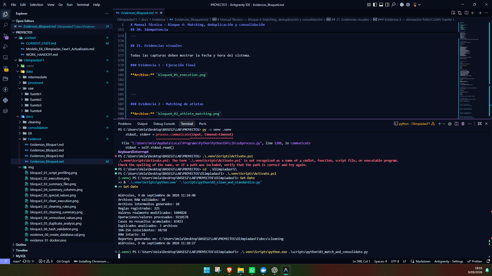
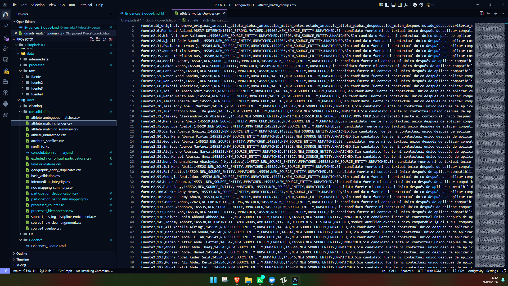
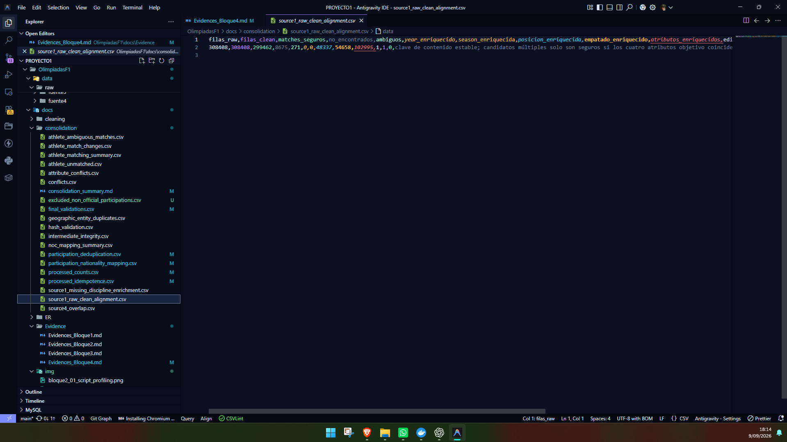
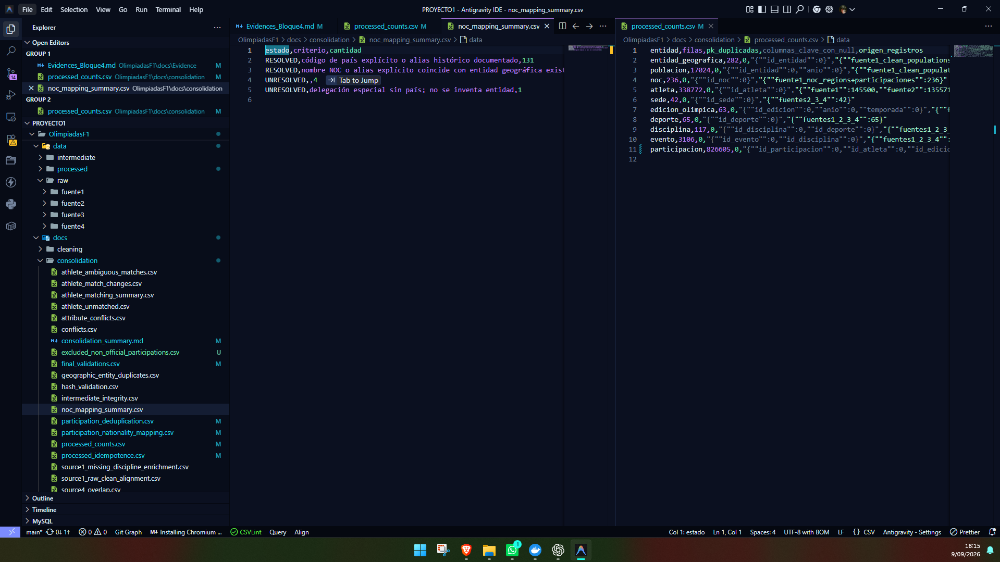
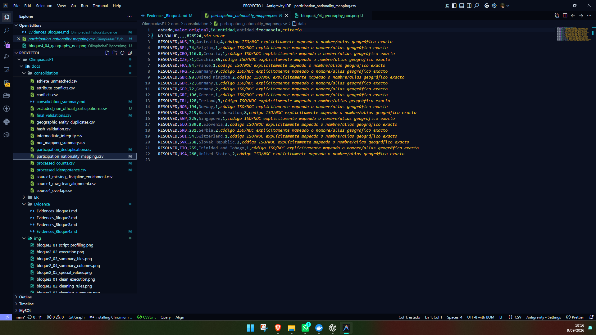
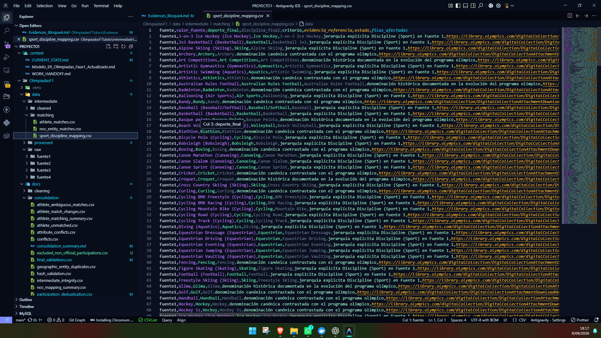
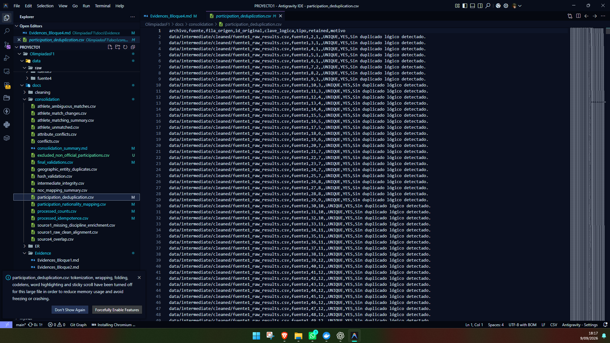
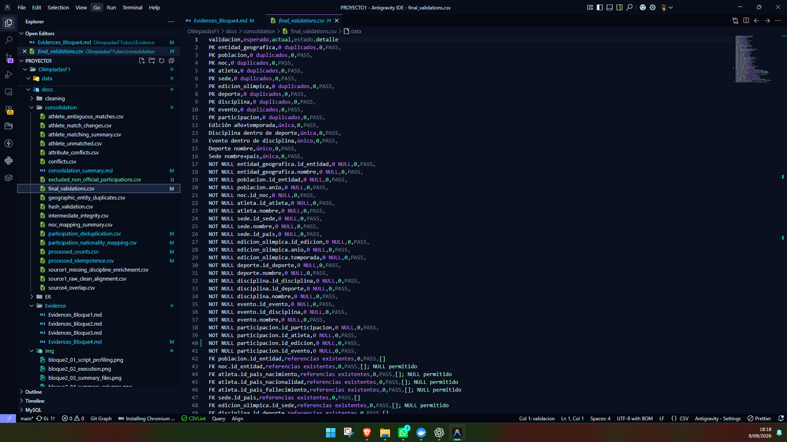
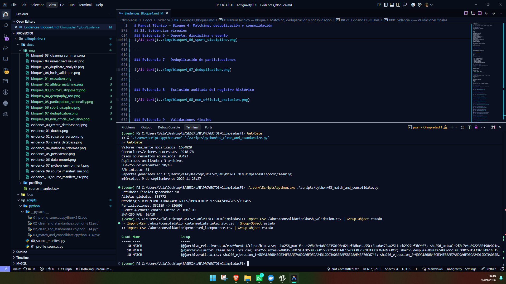

# Manual Técnico — Bloque 4: Matching, deduplicación y consolidación

## 1. Estado del bloque

El **Bloque 4 — Matching, deduplicación y consolidación** fue completado y aprobado técnicamente.

En esta etapa se consolidaron las cuatro fuentes olímpicas en diez archivos finales compatibles con el modelo ER del proyecto. El proceso incluyó matching determinístico de atletas, resolución de entidades geográficas y NOC, alineación entre archivos RAW y CLEAN de la Fuente 1, homologación de la jerarquía deporte–disciplina–evento, deduplicación de participaciones y validaciones finales de integridad.

La participación asociada a `1888-89 Zappas Olympic Games` se conserva en los archivos RAW e intermedios para trazabilidad, pero se excluye únicamente de `data/processed/participacion.csv` por quedar fuera del conjunto de ediciones oficiales modeladas.

No se inició el Bloque 5 durante esta etapa.

**Estado técnico del Bloque 4: COMPLETADO Y APROBADO.**

---

## 2. Objetivo

Consolidar las cuatro fuentes de datos olímpicos en un conjunto final de archivos compatibles con el modelo relacional definido, garantizando:

- matching auditable entre atletas;
- conservación de información no resoluble sin inventar datos;
- separación entre entidad geográfica, NOC y nacionalidad;
- jerarquía correcta `DEPORTE → DISCIPLINA → EVENTO`;
- deduplicación controlada de participaciones;
- integridad referencial;
- reproducibilidad e idempotencia del proceso.

---

## 3. Metodología

El proceso utiliza como entrada los diez archivos generados en:

```text
data/intermediate/cleaned/
```

El flujo ejecutado fue:

1. validar la integridad de los archivos RAW;
2. verificar los archivos intermedios limpios;
3. alinear los resultados RAW y CLEAN de la Fuente 1;
4. construir perfiles de participación por atleta;
5. aplicar matching determinístico de atletas;
6. construir entidades geográficas y NOC;
7. mapear nacionalidades disponibles;
8. resolver deporte, disciplina y evento;
9. construir sedes y ediciones olímpicas;
10. generar participaciones consolidadas;
11. deduplicar participaciones;
12. excluir únicamente registros fuera del alcance oficial definido;
13. construir las diez salidas finales;
14. validar PK, FK, NOT NULL y reglas de dominio;
15. verificar nuevamente integridad e idempotencia.

---

## 4. Script utilizado

Script principal:

```text
scripts/python/03_match_and_consolidate.py
```

Comando reproducible desde la raíz del proyecto:

```powershell
.\.venv\Scripts\python.exe .\scripts\python\03_match_and_consolidate.py
```

Las salidas son generadas en:

```text
data/intermediate/matching/
data/processed/
docs/consolidation/
```

---

## 5. Matching de atletas

El matching de atletas se implementó mediante reglas determinísticas.

Las claves normalizadas se utilizaron únicamente como auxiliares para comparar registros y no reemplazan los valores originales almacenados.

Se utilizaron los siguientes tipos de matching:

### 5.1 DETERMINISTIC_STRONG

Requiere:

- nombre auxiliar exacto;
- sexo comparable compatible;
- NOC comparable compatible;
- candidato único.

Resultado:

```text
177,741 matches
```

### 5.2 DETERMINISTIC_CONTEXTUAL

Se utiliza cuando el matching fuerte no es suficiente.

Considera:

- nombre auxiliar exacto;
- compatibilidad obligatoria de sexo y NOC;
- año compartido;
- deporte o disciplina compatible;
- evento compartido;
- candidato único.

Resultado:

```text
496 matches
```

### 5.3 AMBIGUOUS

Cuando existen múltiples candidatos y la evidencia contextual no permite identificar uno de forma segura, el registro se conserva sin fusionarlo automáticamente.

Resultado:

```text
2,857 registros
```

### 5.4 UNMATCHED

Cuando no existe un candidato seguro, el registro se conserva como una identidad global independiente.

Resultado:

```text
190,415 registros
```

### 5.5 Fuzzy matching

No se aplicó fuzzy matching automático.

Resultado:

```text
0
```

---

## 6. Resultado global del matching

| Tipo | Cantidad |
|---|---:|
| STRONG | 177,741 |
| CONTEXTUAL | 496 |
| AMBIGUOUS | 2,857 |
| UNMATCHED | 190,415 |
| Fuzzy automático | 0 |

Identidades base de Fuente 1:

```text
145,500
```

Atletas globales finales:

```text
338,772
```

La corrección del matching modificó **14,545** matches previamente existentes al considerar conjuntamente identificador global, estado o tipo de match.

El detalle se conserva en:

```text
docs/consolidation/athlete_match_changes.csv
```

---

## 7. Alineación Fuente 1 RAW/CLEAN

Se alinearon:

```text
fuente1_raw_results.csv
fuente1_clean_results.csv
```

La alineación no se realizó por número de fila.

Se construyó una clave estable utilizando atributos de contenido y, cuando existían varios candidatos, solo se consideró seguro el match cuando los valores objetivo coincidían.

Resultados:

| Métrica | Cantidad |
|---|---:|
| Filas RAW | 308,408 |
| Filas CLEAN | 308,408 |
| Matches seguros | 299,462 |
| No encontrados | 8,675 |
| Ambiguos | 271 |
| Posiciones enriquecidas | 48,337 |
| Empates enriquecidos | 54,658 |
| Atributos enriquecidos | 102,995 |
| Año/temporada enriquecidos | 0 |

Este proceso permitió aprovechar información estructurada del archivo CLEAN sin asumir equivalencias inseguras.

---

## 8. Participación histórica fuera del alcance

Se identificó un registro correspondiente a:

```text
Sotirios Versis
```

con:

```text
id_original: 55911
id_atleta global: 55516
fila_origen: 121778
games_original: 1888-89 Zappas Olympic Games
evento: Rope Climbing, Men ()
```

Este registro no contiene una edición oficial compatible con el modelo `EDICION_OLIMPICA`.

No se inventó:

- año;
- temporada;
- `id_edicion`;
- relación con Athens 1896.

El registro se conserva en RAW e intermedios y se excluye únicamente de:

```text
data/processed/participacion.csv
```

La exclusión se documenta en:

```text
docs/consolidation/excluded_non_official_participations.csv
```

---

## 9. Entidades geográficas

La construcción geográfica se realizó a partir de la información de población y correspondencias explícitas.

Se evitó crear una segunda entidad únicamente porque el código NOC y el código de país fueran diferentes.

Resultados:

| Métrica | Cantidad |
|---|---:|
| ENTIDAD_GEOGRAFICA antes de corrección | 363 |
| ENTIDAD_GEOGRAFICA final | 282 |
| Duplicados conceptuales corregidos | 81 |
| Duplicados normalizados restantes | 0 |
| Registros de población conservados | 17,024 |

Los agregados estadísticos de población se conservaron.

---

## 10. NOC

Los códigos NOC se mantuvieron separados de los códigos de país.

Resultados:

```text
NOC totales: 236
NOC resueltos con entidad: 231
NOC sin entidad segura: 5
```

Los NOC sin entidad asociada permanecen válidos porque `NOC.id_entidad` es nullable en el modelo.

No se inventaron asociaciones geográficas.

---

## 11. Nacionalidad de participación

La nacionalidad de participación solo fue asignada cuando la fuente proporcionaba un valor explícito y existía una correspondencia geográfica segura.

Resultados:

| Métrica | Cantidad |
|---|---:|
| Participaciones con nacionalidad resuelta | 81 |
| Valores originales distintos resueltos | 20 |
| Valores presentes sin correspondencia | 0 |
| Participaciones sin valor de nacionalidad en la fuente | 826,524 |

El NOC no se utilizó como sustituto automático de nacionalidad.

El reporte se encuentra en:

```text
docs/consolidation/participation_nationality_mapping.csv
```

---

## 12. Deporte, disciplina y evento

La jerarquía final se estructuró como:

```text
DEPORTE
   ↓
DISCIPLINA
   ↓
EVENTO
```

Se utilizaron:

- relaciones explícitas presentes en la Fuente 1;
- denominaciones canónicas;
- información del evento;
- contexto por atleta, fuente y edición.

Los casos genéricos se resolvieron únicamente cuando el contexto permitía una única interpretación segura.

Resultados:

```text
Mapeos resueltos: 313
Filas cubiertas: 832,189
Pendientes: 0
```

La salida final contiene:

```text
65 deportes
117 disciplinas
3,106 eventos
```

---

## 13. Fuente 4

La Fuente 4 se comparó con la Fuente 2 utilizando igualdad normalizada sobre catorce columnas comunes.

Resultado:

```text
100/100 MATCHED_EXACT
```

Las cien filas se encontraron contenidas de forma demostrable en la Fuente 2.

Por ello no se duplicaron en la participación consolidada.

El detalle está en:

```text
docs/consolidation/source4_overlap.csv
```

---

## 14. Deduplicación de participaciones

La deduplicación se recalculó después de corregir el matching de atletas.

Se utilizaron claves lógicas basadas en:

- atleta;
- edición;
- evento;
- NOC;
- equipo;
- nombre de competencia;
- información de resultado.

Solo se eliminaron duplicados exactos demostrables.

Los registros clasificados como:

```text
PROBABLE_DUPLICATE
CONFLICT
```

se conservaron.

Resultados finales:

| Métrica | Cantidad |
|---|---:|
| Participaciones de entrada | 832,189 |
| Participaciones finales | 826,605 |
| Duplicados exactos entre fuentes excluidos | 4,120 |
| Duplicados exactos internos excluidos | 1,463 |
| PROBABLE_DUPLICATE conservados | 142,148 |
| CONFLICT conservados | 264 |
| Registro fuera del alcance oficial excluido | 1 |

---

## 15. Archivos finales generados

Se generaron diez CSV en:

```text
data/processed/
```

Archivos:

1. `entidad_geografica.csv`
2. `poblacion.csv`
3. `noc.csv`
4. `atleta.csv`
5. `sede.csv`
6. `edicion_olimpica.csv`
7. `deporte.csv`
8. `disciplina.csv`
9. `evento.csv`
10. `participacion.csv`

---

## 16. Conteos finales

| Entidad | Filas |
|---|---:|
| entidad_geografica | 282 |
| poblacion | 17,024 |
| noc | 236 |
| atleta | 338,772 |
| sede | 42 |
| edicion_olimpica | 63 |
| deporte | 65 |
| disciplina | 117 |
| evento | 3,106 |
| participacion | 826,605 |

Estos conteos constituyen la referencia final para la etapa de carga SQL.

---

## 17. Reportes generados

Los principales reportes se almacenaron en:

```text
docs/consolidation/
```

Incluyen:

```text
athlete_matching_summary.csv
athlete_ambiguous_matches.csv
athlete_unmatched.csv
athlete_match_changes.csv
attribute_conflicts.csv
noc_mapping_summary.csv
geographic_entity_duplicates.csv
participation_nationality_mapping.csv
source1_raw_clean_alignment.csv
source1_missing_discipline_enrichment.csv
source4_overlap.csv
participation_deduplication.csv
excluded_non_official_participations.csv
processed_counts.csv
final_validations.csv
hash_validation.csv
intermediate_integrity.csv
processed_idempotence.csv
```

También se generaron archivos de matching en:

```text
data/intermediate/matching/
```

---

## 18. Validaciones finales

El archivo:

```text
docs/consolidation/final_validations.csv
```

contiene **56 validaciones**.

Resultado:

```text
PASS: 56
FAIL: 0
```

Las validaciones comprueban:

- claves primarias sin duplicados;
- edición única por año y temporada;
- disciplina única dentro de deporte;
- evento único dentro de disciplina;
- deporte sin duplicados lógicos;
- sede única por nombre y país;
- campos obligatorios sin NULL;
- integridad de claves foráneas;
- medallas válidas;
- jerarquía deporte–disciplina sin pendientes.

---

## 19. Integridad de archivos

La integridad de los archivos de entrada fue verificada.

Resultados:

```text
RAW SHA-256: 10/10 MATCH
Intermedios limpios: 10/10 MATCH
```

Esto confirma que:

- `data/raw/` permaneció intacto;
- `data/intermediate/cleaned/` permaneció intacto.

---

## 20. Idempotencia

El proceso se ejecutó nuevamente utilizando las mismas entradas.

Los diez archivos de:

```text
data/processed/
```

fueron comparados mediante hash.

Resultado:

```text
10/10 MATCH
```

Esto confirma que el proceso es idempotente y reproducible.

---

## 21. Evidencias visuales

Todas las capturas deben mostrar la fecha y hora del sistema.

### Evidencia 1 — Ejecución final





---

### Evidencia 2 — Matching de atletas




---

### Evidencia 3 — Alineación RAW/CLEAN Fuente 1



---

### Evidencia 4 — Entidades geográficas y NOC



---

### Evidencia 5 — Nacionalidad de participación



---

### Evidencia 6 — Deporte, disciplina y evento



---

### Evidencia 7 — Deduplicación de participaciones



---

### Evidencia 8 — Exclusión auditada del registro histórico



---

### Evidencia 9 — Validaciones finales




---

## 22. Estado final del Bloque 4

**Estado técnico: COMPLETADO Y APROBADO**

El proceso de matching, deduplicación y consolidación fue ejecutado, corregido y validado.

Los diez archivos finales cumplen las validaciones definidas para el modelo:

```text
56/56 PASS
```

Los datos consolidados quedan preparados para la siguiente etapa:

```text
Bloque 5 — Modelo físico SQL Server
```

En este bloque no se crearon tablas SQL, no se cargaron datos en SQL Server y no se inició el Bloque 5.
