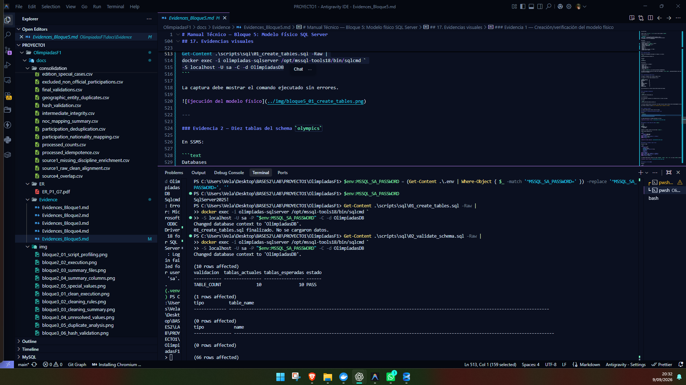
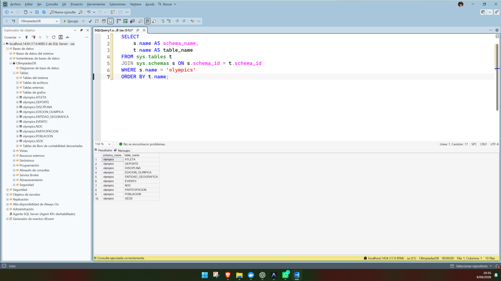
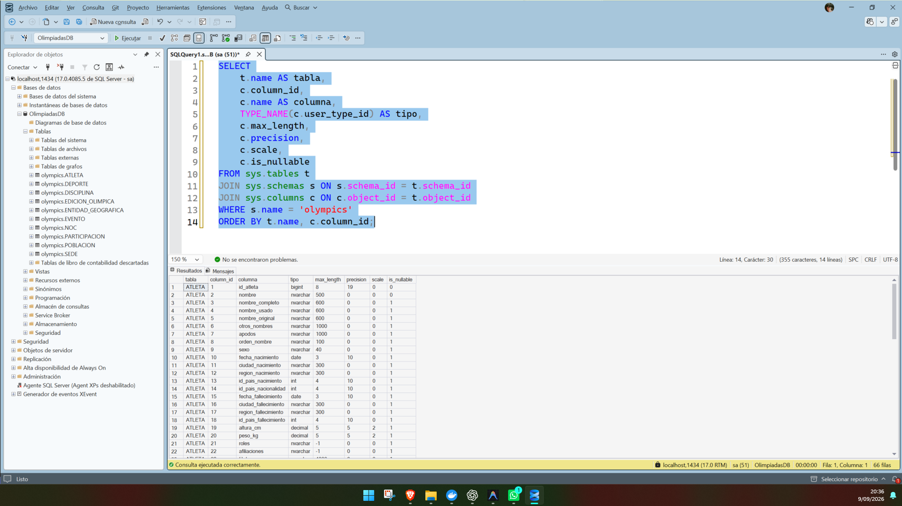
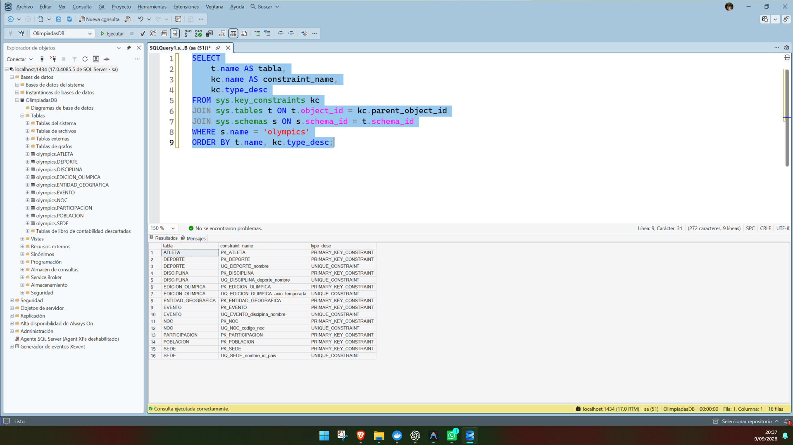
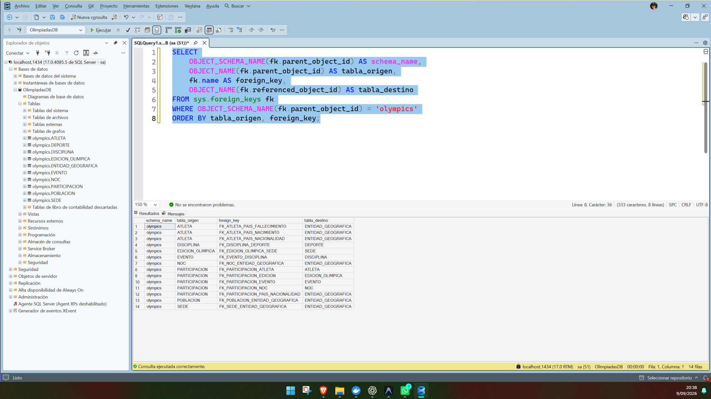
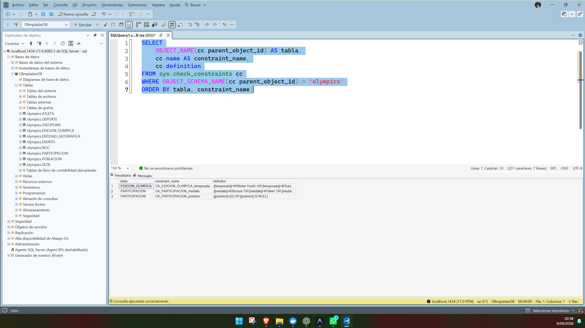
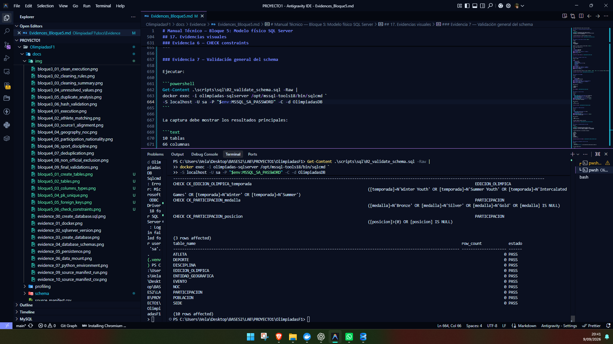
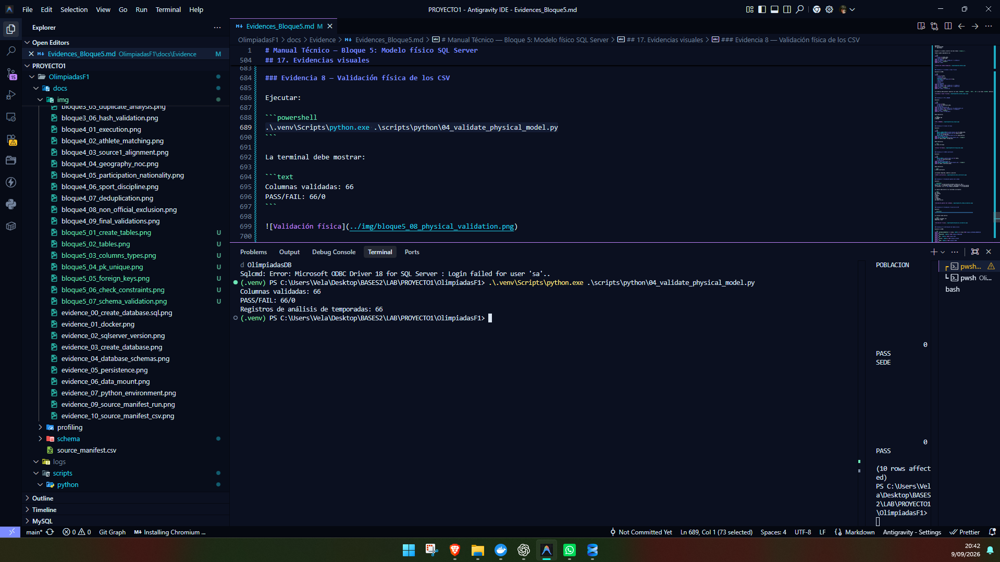
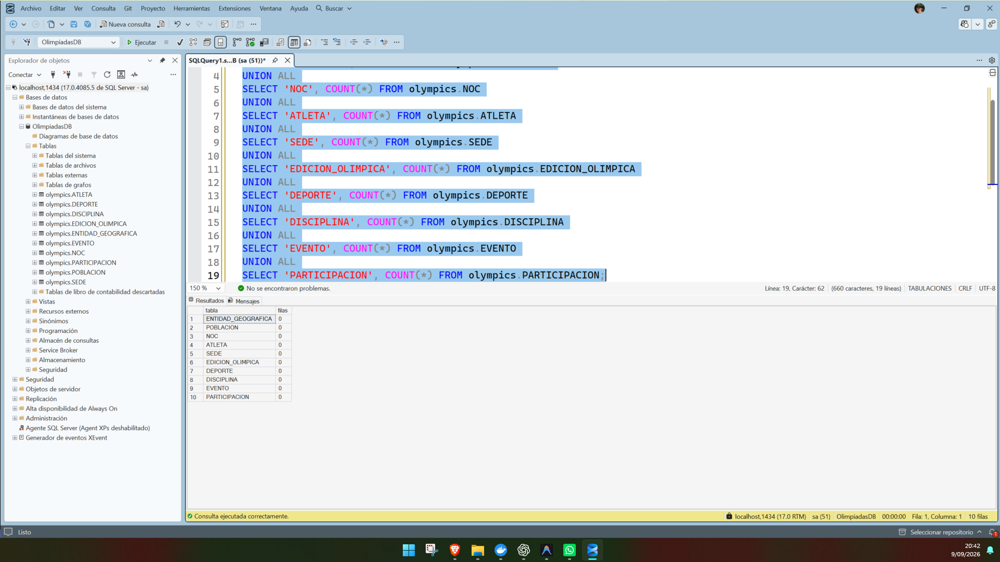

# Manual Técnico — Bloque 5: Modelo físico SQL Server

## 1. Estado del bloque

El **Bloque 5 — Modelo físico SQL Server** fue completado y aprobado técnicamente.

En esta etapa se creó y validó el modelo físico definitivo de la base de datos `OlimpiadasDB` en SQL Server 2025, utilizando exclusivamente el schema `olympics`.

Se crearon exactamente diez tablas finales, con sus tipos de datos, claves primarias, claves foráneas, restricciones `UNIQUE` y restricciones `CHECK`.

No se cargaron datos en las tablas y no se inició el Bloque 6.

**Estado técnico del Bloque 5: COMPLETADO Y APROBADO.**

---

## 2. Objetivo

Implementar en SQL Server el modelo físico correspondiente al modelo ER aprobado, verificando que la estructura soporte sin pérdida los datos consolidados generados en el Bloque 4.

Los objetivos específicos fueron:

- crear las diez tablas finales;
- utilizar tipos de datos compatibles con SQL Server 2025;
- preservar texto Unicode mediante `NVARCHAR`;
- definir claves primarias y foráneas;
- definir restricciones `UNIQUE`;
- definir reglas de dominio mediante `CHECK`;
- validar longitudes, precisión y escala contra los CSV procesados;
- comprobar que el schema físico coincida con el modelo esperado;
- dejar las tablas vacías y listas para la carga del Bloque 6.

---

## 3. Archivos utilizados y generados

Los principales archivos del Bloque 5 son:

```text
scripts/sql/00_reset_physical_tables.sql
scripts/sql/01_create_tables.sql
scripts/sql/02_validate_schema.sql
scripts/python/04_validate_physical_model.py
docs/schema/physical_model_validation.csv
docs/schema/edition_season_analysis.csv
docs/Evidence/Evidences_Bloque5.md
```

### Función de cada archivo

- `00_reset_physical_tables.sql`: elimina únicamente las diez tablas físicas del schema `olympics` en orden inverso de dependencias. Es un script destructivo separado y no debe ejecutarse durante el uso normal de la base.
- `01_create_tables.sql`: crea el modelo físico definitivo.
- `02_validate_schema.sql`: inspecciona metadatos de SQL Server y verifica tablas, columnas, tipos, PK, FK, `UNIQUE`, `CHECK`, precisión, escala y cantidad de filas.
- `04_validate_physical_model.py`: compara los tipos físicos propuestos contra los diez CSV finales de `data/processed/`.
- `physical_model_validation.csv`: contiene el resultado detallado de las 66 columnas validadas.
- `edition_season_analysis.csv`: contiene el análisis actualizado de las 61 ediciones finales.

---

## 4. Ejecución del modelo físico

El modelo físico fue creado sobre:

```text
Base de datos: OlimpiadasDB
Schema: olympics
```

El script principal de creación es:

```text
scripts/sql/01_create_tables.sql
```

Puede ejecutarse desde PowerShell utilizando el cliente `sqlcmd` disponible dentro del contenedor:

```powershell
Get-Content .\scripts\sql\01_create_tables.sql -Raw |
docker exec -i olimpiadas-sqlserver /opt/mssql-tools18/bin/sqlcmd `
-S localhost -U sa -C -d OlimpiadasDB
```

El script es no destructivo: no contiene `DROP TABLE` automático. Si las tablas ya existen, no deben duplicarse.

> **Nota:** para obtener evidencias no es necesario ejecutar nuevamente `00_reset_physical_tables.sql`. Ese archivo solo debe utilizarse cuando se desea recrear deliberadamente el modelo físico en un entorno de desarrollo vacío.

---

## 5. Tablas finales

Se crearon exactamente las siguientes diez tablas:

1. `olympics.ENTIDAD_GEOGRAFICA`
2. `olympics.POBLACION`
3. `olympics.NOC`
4. `olympics.ATLETA`
5. `olympics.SEDE`
6. `olympics.EDICION_OLIMPICA`
7. `olympics.DEPORTE`
8. `olympics.DISCIPLINA`
9. `olympics.EVENTO`
10. `olympics.PARTICIPACION`

No se crearon tablas finales en `dbo`.

Tampoco se crearon entidades adicionales como:

```text
FUENTE
RESULTADO
MEDALLA
TIPO_MEDALLA
```

---

## 6. Tipos físicos definitivos

Se utilizó `NVARCHAR` para los atributos textuales con el objetivo de preservar nombres internacionales, tildes y caracteres Unicode.

Los principales tipos físicos utilizados son:

| Tabla | Columnas principales |
|---|---|
| `ENTIDAD_GEOGRAFICA` | `id_entidad INT`, `nombre NVARCHAR(150)`, `codigo_pais CHAR(3)` |
| `POBLACION` | `id_entidad INT`, `anio SMALLINT`, `poblacion BIGINT` |
| `NOC` | `id_noc INT`, `codigo_noc CHAR(3)`, `nombre_noc NVARCHAR(150)`, `id_entidad INT`, `notas NVARCHAR(500)` |
| `ATLETA` | IDs `BIGINT/INT`, fechas `DATE`, medidas `DECIMAL(5,2)`, coordenadas `DECIMAL(19,16)` |
| `SEDE` | `id_sede INT`, `nombre NVARCHAR(150)`, `id_pais INT` |
| `EDICION_OLIMPICA` | `id_edicion INT`, `anio SMALLINT`, `temporada NVARCHAR(20)`, `id_sede INT` |
| `DEPORTE` | `id_deporte INT`, `nombre NVARCHAR(150)` |
| `DISCIPLINA` | `id_disciplina INT`, `id_deporte INT`, `nombre NVARCHAR(150)` |
| `EVENTO` | `id_evento BIGINT`, `id_disciplina INT`, `nombre NVARCHAR(300)` |
| `PARTICIPACION` | IDs `BIGINT/INT`, edad y altura `DECIMAL(5,2)`, peso registrado `DECIMAL(16,13)`, `empatado BIT` |

---

## 7. Ajustes físicos respecto al modelo inicial

La validación contra los CSV finales permitió detectar atributos que necesitaban mayor capacidad física.

### 7.1 Temporada

Se utilizó:

```sql
NVARCHAR(20)
```

en `EDICION_OLIMPICA.temporada`.

El máximo observado requiere más de diez caracteres y el dominio final contiene:

```text
Summer
Winter
Intercalated Games
Summer Youth
Winter Youth
```

### 7.2 Títulos del atleta

Se utilizó:

```sql
NVARCHAR(2000)
```

en `ATLETA.titulos`.

El máximo observado es de 1,518 caracteres, por lo que `NVARCHAR(500)` no era suficiente.

### 7.3 Coordenadas

Se utilizaron:

```sql
ATLETA.latitud  DECIMAL(19,16)
ATLETA.longitud DECIMAL(19,16)
```

La precisión de 16 decimales permite conservar exactamente los valores observados en los CSV procesados.

### 7.4 Peso registrado

Se utilizó:

```sql
PARTICIPACION.peso_kg_registrado DECIMAL(16,13)
```

para evitar redondear los valores con mayor escala presentes en la fuente consolidada.

---

## 8. Claves primarias

Se crearon diez claves primarias:

| Tabla | PK |
|---|---|
| `ENTIDAD_GEOGRAFICA` | `id_entidad` |
| `POBLACION` | `(id_entidad, anio)` |
| `NOC` | `id_noc` |
| `ATLETA` | `id_atleta` |
| `SEDE` | `id_sede` |
| `EDICION_OLIMPICA` | `id_edicion` |
| `DEPORTE` | `id_deporte` |
| `DISCIPLINA` | `id_disciplina` |
| `EVENTO` | `id_evento` |
| `PARTICIPACION` | `id_participacion` |

Resultado:

```text
PK: 10
```

---

## 9. Claves foráneas

Se crearon 14 claves foráneas.

Relaciones principales:

```text
POBLACION.id_entidad
    → ENTIDAD_GEOGRAFICA.id_entidad

NOC.id_entidad
    → ENTIDAD_GEOGRAFICA.id_entidad

ATLETA.id_pais_nacimiento
ATLETA.id_pais_nacionalidad
ATLETA.id_pais_fallecimiento
    → ENTIDAD_GEOGRAFICA.id_entidad

SEDE.id_pais
    → ENTIDAD_GEOGRAFICA.id_entidad

EDICION_OLIMPICA.id_sede
    → SEDE.id_sede

DISCIPLINA.id_deporte
    → DEPORTE.id_deporte

EVENTO.id_disciplina
    → DISCIPLINA.id_disciplina

PARTICIPACION.id_atleta
    → ATLETA.id_atleta

PARTICIPACION.id_edicion
    → EDICION_OLIMPICA.id_edicion

PARTICIPACION.id_evento
    → EVENTO.id_evento

PARTICIPACION.id_noc
    → NOC.id_noc

PARTICIPACION.id_pais_nacionalidad
    → ENTIDAD_GEOGRAFICA.id_entidad
```

Resultado:

```text
FK: 14
```

Las FK conceptualmente opcionales permanecen `NULLABLE`, incluyendo `NOC.id_entidad`.

---

## 10. Restricciones UNIQUE

Se definieron seis restricciones de unicidad:

```text
NOC(codigo_noc)
SEDE(nombre, id_pais)
EDICION_OLIMPICA(anio, temporada)
DEPORTE(nombre)
DISCIPLINA(id_deporte, nombre)
EVENTO(id_disciplina, nombre)
```

Resultado:

```text
UNIQUE: 6
```

No se creó `UNIQUE` sobre `ENTIDAD_GEOGRAFICA.codigo_pais`, debido a la presencia de entidades agregadas e históricas.

---

## 11. Restricciones CHECK

Se definieron tres restricciones `CHECK`.

### Temporada

`EDICION_OLIMPICA.temporada` admite únicamente:

```text
Summer
Winter
Intercalated Games
Summer Youth
Winter Youth
```

### Medalla

`PARTICIPACION.medalla` admite:

```text
Gold
Silver
Bronze
NULL
```

### Posición

`PARTICIPACION.posicion` debe ser mayor que cero o `NULL`.

Resultado:

```text
CHECK: 3
```

No se agregaron restricciones arbitrarias sobre edad, altura o peso que pudieran rechazar datos históricos válidos.

---

## 12. Validación física contra los CSV

La validación fue ejecutada con:

```powershell
.\.venv\Scripts\python.exe .\scripts\python\04_validate_physical_model.py
```

El proceso evaluó exactamente las 66 columnas del modelo físico contra los diez CSV de:

```text
data/processed/
```

Resultado:

```text
COBERTURA: 66/66
PASS: 66
FAIL: 0
```

Las siete columnas `DECIMAL` también fueron analizadas considerando precisión, escala y necesidad de redondeo.

| Columna | Tipo SQL | Redondeo |
|---|---|---:|
| `ATLETA.altura_cm` | `DECIMAL(5,2)` | 0 |
| `ATLETA.peso_kg` | `DECIMAL(5,2)` | 0 |
| `ATLETA.latitud` | `DECIMAL(19,16)` | 0 |
| `ATLETA.longitud` | `DECIMAL(19,16)` | 0 |
| `PARTICIPACION.edad` | `DECIMAL(5,2)` | 0 |
| `PARTICIPACION.altura_cm_registrada` | `DECIMAL(5,2)` | 0 |
| `PARTICIPACION.peso_kg_registrado` | `DECIMAL(16,13)` | 0 |

Por lo tanto, el DDL definitivo conserva los valores actuales sin pérdida de precisión.

---

## 13. Validación del schema en SQL Server

El script:

```text
scripts/sql/02_validate_schema.sql
```

consulta metadatos internos de SQL Server mediante:

```text
sys.tables
sys.columns
sys.key_constraints
sys.foreign_keys
sys.check_constraints
sys.indexes
sys.partitions
```

También valida `precision` y `scale` para las siete columnas `DECIMAL`.

Puede ejecutarse con:

```powershell
Get-Content .\scripts\sql\02_validate_schema.sql -Raw |
docker exec -i olimpiadas-sqlserver /opt/mssql-tools18/bin/sqlcmd `
-S localhost -U sa -C -d OlimpiadasDB
```

Resultados:

| Validación | Resultado |
|---|---:|
| Tablas esperadas en `olympics` | 10/10 |
| Tablas extra en `olympics` | 0 |
| Tablas finales en `dbo` | 0 |
| Columnas | 66/66 PASS |
| PK | 10 |
| UNIQUE | 6 |
| FK | 14 |
| CHECK | 3 |
| DECIMAL precision/scale | 7/7 PASS |
| Tablas vacías | 10/10 |

---

## 14. Ediciones finales

Después de la homologación realizada en el Bloque 4, el archivo:

```text
data/processed/edicion_olimpica.csv
```

contiene:

```text
61 ediciones
```

Distribución:

| Tipo de edición | Cantidad |
|---|---:|
| Summer | 30 |
| Winter | 24 |
| Intercalated Games | 1 |
| Summer Youth | 3 |
| Winter Youth | 3 |

La categoría `Equestrian` ya no existe como edición independiente.

Las 300 participaciones ecuestres de 1956 fueron homologadas a `1956 | Summer`, manteniendo Melbourne como sede principal y documentando Stockholm como excepción histórica en el Bloque 4.

---

## 15. Confirmación de tablas vacías

El Bloque 5 únicamente crea y valida el modelo físico.

Al finalizar, las diez tablas permanecen vacías:

```text
ENTIDAD_GEOGRAFICA    0
POBLACION             0
NOC                   0
ATLETA                0
SEDE                   0
EDICION_OLIMPICA      0
DEPORTE                0
DISCIPLINA             0
EVENTO                 0
PARTICIPACION          0
```

Esto confirma que no se realizó carga de datos durante este bloque.

---

## 16. Estrategia de reejecución

El script:

```text
scripts/sql/01_create_tables.sql
```

es no destructivo.

Para validaciones rutinarias no es necesario borrar ni recrear las tablas.

El script:

```text
scripts/sql/00_reset_physical_tables.sql
```

se mantiene separado porque es destructivo. Solo debe utilizarse cuando se desea recrear deliberadamente las diez tablas en un entorno de desarrollo vacío.

Para obtener evidencias visuales **no es necesario volver a ejecutar el reset**.

---

## 17. Evidencias visuales

Las capturas deben mostrar fecha y hora del sistema.

### Evidencia 1 — Creación/verificación del modelo físico

Ejecutar:

```powershell
Get-Content .\scripts\sql\01_create_tables.sql -Raw |
docker exec -i olimpiadas-sqlserver /opt/mssql-tools18/bin/sqlcmd `
-S localhost -U sa -C -d OlimpiadasDB
```

La captura debe mostrar el comando ejecutado sin errores.



---

### Evidencia 2 — Diez tablas del schema `olympics`

En SSMS:

```text
Databases
└── OlimpiadasDB
    └── Tables
```

Expandir el listado y mostrar las diez tablas `olympics.*`.

También puede comprobarse con:

```sql
SELECT
    s.name AS schema_name,
    t.name AS table_name
FROM sys.tables t
JOIN sys.schemas s ON s.schema_id = t.schema_id
WHERE s.name = 'olympics'
ORDER BY t.name;
```



---

### Evidencia 3 — Columnas y tipos físicos

Ejecutar en SSMS:

```sql
SELECT
    t.name AS tabla,
    c.column_id,
    c.name AS columna,
    TYPE_NAME(c.user_type_id) AS tipo,
    c.max_length,
    c.precision,
    c.scale,
    c.is_nullable
FROM sys.tables t
JOIN sys.schemas s ON s.schema_id = t.schema_id
JOIN sys.columns c ON c.object_id = t.object_id
WHERE s.name = 'olympics'
ORDER BY t.name, c.column_id;
```

La evidencia debe permitir observar los tipos `NVARCHAR`, `BIGINT`, `DATE`, `BIT` y los tipos `DECIMAL` definitivos.



---

### Evidencia 4 — PK y UNIQUE

Ejecutar:

```sql
SELECT
    t.name AS tabla,
    kc.name AS constraint_name,
    kc.type_desc
FROM sys.key_constraints kc
JOIN sys.tables t ON t.object_id = kc.parent_object_id
JOIN sys.schemas s ON s.schema_id = t.schema_id
WHERE s.name = 'olympics'
ORDER BY t.name, kc.type_desc;
```

Debe observarse:

```text
10 PRIMARY KEY
6 UNIQUE
```



---

### Evidencia 5 — Claves foráneas

Ejecutar:

```sql
SELECT
    OBJECT_SCHEMA_NAME(fk.parent_object_id) AS schema_name,
    OBJECT_NAME(fk.parent_object_id) AS tabla_origen,
    fk.name AS foreign_key,
    OBJECT_NAME(fk.referenced_object_id) AS tabla_destino
FROM sys.foreign_keys fk
WHERE OBJECT_SCHEMA_NAME(fk.parent_object_id) = 'olympics'
ORDER BY tabla_origen, foreign_key;
```

Debe observarse:

```text
14 claves foráneas
```



---

### Evidencia 6 — CHECK constraints

Ejecutar:

```sql
SELECT
    OBJECT_NAME(cc.parent_object_id) AS tabla,
    cc.name AS constraint_name,
    cc.definition
FROM sys.check_constraints cc
WHERE OBJECT_SCHEMA_NAME(cc.parent_object_id) = 'olympics'
ORDER BY tabla, constraint_name;
```

Debe observarse:

```text
3 CHECK constraints
```

incluyendo temporada, medalla y posición.



---

### Evidencia 7 — Validación general del schema

Ejecutar:

```powershell
Get-Content .\scripts\sql\02_validate_schema.sql -Raw |
docker exec -i olimpiadas-sqlserver /opt/mssql-tools18/bin/sqlcmd `
-S localhost -U sa -P "$env:MSSQL_SA_PASSWORD" -C -d OlimpiadasDB
```

La captura debe mostrar los resultados principales:

```text
10 tablas
66 columnas
10 PK
6 UNIQUE
14 FK
3 CHECK
7/7 DECIMAL
10 tablas vacías
```



---

### Evidencia 8 — Validación física de los CSV

Ejecutar:

```powershell
.\.venv\Scripts\python.exe .\scripts\python\04_validate_physical_model.py
```

La terminal debe mostrar:

```text
Columnas validadas: 66
PASS/FAIL: 66/0
```



---

### Evidencia 9 — Confirmación de tablas vacías

Ejecutar en SSMS:

```sql
SELECT 'ENTIDAD_GEOGRAFICA' AS tabla, COUNT(*) AS filas FROM olympics.ENTIDAD_GEOGRAFICA
UNION ALL
SELECT 'POBLACION', COUNT(*) FROM olympics.POBLACION
UNION ALL
SELECT 'NOC', COUNT(*) FROM olympics.NOC
UNION ALL
SELECT 'ATLETA', COUNT(*) FROM olympics.ATLETA
UNION ALL
SELECT 'SEDE', COUNT(*) FROM olympics.SEDE
UNION ALL
SELECT 'EDICION_OLIMPICA', COUNT(*) FROM olympics.EDICION_OLIMPICA
UNION ALL
SELECT 'DEPORTE', COUNT(*) FROM olympics.DEPORTE
UNION ALL
SELECT 'DISCIPLINA', COUNT(*) FROM olympics.DISCIPLINA
UNION ALL
SELECT 'EVENTO', COUNT(*) FROM olympics.EVENTO
UNION ALL
SELECT 'PARTICIPACION', COUNT(*) FROM olympics.PARTICIPACION;
```

Los diez resultados deben mostrar:

```text
0 filas
```



---

## 18. Resultado final

El modelo físico definitivo quedó validado con los siguientes resultados:

```text
Tablas:                  10/10
Columnas:                66/66 PASS
PK:                      10
UNIQUE:                  6
FK:                      14
CHECK:                   3
DECIMAL precision/scale: 7/7 PASS
Validación CSV:          66/66 PASS
Tablas vacías:           10/10
Ediciones procesadas:    61
Participaciones CSV:     826,605
```

No se truncaron datos ni se detectó pérdida de precisión con los tipos físicos definitivos.

No se cargaron datos y no se inició el Bloque 6.

**Estado técnico final del Bloque 5: COMPLETADO Y APROBADO.**
