# Manual Técnico — Bloque 6: Carga de datos e índices

## 1. Estado del bloque

El **Bloque 6 — Carga de datos e índices** fue completado y aprobado técnicamente.

En esta etapa se cargaron los diez archivos consolidados de `data/processed/` a SQL Server mediante una capa de staging bajo el schema `stg`, seguida de la carga controlada hacia las diez tablas finales del schema `olympics`.

También se ejecutaron validaciones de integridad, precisión decimal, Unicode, conteos, constraints e índices.

No se modificaron los archivos de `data/raw/`, `data/intermediate/` ni `data/processed/`.

No se inició el Bloque 7.

**Estado técnico del Bloque 6: COMPLETADO Y APROBADO.**

---

## 2. Objetivo

Cargar los diez CSV consolidados del Bloque 4 a las tablas físicas aprobadas en el Bloque 5, garantizando:

- carga reproducible;
- uso de staging;
- conversión explícita de tipos;
- preservación de `NULL`;
- preservación de Unicode;
- integridad de PK, FK, UNIQUE y CHECK;
- ausencia de truncamientos;
- ausencia de pérdida de precisión decimal;
- conteos exactos entre CSV, staging y tablas finales;
- creación de índices adicionales justificados;
- prevención de cargas duplicadas.

---

## 3. Archivos utilizados

Scripts SQL del Bloque 6:

```text
scripts/sql/03_create_staging.sql
scripts/sql/03_reset_staging.sql
scripts/sql/04_bulk_load_staging.sql
scripts/sql/05_validate_staging.sql
scripts/sql/06_load_final.sql
scripts/sql/07_create_indexes.sql
scripts/sql/08_validate_loaded_data.sql
```

Script de auditoría:

```text
scripts/python/09_generate_loading_reports.py
```

Reportes:

```text
docs/loading/load_counts.csv
docs/loading/load_validation.csv
docs/loading/unicode_validation.csv
docs/loading/indexes_created.csv
docs/loading/load_metrics_run_20260909.csv
```

---

## 4. Archivos de entrada

Se cargaron exclusivamente los diez CSV finales de:

```text
data/processed/
```

Archivos:

```text
entidad_geografica.csv
poblacion.csv
noc.csv
atleta.csv
sede.csv
edicion_olimpica.csv
deporte.csv
disciplina.csv
evento.csv
participacion.csv
```

Dentro del contenedor estuvieron disponibles en:

```text
/var/opt/mssql/import/processed/
```

No se utilizaron archivos de `raw`, `intermediate` ni `docs` como fuente de carga.

---

## 5. Estrategia de staging

La carga se realizó en dos etapas.

### 5.1 Staging

Se crearon diez tablas auxiliares bajo:

```text
stg
```

Estas tablas reciben los CSV como texto para permitir una validación previa antes de insertar a las tablas finales.

El script utilizado es:

```text
scripts/sql/03_create_staging.sql
```

La carga staging se realiza con:

```text
scripts/sql/04_bulk_load_staging.sql
```

Se utilizó `BULK INSERT` con formato CSV.

La primera variante con `CODEPAGE` no fue compatible con SQL Server Linux, por lo que se utilizó una variante compatible sin esa opción y posteriormente se comprobó de forma explícita la preservación de Unicode.

### 5.2 Validación staging

Antes de insertar en las tablas finales se ejecutó:

```text
scripts/sql/05_validate_staging.sql
```

Este script valida, entre otros:

- cantidad de filas;
- conversiones inválidas;
- campos obligatorios vacíos;
- duplicados de PK;
- longitudes;
- dominios;
- referencias FK potencialmente inválidas;
- precisión decimal.

La salida de auditoría utiliza:

```text
validacion | esperado | actual | estado | detalle
```

---

## 6. Carga final

La carga final se realizó con:

```text
scripts/sql/06_load_final.sql
```

La inserción se hace columna por columna y respeta las dependencias entre tablas.

Orden:

```text
ENTIDAD_GEOGRAFICA
DEPORTE
NOC
ATLETA
SEDE
EDICION_OLIMPICA
DISCIPLINA
EVENTO
POBLACION
PARTICIPACION
```

No se utilizó `INSERT ... SELECT *`.

Se utilizó control transaccional con `SET XACT_ABORT ON`.

El script contiene un preflight que aborta si las tablas finales ya contienen datos, evitando una carga duplicada.

La prueba de reejecución confirmó que `PARTICIPACION` permaneció en:

```text
826,605 filas
```

---

## 7. Tratamiento de NULL

Los campos vacíos se convierten a `NULL` únicamente cuando la columna destino lo permite.

Se utiliza una estrategia equivalente a:

```sql
NULLIF(TRIM(columna), '')
```

No se convierten globalmente cadenas descriptivas como:

```text
NA
N/A
None
null
```

La semántica de valores faltantes fue definida en bloques anteriores.

---

## 8. Conversión de tipos

Las conversiones staging → final se realizan de forma explícita.

Se validaron los siguientes tipos:

```text
INT
BIGINT
SMALLINT
DATE
BIT
DECIMAL(5,2)
DECIMAL(19,16)
DECIMAL(16,13)
```

Tipos DECIMAL definitivos:

```text
ATLETA.altura_cm                    DECIMAL(5,2)
ATLETA.peso_kg                      DECIMAL(5,2)
ATLETA.latitud                      DECIMAL(19,16)
ATLETA.longitud                     DECIMAL(19,16)
PARTICIPACION.edad                  DECIMAL(5,2)
PARTICIPACION.altura_cm_registrada  DECIMAL(5,2)
PARTICIPACION.peso_kg_registrado    DECIMAL(16,13)
```

Resultado:

```text
Discrepancias DECIMAL: 0
Redondeos: 0
```

---

## 9. Conteos finales

Los conteos esperados, staging y SQL final coinciden.

| Entidad | Filas |
|---|---:|
| ENTIDAD_GEOGRAFICA | 282 |
| POBLACION | 17,024 |
| NOC | 236 |
| ATLETA | 338,772 |
| SEDE | 42 |
| EDICION_OLIMPICA | 61 |
| DEPORTE | 65 |
| DISCIPLINA | 117 |
| EVENTO | 3,106 |
| PARTICIPACION | 826,605 |

Total cargado:

```text
1,186,310 filas
```

El reporte se encuentra en:

```text
docs/loading/load_counts.csv
```

---

## 10. Integridad posterior

Las validaciones finales confirmaron:

```text
PK duplicadas:                0
FK huérfanas:                 0
Conversiones inválidas:       0
Truncamientos:                0
Dominios inválidos:           0
Discrepancias DECIMAL:        0
```

Constraints activos:

```text
10 PK
6 UNIQUE
14 FK
3 CHECK
```

El reporte detallado se encuentra en:

```text
docs/loading/load_validation.csv
```

---

## 11. Validación Unicode

La preservación Unicode se validó de extremo a extremo comparando:

```text
data/processed/atleta.csv
```

contra:

```text
olympics.ATLETA
```

La comparación se realizó por `id_atleta`.

Resultado:

```text
Nombres no ASCII en CSV: 26,261
Filas comparadas:         26,261
Diferencias:              0
Estado:                   PASS
```

Reporte:

```text
docs/loading/unicode_validation.csv
```

---

## 12. Índices adicionales

Después de la carga se crearon ocho índices no cluster adicionales:

```text
PARTICIPACION(id_atleta)
PARTICIPACION(id_edicion)
PARTICIPACION(id_evento)
PARTICIPACION(id_noc)
PARTICIPACION(id_pais_nacionalidad)
ATLETA(id_pais_nacionalidad)
NOC(id_entidad)
SEDE(id_pais)
```

Estos índices apoyan consultas por:

- atleta;
- edición;
- evento;
- NOC;
- país;
- relaciones geográficas.

Reporte:

```text
docs/loading/indexes_created.csv
```

---

## 13. Tiempos históricos de carga

Los tiempos de la corrida del 09/09/2026 se conservan como evidencia histórica en:

```text
docs/loading/load_metrics_run_20260909.csv
```

Resumen:

```text
Carga staging:        27.964 s
Carga ATLETA:          4.614 s
Carga PARTICIPACION:  12.591 s
Carga final total:    17.787 s
Creación de índices:   3.426 s
```

Estos tiempos no se regeneran artificialmente.

---

## 14. Integridad de archivos

Después de la carga:

```text
RAW SHA-256: 10/10 MATCH
```

Se confirmó que permanecieron intactos:

```text
data/raw/
data/intermediate/cleaned/
data/processed/
```

---

# 15. Evidencias visuales

Todas las capturas deben mostrar, cuando sea posible, fecha y hora del sistema.

---

## Evidencia 1 — Ruta de los CSV dentro del contenedor

Ejecutar en PowerShell:

```powershell
docker exec -it olimpiadas-sqlserver bash -lc "ls -lah /var/opt/mssql/import/processed/"
```

Debe observarse la lista de los diez CSV.


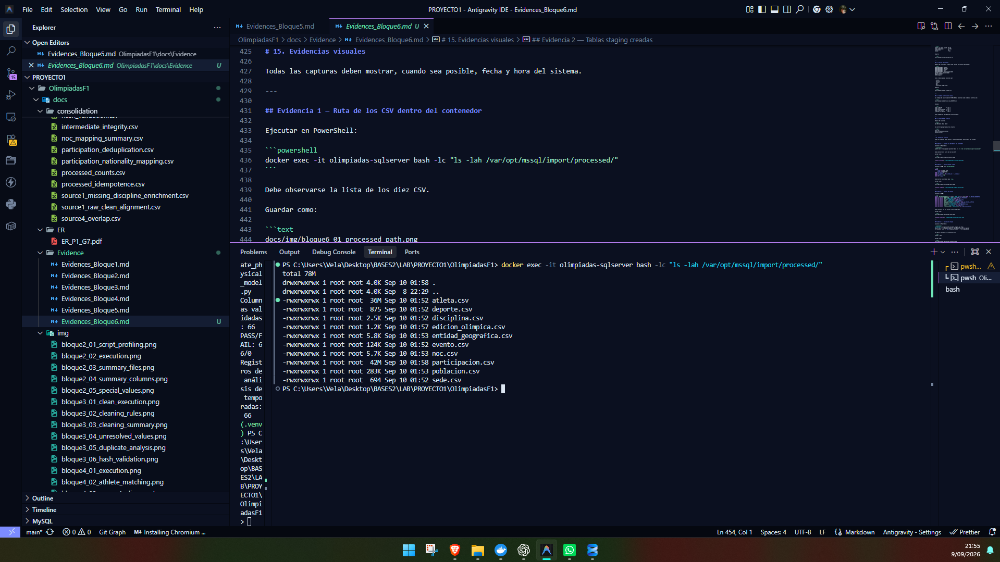

---

## Evidencia 2 — Tablas staging creadas

Ejecutar en SSMS sobre `OlimpiadasDB`:

```sql
SELECT
    s.name AS schema_name,
    t.name AS table_name
FROM sys.tables t
JOIN sys.schemas s ON s.schema_id = t.schema_id
WHERE s.name = 'stg'
ORDER BY t.name;
```

Debe mostrar diez tablas bajo `stg`.


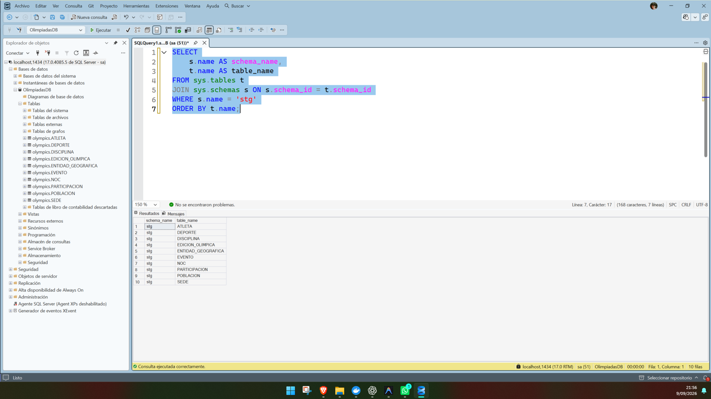

---

## Evidencia 3 — Conteos de staging

Ejecutar en SSMS:

```sql
SELECT 'ENTIDAD_GEOGRAFICA' AS tabla, COUNT_BIG(*) AS filas FROM stg.ENTIDAD_GEOGRAFICA
UNION ALL SELECT 'POBLACION', COUNT_BIG(*) FROM stg.POBLACION
UNION ALL SELECT 'NOC', COUNT_BIG(*) FROM stg.NOC
UNION ALL SELECT 'ATLETA', COUNT_BIG(*) FROM stg.ATLETA
UNION ALL SELECT 'SEDE', COUNT_BIG(*) FROM stg.SEDE
UNION ALL SELECT 'EDICION_OLIMPICA', COUNT_BIG(*) FROM stg.EDICION_OLIMPICA
UNION ALL SELECT 'DEPORTE', COUNT_BIG(*) FROM stg.DEPORTE
UNION ALL SELECT 'DISCIPLINA', COUNT_BIG(*) FROM stg.DISCIPLINA
UNION ALL SELECT 'EVENTO', COUNT_BIG(*) FROM stg.EVENTO
UNION ALL SELECT 'PARTICIPACION', COUNT_BIG(*) FROM stg.PARTICIPACION;
```

Debe coincidir con los conteos finales esperados.


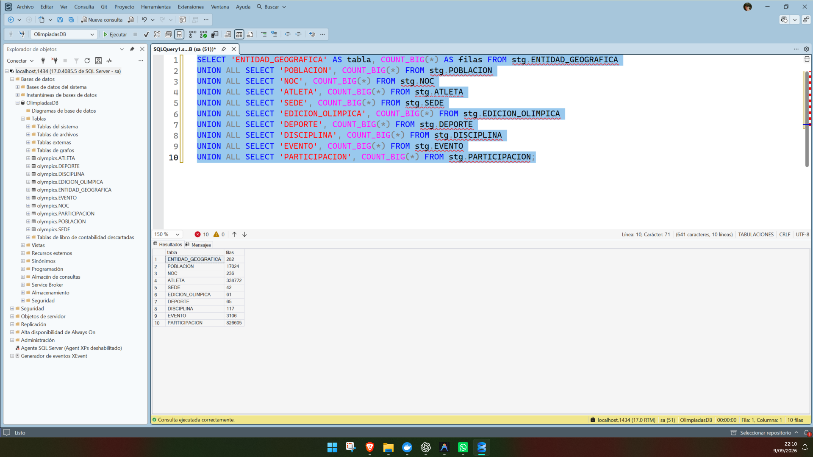

---

## Evidencia 4 — Validación staging

Ejecutar en PowerShell:

```powershell
Get-Content .\scripts\sql\05_validate_staging.sql -Raw |
docker exec -i olimpiadas-sqlserver /opt/mssql-tools18/bin/sqlcmd `
-S localhost -U sa -P "$env:MSSQL_SA_PASSWORD" -C -d OlimpiadasDB
```

La captura debe mostrar validaciones con:

```text
estado = PASS
```


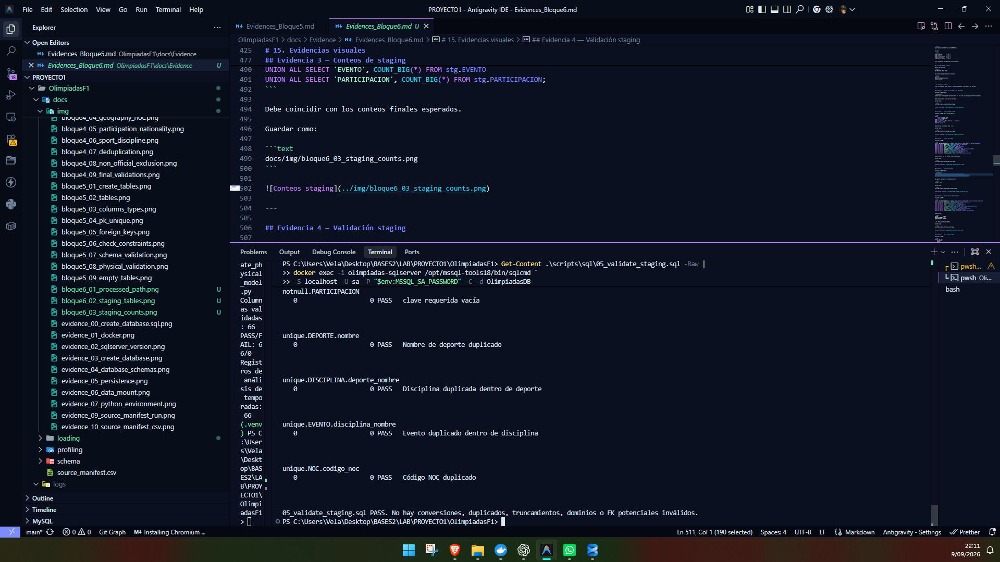

---

## Evidencia 5 — Conteos de las tablas finales

Ejecutar en SSMS:

```sql
SELECT 'ENTIDAD_GEOGRAFICA' AS tabla, COUNT_BIG(*) AS filas FROM olympics.ENTIDAD_GEOGRAFICA
UNION ALL SELECT 'POBLACION', COUNT_BIG(*) FROM olympics.POBLACION
UNION ALL SELECT 'NOC', COUNT_BIG(*) FROM olympics.NOC
UNION ALL SELECT 'ATLETA', COUNT_BIG(*) FROM olympics.ATLETA
UNION ALL SELECT 'SEDE', COUNT_BIG(*) FROM olympics.SEDE
UNION ALL SELECT 'EDICION_OLIMPICA', COUNT_BIG(*) FROM olympics.EDICION_OLIMPICA
UNION ALL SELECT 'DEPORTE', COUNT_BIG(*) FROM olympics.DEPORTE
UNION ALL SELECT 'DISCIPLINA', COUNT_BIG(*) FROM olympics.DISCIPLINA
UNION ALL SELECT 'EVENTO', COUNT_BIG(*) FROM olympics.EVENTO
UNION ALL SELECT 'PARTICIPACION', COUNT_BIG(*) FROM olympics.PARTICIPACION;
```

Debe mostrar:

```text
ATLETA          338772
EDICION_OLIMPICA 61
PARTICIPACION   826605
```

y los demás conteos aprobados.


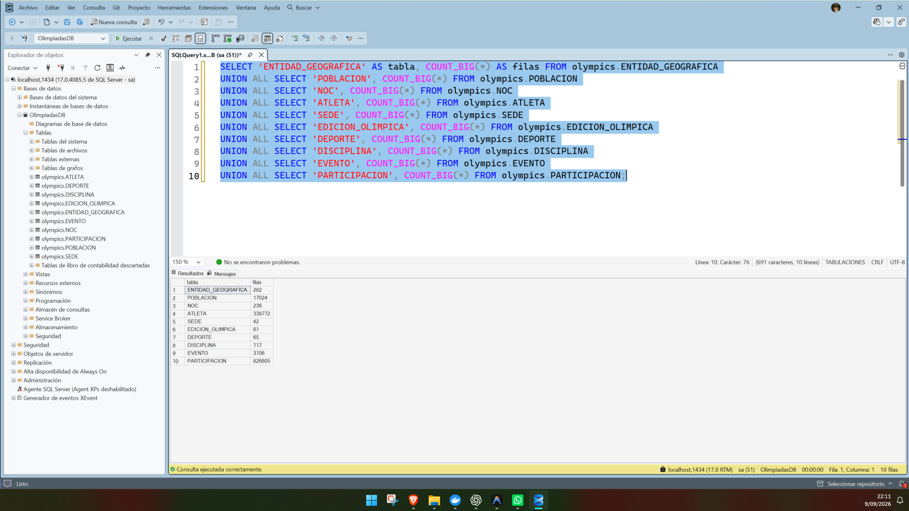

---

## Evidencia 6 — Tabla ATLETA cargada

Ejecutar en SSMS:

```sql
SELECT TOP (20)
    id_atleta,
    nombre,
    sexo,
    fecha_nacimiento,
    altura_cm,
    peso_kg
FROM olympics.ATLETA
ORDER BY id_atleta;
```


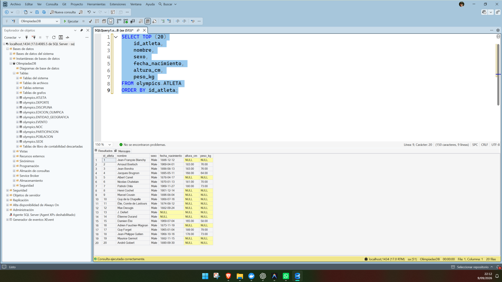

---

## Evidencia 7 — Tabla PARTICIPACION cargada

Ejecutar en SSMS:


```sql
SELECT TOP (20) *
FROM olympics.PARTICIPACION
ORDER BY id_participacion;
```


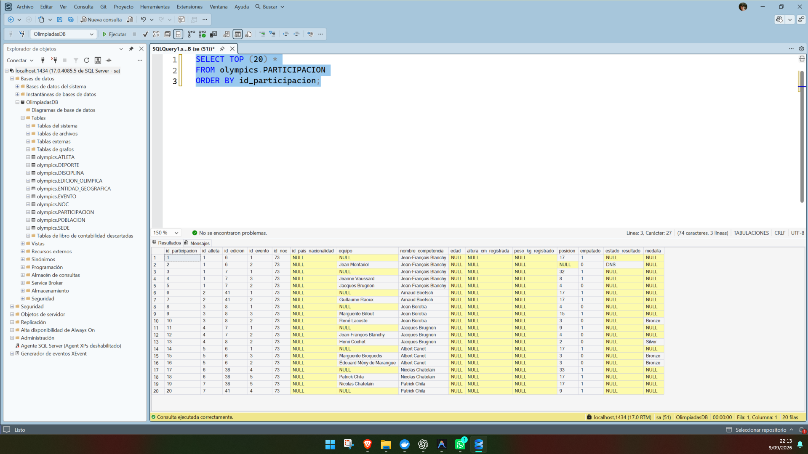

---

## Evidencia 8 — Constraints activos

Ejecutar en SSMS:

```sql
SELECT
    'PK_UNIQUE' AS tipo,
    COUNT(*) AS cantidad
FROM sys.key_constraints
WHERE parent_object_id IN (
    SELECT object_id
    FROM sys.tables
    WHERE schema_id = SCHEMA_ID('olympics')
)

UNION ALL

SELECT
    'FK',
    COUNT(*)
FROM sys.foreign_keys
WHERE parent_object_id IN (
    SELECT object_id
    FROM sys.tables
    WHERE schema_id = SCHEMA_ID('olympics')
)

UNION ALL

SELECT
    'CHECK',
    COUNT(*)
FROM sys.check_constraints
WHERE parent_object_id IN (
    SELECT object_id
    FROM sys.tables
    WHERE schema_id = SCHEMA_ID('olympics')
);
```

Debe observarse:

```text
PK_UNIQUE = 16
FK        = 14
CHECK     = 3
```


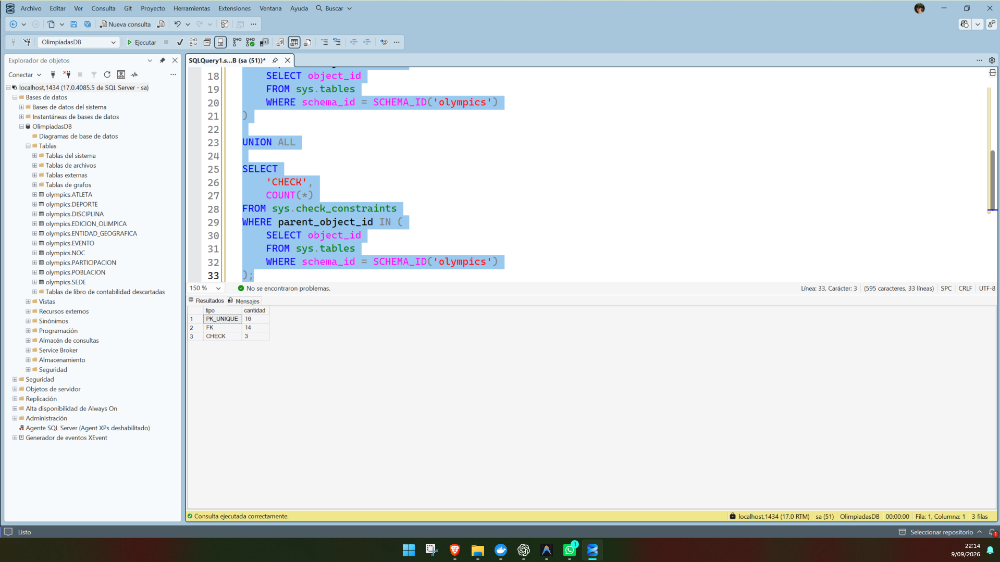

---

## Evidencia 9 — Índices adicionales

Ejecutar en SSMS:

```sql
SELECT
    OBJECT_NAME(i.object_id) AS tabla,
    i.name AS indice
FROM sys.indexes i
WHERE OBJECT_SCHEMA_NAME(i.object_id) = 'olympics'
  AND i.name LIKE 'IX_%'
ORDER BY tabla, indice;
```

Debe mostrar ocho índices adicionales.


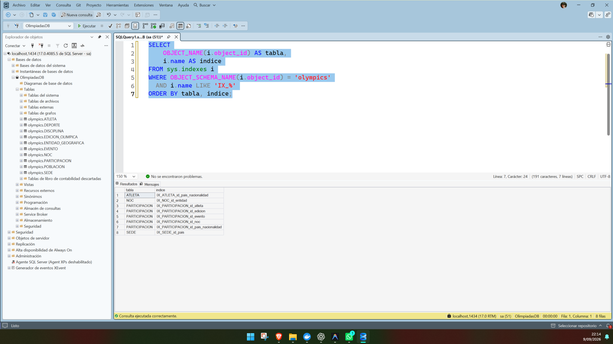

---

## Evidencia 10 — Validación final del Bloque 6

Ejecutar en PowerShell:

```powershell
Get-Content .\scripts\sql\08_validate_loaded_data.sql -Raw |
docker exec -i olimpiadas-sqlserver /opt/mssql-tools18/bin/sqlcmd `
-S localhost -U sa -P "$env:MSSQL_SA_PASSWORD" -C -d OlimpiadasDB
```

La salida debe mostrar las validaciones finales sin errores.


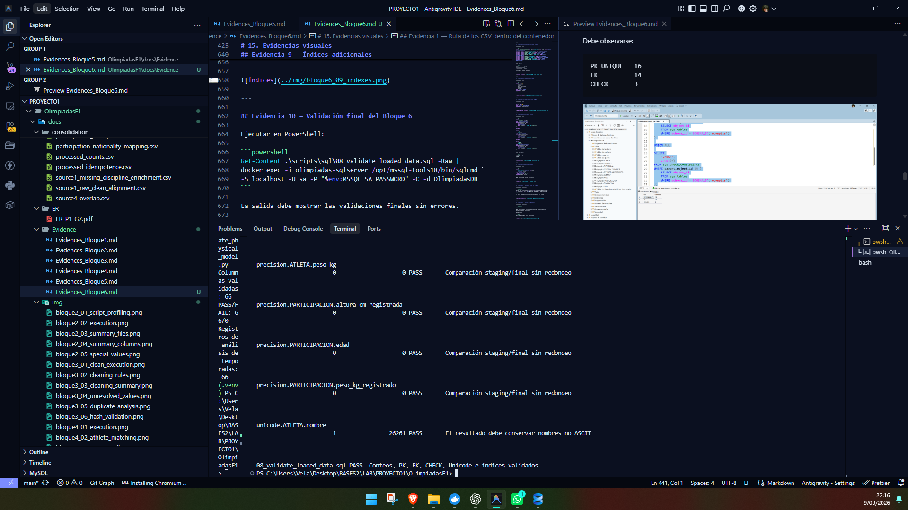

---

## Evidencia 11 — Auditoría reproducible

Ejecutar en PowerShell:

```powershell
.\.venv\Scripts\python.exe .\scripts\python\09_generate_loading_reports.py
```

Debe indicar que la auditoría fue regenerada y que las métricas históricas fueron conservadas.


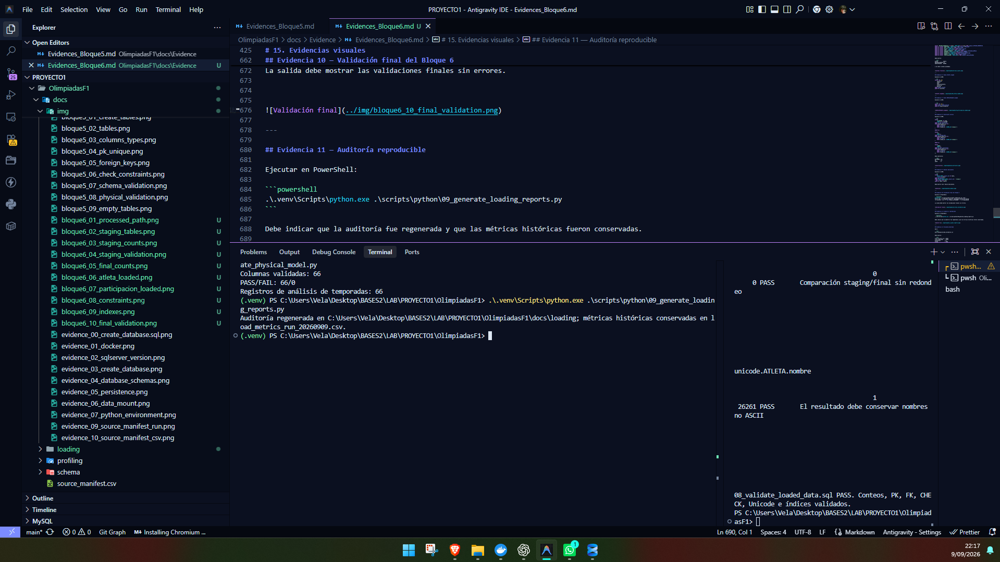

---

## Evidencia 12 — Unicode preservado

Abrir:

```text
docs/loading/unicode_validation.csv
```

Debe mostrar:

```text
filas_no_ascii_csv = 26261
filas_comparadas   = 26261
diferencias        = 0
estado             = PASS
```


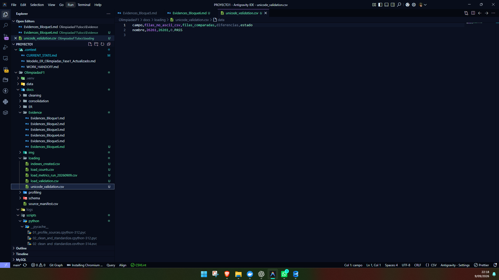

---

## 16. Qué NO ejecutar nuevamente

No volver a ejecutar:

```text
06_load_final.sql
```

porque las tablas finales ya contienen datos y el preflight debe abortar la carga.

Tampoco ejecutar:

```text
DELETE
TRUNCATE
DROP
00_reset_physical_tables.sql
```

No es necesario recargar ni recrear la base para obtener evidencias.

---

## 17. Resultado final

El Bloque 6 finalizó con:

```text
10/10 CSV cargados en staging
10/10 tablas finales cargadas
1,186,310 filas totales
338,772 atletas
826,605 participaciones
61 ediciones
0 PK duplicadas
0 FK huérfanas
0 conversiones inválidas
0 truncamientos
0 redondeos
26,261 nombres Unicode comparados
0 diferencias Unicode
8 índices adicionales
```

**Estado técnico final del Bloque 6: COMPLETADO Y APROBADO.**

No se inició el Bloque 7.
