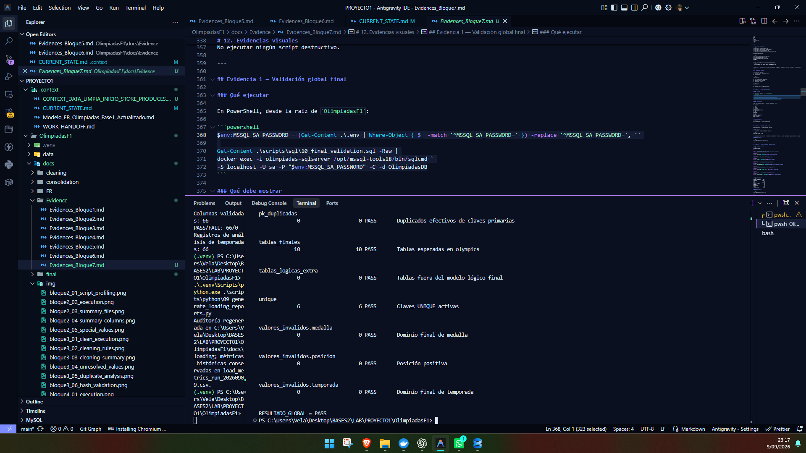
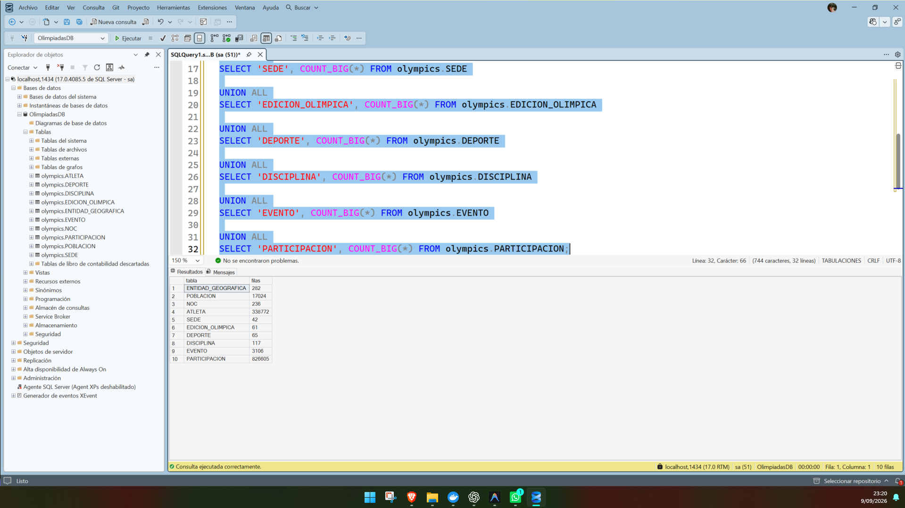
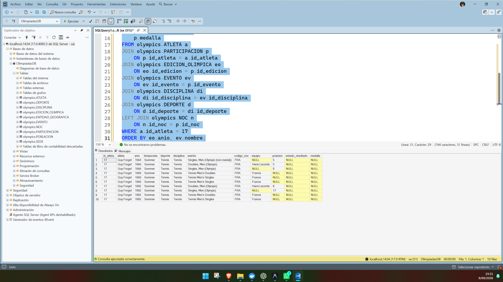
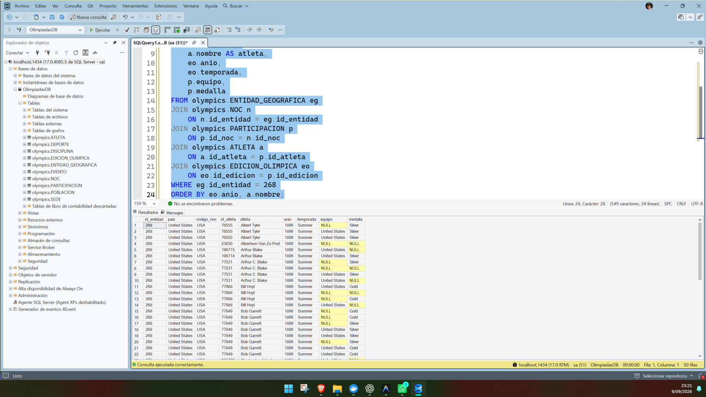
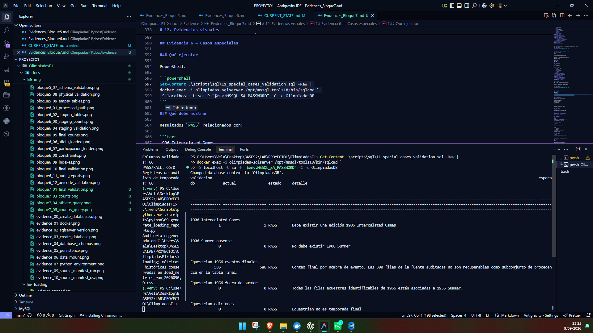
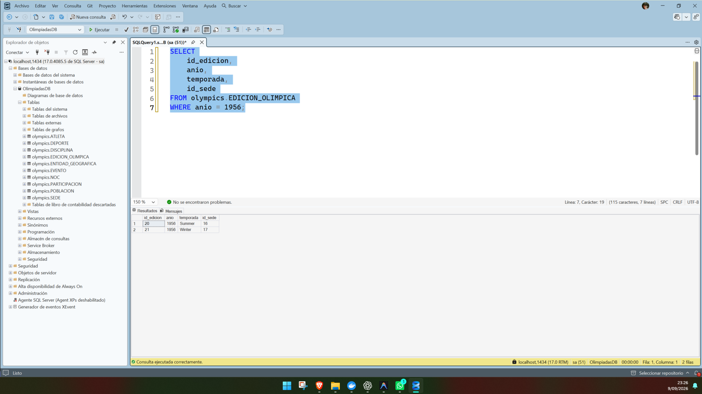
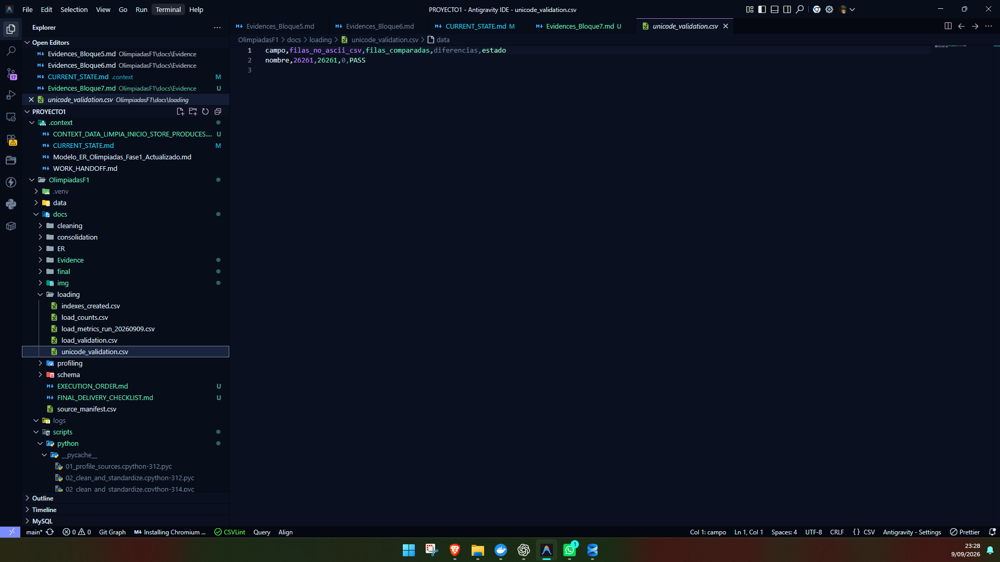
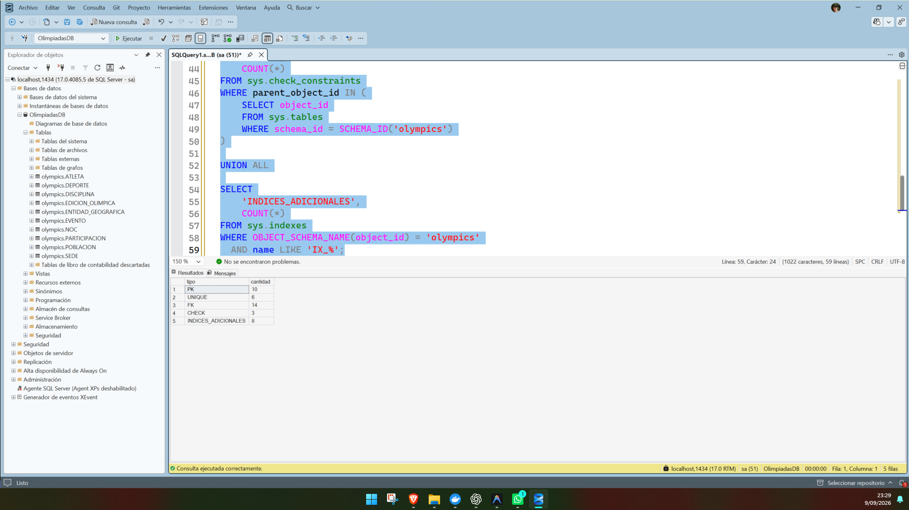
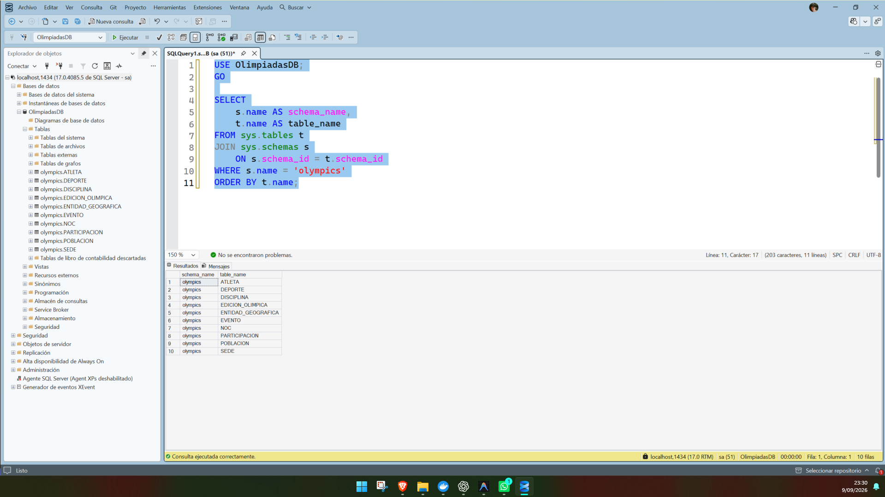

# Manual Técnico — Bloque 7: Validación final y cierre documental

## 1. Estado del bloque

El **Bloque 7 — Validación final, cierre documental y preparación de entrega** fue ejecutado sin modificar los datos cargados.

Durante este bloque:

- no se recargaron datos;
- no se ejecutó `06_load_final.sql`;
- no se ejecutaron resets;
- no se utilizaron `DELETE`, `TRUNCATE` ni `DROP`;
- no se modificaron los CSV de `data/raw/`, `data/intermediate/` ni `data/processed/`;
- no se implementaron procedimientos almacenados;
- no se inició ningún Bloque 8.

Resultado técnico vigente:

```text
10_final_validation = 26/26 PASS
11_special_cases_validation = 8/8 PASS
RESULTADO_GLOBAL = PASS
RESULTADO_CASOS_ESPECIALES = PASS
FINAL_DATABASE_VALIDATION_PASS

Las validaciones SQL fueron regeneradas después de la aplicación oficial del Bloque 4 y de la reconstrucción/verificación de OlimpiadasDB.

La corrida histórica previa al Bloque 4 documentó 338,772 atletas, 3,106 eventos, 826,605 participaciones y un total de 1,186,310 filas. Esos valores se conservan como trazabilidad de la ejecución anterior y no representan el estado vigente.
```

**Estado técnico del Bloque 7: FINAL_DATABASE_VALIDATION_PASS.** La revisión externa y la incorporación de capturas visuales finales permanecen como tareas manuales de entrega.

Las capturas visuales deben agregarse manualmente como evidencia final.

---

## 2. Objetivo

El objetivo de este bloque es demostrar que todo el proyecto quedó consistente, cargado, reproducible y listo para entrega.

Las actividades principales fueron:

- auditar estructura y conteos finales;
- verificar constraints e índices;
- comprobar PK duplicadas y FK huérfanas;
- validar casos especiales;
- ejecutar consultas funcionales;
- revisar Unicode y precisión decimal;
- documentar el orden de ejecución;
- preparar el README;
- preparar el checklist de entrega;
- preparar el handoff técnico para los compañeros que desarrollarán los procedimientos almacenados.

---

## 3. Estado final de la base

Base:

```text
OlimpiadasDB
```

Schema final:

```text
olympics
```

Schema auxiliar ETL:

```text
stg
```

El schema `stg` no forma parte del modelo lógico final y no debe utilizarse en los procedimientos almacenados posteriores.

---

## 4. Tablas finales

Las diez entidades finales son:

1. `olympics.ENTIDAD_GEOGRAFICA`
2. `olympics.POBLACION`
3. `olympics.NOC`
4. `olympics.ATLETA`
5. `olympics.SEDE`
6. `olympics.EDICION_OLIMPICA`
7. `olympics.DEPORTE`
8. `olympics.DISCIPLINA`
9. `olympics.EVENTO`
10. `olympics.PARTICIPACION`

No forman parte del modelo lógico final:

```text
FUENTE
RESULTADO
MEDALLA
TIPO_MEDALLA
```

---

## 5. Conteos finales

| Entidad | Filas |
|---|---:|
| ENTIDAD_GEOGRAFICA | 282 |
| POBLACION | 17,024 |
| NOC | 236 |
| ATLETA | 336,419 |
| SEDE | 42 |
| EDICION_OLIMPICA | 61 |
| DEPORTE | 65 |
| DISCIPLINA | 117 |
| EVENTO | 3,007 |
| PARTICIPACION | 733,414 |

Total:

```text
1,090,667 filas
```

---

## 6. Estructura y restricciones

Resultado final:

```text
Tablas:              10
Columnas:            66
PK:                  10
UNIQUE:               6
FK:                  14
CHECK:                3
Índices adicionales:  8
```

También se verificó:

```text
PK duplicadas:       0
FK huérfanas:        0
Dominios inválidos:  0
```

---

## 7. Validación DECIMAL

Los siete campos DECIMAL conservaron su precisión sin redondeo:

```text
ATLETA.altura_cm                    DECIMAL(5,2)
ATLETA.peso_kg                      DECIMAL(5,2)
ATLETA.latitud                      DECIMAL(19,16)
ATLETA.longitud                     DECIMAL(19,16)
PARTICIPACION.edad                  DECIMAL(5,2)
PARTICIPACION.altura_cm_registrada  DECIMAL(5,2)
PARTICIPACION.peso_kg_registrado    DECIMAL(16,13)
```

Resultado:

```text
Discrepancias: 0
Redondeos:     0
```

---

## 8. Validación Unicode

Se compararon exactamente los nombres no ASCII de:

```text
data/processed/atleta.csv
```

contra:

```text
olympics.ATLETA
```

por medio de `id_atleta`.

Resultado:

```text
Nombres no ASCII:  26,261
Filas comparadas:  26,261
Diferencias:       0
Estado:            PASS
```

---

## 9. Casos especiales

### 9.1 Atenas 1906

Debe existir únicamente como:

```text
1906 | Intercalated Games
```

No debe existir:

```text
1906 | Summer
```

### 9.2 Equestrian 1956

No debe existir una edición final con:

```text
temporada = 'Equestrian'
```

Las pruebas ecuestres de 1956 fueron homologadas a:

```text
1956 | Summer
```

La excepción histórica de Stockholm quedó documentada en el Bloque 4.

El conteo final vigente es de **536 participaciones**. El valor histórico pre-Bloque 4 era **586**; la reducción de 50 corresponde exclusivamente a 50 duplicados complementarios preexistentes eliminados por el plan de consolidación. No se eliminaron atletas ni eventos lógicos: permanecen **396 atletas distintos** y **6 eventos distintos**.

### 9.3 Youth Olympic Games

Se conservan:

```text
Summer Youth: 3 ediciones
Winter Youth: 3 ediciones
```

### 9.4 Zappas

La exclusión de la participación de `1888-89 Zappas Olympic Games` fue auditada en el Bloque 4.

En el modelo final no se conserva el atributo de procedencia original `Games`, por lo que la trazabilidad específica de esa fila permanece en los reportes de consolidación.

No existen atributos finales `Zappas` en los campos inspeccionados del modelo final.

---

## 10. Consultas funcionales

Se ejecutaron pruebas funcionales para demostrar que el modelo soporta las consultas posteriores.

### Consulta por atleta

Ruta:

```text
ATLETA
→ PARTICIPACION
→ EDICION_OLIMPICA
→ EVENTO
→ DISCIPLINA
→ DEPORTE
→ NOC
```

Atleta de prueba:

```text
Guy Forget
id_atleta = 17
```

### Consulta por país/NOC

Ruta:

```text
ENTIDAD_GEOGRAFICA
→ NOC
→ PARTICIPACION
→ ATLETA
→ EDICION_OLIMPICA
```

Entidad de prueba:

```text
United States
id_entidad = 268
NOC = USA
```

También se probaron casos de:

```text
Unicode
medalla
sin medalla
DNF
DNS
DQ
empate
NOC histórico
Youth
1906
```

---

## 11. Scripts del Bloque 7

```text
scripts/sql/10_final_validation.sql
scripts/sql/11_special_cases_validation.sql
scripts/sql/12_functional_queries.sql
scripts/python/13_generate_final_validation_report.py
```

Documentación generada:

```text
docs/final/final_validation_report.csv
docs/EXECUTION_ORDER.md
docs/FINAL_DELIVERY_CHECKLIST.md
docs/Evidence/Evidences_Bloque7.md
README.md
```

Handoff interno para los procedimientos almacenados:

```text
.context/CONTEXT_DATA_LIMPIA_INICIO_STORE_PRODUCES.md
```

Ese archivo es únicamente material de apoyo para los integrantes del grupo y no forma parte de la entrega académica oficial.

---

# 12. Evidencias visuales

Antes de tomar capturas:

1. Abrir SQL Server Management Studio.
2. Conectarse a:

```text
localhost,1434
```

3. Usar autenticación SQL Server.
4. Abrir una nueva consulta.
5. Seleccionar arriba:

```text
OlimpiadasDB
```

No ejecutar ningún script destructivo.

---

## Evidencia 1 — Validación global final

### Qué ejecutar

En PowerShell, desde la raíz de `OlimpiadasF1`:

```powershell
$env:MSSQL_SA_PASSWORD = (Get-Content .\.env | Where-Object { $_ -match '^MSSQL_SA_PASSWORD=' }) -replace '^MSSQL_SA_PASSWORD=', ''

Get-Content .\scripts\sql\10_final_validation.sql -Raw |
docker exec -i olimpiadas-sqlserver /opt/mssql-tools18/bin/sqlcmd `
-S localhost -U sa -P "$env:MSSQL_SA_PASSWORD" -C -d OlimpiadasDB
```

### Qué debe mostrar

Debe observarse la auditoría final con resultados `PASS`.

En especial:

```text
10 tablas
66 columnas
336419 atletas
733414 participaciones
61 ediciones
10 PK
6 UNIQUE
14 FK
3 CHECK
8 índices adicionales
0 PK duplicadas
0 FK huérfanas
```




---


## Evidencia 3 — Conteos finales de las diez tablas

### Qué ejecutar en SSMS

```sql
USE OlimpiadasDB;
GO

SELECT 'ENTIDAD_GEOGRAFICA' AS tabla, COUNT_BIG(*) AS filas
FROM olympics.ENTIDAD_GEOGRAFICA

UNION ALL
SELECT 'POBLACION', COUNT_BIG(*) FROM olympics.POBLACION

UNION ALL
SELECT 'NOC', COUNT_BIG(*) FROM olympics.NOC

UNION ALL
SELECT 'ATLETA', COUNT_BIG(*) FROM olympics.ATLETA

UNION ALL
SELECT 'SEDE', COUNT_BIG(*) FROM olympics.SEDE

UNION ALL
SELECT 'EDICION_OLIMPICA', COUNT_BIG(*) FROM olympics.EDICION_OLIMPICA

UNION ALL
SELECT 'DEPORTE', COUNT_BIG(*) FROM olympics.DEPORTE

UNION ALL
SELECT 'DISCIPLINA', COUNT_BIG(*) FROM olympics.DISCIPLINA

UNION ALL
SELECT 'EVENTO', COUNT_BIG(*) FROM olympics.EVENTO

UNION ALL
SELECT 'PARTICIPACION', COUNT_BIG(*) FROM olympics.PARTICIPACION;
```

### Qué debe mostrar

```text
ENTIDAD_GEOGRAFICA     282
POBLACION            17024
NOC                     236
ATLETA               336419
SEDE                     42
EDICION_OLIMPICA         61
DEPORTE                   65
DISCIPLINA               117
EVENTO                  3007
PARTICIPACION         733414
```



---

## Evidencia 4 — Consulta funcional por atleta

### Opción recomendada

Abrir:

```text
scripts/sql/12_functional_queries.sql
```

en SSMS y ejecutar únicamente la sección de consulta por atleta.

El script debe seleccionar dinámicamente o utilizar el atleta de prueba:

```text
Guy Forget
id_atleta = 17
```

### Si se desea una consulta manual

```sql
USE OlimpiadasDB;
GO

SELECT
    a.id_atleta,
    a.nombre AS atleta,
    eo.anio,
    eo.temporada,
    d.nombre AS deporte,
    di.nombre AS disciplina,
    ev.nombre AS evento,
    n.codigo_noc,
    p.equipo,
    p.posicion,
    p.estado_resultado,
    p.medalla
FROM olympics.ATLETA a
JOIN olympics.PARTICIPACION p
    ON p.id_atleta = a.id_atleta
JOIN olympics.EDICION_OLIMPICA eo
    ON eo.id_edicion = p.id_edicion
JOIN olympics.EVENTO ev
    ON ev.id_evento = p.id_evento
JOIN olympics.DISCIPLINA di
    ON di.id_disciplina = ev.id_disciplina
JOIN olympics.DEPORTE d
    ON d.id_deporte = di.id_deporte
LEFT JOIN olympics.NOC n
    ON n.id_noc = p.id_noc
WHERE a.id_atleta = 17
ORDER BY eo.anio, ev.nombre;
```

### Qué mostrar

Que una sola consulta recorre correctamente todas las relaciones del atleta.

### Nombre sugerido



---

## Evidencia 5 — Consulta funcional por país/NOC

### Opción recomendada

Abrir:

```text
scripts/sql/12_functional_queries.sql
```

y ejecutar la sección de consulta por país/NOC.

Entidad de prueba:

```text
United States
id_entidad = 268
NOC = USA
```

### Consulta manual

```sql
USE OlimpiadasDB;
GO

SELECT TOP (50)
    eg.id_entidad,
    eg.nombre AS pais,
    n.codigo_noc,
    a.id_atleta,
    a.nombre AS atleta,
    eo.anio,
    eo.temporada,
    p.equipo,
    p.medalla
FROM olympics.ENTIDAD_GEOGRAFICA eg
JOIN olympics.NOC n
    ON n.id_entidad = eg.id_entidad
JOIN olympics.PARTICIPACION p
    ON p.id_noc = n.id_noc
JOIN olympics.ATLETA a
    ON a.id_atleta = p.id_atleta
JOIN olympics.EDICION_OLIMPICA eo
    ON eo.id_edicion = p.id_edicion
WHERE eg.id_entidad = 268
ORDER BY eo.anio, a.nombre;
```

### Qué mostrar

Que el modelo permite consultar correctamente:

```text
país → NOC → participación → atleta → edición
```

### Nombre sugerido



---

## Evidencia 6 — Casos especiales

### Qué ejecutar

PowerShell:

```powershell
Get-Content .\scripts\sql\11_special_cases_validation.sql -Raw |
docker exec -i olimpiadas-sqlserver /opt/mssql-tools18/bin/sqlcmd `
-S localhost -U sa -P "$env:MSSQL_SA_PASSWORD" -C -d OlimpiadasDB
```

### Qué debe mostrar

Resultados `PASS` relacionados con:

```text
1906 Intercalated Games
1906 Summer ausente
Equestrian ausente
Youth preservado
Zappas auditado
```

y al final:

```text
RESULTADO_CASOS_ESPECIALES = PASS
```

### Nombre sugerido




---

## Evidencia 7 — Ausencia de Equestrian

### Qué ejecutar en SSMS

```sql
USE OlimpiadasDB;
GO

SELECT
    COUNT_BIG(*) AS ediciones_equestrian
FROM olympics.EDICION_OLIMPICA
WHERE temporada = N'Equestrian';
```

### Resultado esperado

```text
0
```

También puede mostrarse 1956:

```sql
SELECT
    id_edicion,
    anio,
    temporada,
    id_sede
FROM olympics.EDICION_OLIMPICA
WHERE anio = 1956;
```

### Nombre sugerido



---

## Evidencia 8 — Validación Unicode exacta

### Opción 1

Abrir:

```text
docs/loading/unicode_validation.csv
```

en VS Code o Excel.

Debe mostrar:

```text
campo                nombre
filas_no_ascii_csv   26261
filas_comparadas     26261
diferencias          0
estado               PASS
```



---

## Evidencia 9 — Constraints e índices

### Qué ejecutar en SSMS

```sql
USE OlimpiadasDB;
GO

SELECT
    'PK' AS tipo,
    COUNT(*) AS cantidad
FROM sys.key_constraints
WHERE type = 'PK'
  AND parent_object_id IN (
      SELECT object_id
      FROM sys.tables
      WHERE schema_id = SCHEMA_ID('olympics')
  )

UNION ALL

SELECT
    'UNIQUE',
    COUNT(*)
FROM sys.key_constraints
WHERE type = 'UQ'
  AND parent_object_id IN (
      SELECT object_id
      FROM sys.tables
      WHERE schema_id = SCHEMA_ID('olympics')
  )

UNION ALL

SELECT
    'FK',
    COUNT(*)
FROM sys.foreign_keys
WHERE parent_object_id IN (
    SELECT object_id
    FROM sys.tables
    WHERE schema_id = SCHEMA_ID('olympics')
)

UNION ALL

SELECT
    'CHECK',
    COUNT(*)
FROM sys.check_constraints
WHERE parent_object_id IN (
    SELECT object_id
    FROM sys.tables
    WHERE schema_id = SCHEMA_ID('olympics')
)

UNION ALL

SELECT
    'INDICES_ADICIONALES',
    COUNT(*)
FROM sys.indexes
WHERE OBJECT_SCHEMA_NAME(object_id) = 'olympics'
  AND name LIKE 'IX_%';
```

### Resultado esperado

```text
PK                   10
UNIQUE                6
FK                   14
CHECK                 3
INDICES_ADICIONALES   8
```

### Nombre sugerido



---

## Evidencia 10 — Estructura final de las diez tablas

### Qué mostrar

En SSMS:

```text
Databases
└── OlimpiadasDB
    └── Tables
```

Expandir el nodo y mostrar las diez tablas `olympics.*`.

También ejecutar:

```sql
USE OlimpiadasDB;
GO

SELECT
    s.name AS schema_name,
    t.name AS table_name
FROM sys.tables t
JOIN sys.schemas s
    ON s.schema_id = t.schema_id
WHERE s.name = 'olympics'
ORDER BY t.name;
```

### Resultado esperado

Diez filas correspondientes a las diez tablas finales.



---


# 13. Qué NO ejecutar

Durante la toma de evidencias del Bloque 7 no ejecutar:

```text
scripts/sql/00_reset_physical_tables.sql
scripts/sql/03_reset_staging.sql
scripts/sql/06_load_final.sql
```

Tampoco utilizar:

```sql
DELETE
TRUNCATE
DROP
```

No es necesario volver a limpiar, consolidar o cargar datos.

---

# 14. Orden recomendado para sacar las capturas

Para evitar repetir trabajo:

```text
1. Abrir SSMS y seleccionar OlimpiadasDB.
2. Sacar estructura final.
3. Sacar conteos finales.
4. Sacar constraints e índices.
5. Ejecutar consulta funcional por atleta.
6. Ejecutar consulta funcional por país.
7. Ejecutar consulta Equestrian = 0.
8. Ejecutar 11_special_cases_validation.sql.
9. Ejecutar 10_final_validation.sql.
10. Capturar RESULTADO_GLOBAL = PASS.
11. Abrir unicode_validation.csv.
12. Abrir README + EXECUTION_ORDER.
13. Abrir FINAL_DELIVERY_CHECKLIST.md.
14. Opcional: regenerar final_validation_report.csv y capturarlo.
```

---

# 15. Resultado final del Bloque 7

```text
Validaciones SQL post-Bloque 4:  PASS
10_final_validation:               26/26 PASS
11_special_cases_validation:        8/8 PASS
FINAL_DATABASE_VALIDATION:          PASS
Tablas finales:                   10
Columnas:                         66
ATLETA esperado:                  336,419
PARTICIPACION esperada:           733,414
EVENTO esperado:                  3,007
Total esperado:                   1,090,667
EDICION_OLIMPICA:                 61
PK:                               10
UNIQUE:                            6
FK:                               14
CHECK:                             3
Índices adicionales:               8
PK duplicadas:                     0
FK huérfanas:                      0
Discrepancias DECIMAL:             0
Unicode comparado:            26,261
Diferencias Unicode:               0
RAW SHA-256:                   10/10 MATCH
1906:                         PASS
Equestrian final:                 0
Youth:                         PASS
```

**Estado técnico vigente:** `FINAL_DATABASE_VALIDATION_PASS`. El reporte final vigente contiene 34/34 validaciones PASS. Las capturas visuales finales siguen pendientes de incorporación manual si todavía no han sido tomadas.

No existe un Bloque 8 dentro del alcance actual.
