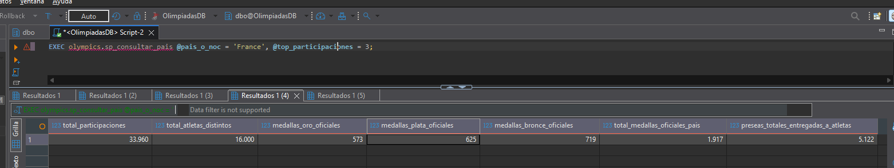
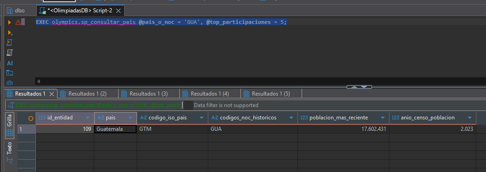
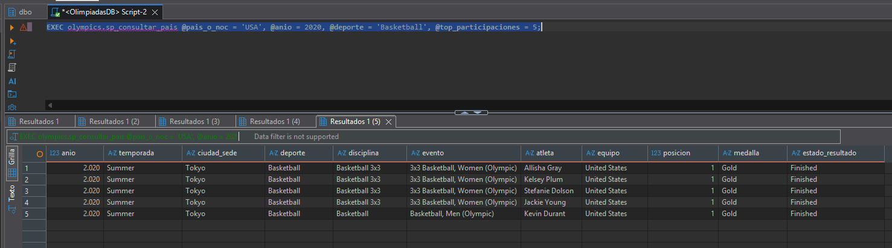
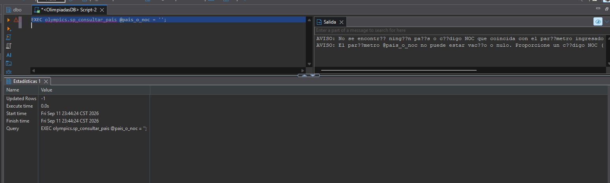
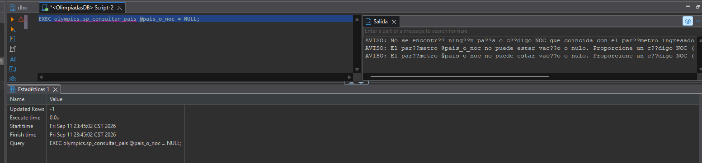

# Manual Técnico — Inciso e): Stored Procedure de Consulta de País y Sedes Olímpicas

## 1. Identificación y Estado Técnico

- **Asignatura:** Sistemas de Bases de Datos 2 — 2do. Semestre 2026
- **Proyecto:** Fase 1 — Integración y Homologación de Datos Históricos Olímpicos (1896 – 2024)
- **Grupo:** 7
- **Inciso:** e) Stored Procedure de consulta por País y Sedes
- **Script SQL Oficial:** [`OlimpiadasF1/scripts/sql/14_sp_consultar_pais.sql`](../../scripts/sql/14_sp_consultar_pais.sql)
- **Base de Datos:** `OlimpiadasDB`
- **Esquema de Producción:** `olympics`
- **Motor:** Microsoft SQL Server 2025 Developer — Contenedor Docker `olimpiadas-sqlserver`
- **Estado Técnico:** `STORED_PROCEDURE_E_VALIDATION_PASS` (100% Funcional y Verificado en Docker)
- **Fecha de verificación final:** 2026-09-12
- **Magnitudes de la BD al momento de la verificación:**

| Tabla | Filas | Verificado por |
|---|---:|---|
| `olympics.ENTIDAD_GEOGRAFICA` | 282 | `10_final_validation.sql` PASS |
| `olympics.POBLACION` | 17,024 | `10_final_validation.sql` PASS |
| `olympics.NOC` | 236 | `10_final_validation.sql` PASS |
| `olympics.ATLETA` | 336,419 | `10_final_validation.sql` PASS |
| `olympics.SEDE` | 42 | `10_final_validation.sql` PASS |
| `olympics.EDICION_OLIMPICA` | 61 | `10_final_validation.sql` PASS |
| `olympics.DEPORTE` | 65 | `10_final_validation.sql` PASS |
| `olympics.DISCIPLINA` | 117 | `10_final_validation.sql` PASS |
| `olympics.EVENTO` | 3,007 | `10_final_validation.sql` PASS |
| `olympics.PARTICIPACION` | 733,414 | `10_final_validation.sql` PASS |
| **TOTAL** | **1,090,667** | — |

---

## 2. Alcance y Objetivos

### 2.1. Requerimiento Oficial del Enunciado (Inciso e)
> *"Desarrollar un procedimiento almacenado que consulte información por País, incluyendo si ha sido sede de juegos olímpicos (y en qué años), medallero, atletas y participaciones."*

### 2.2. Alcance Técnico
Este componente implementa el procedimiento almacenado `olympics.sp_consultar_pais` bajo estrictos estándares de ingeniería de bases de datos:
1. **Consultas de Solo Lectura sobre el Modelo Final:** Opera exclusivamente sobre el esquema `olympics`, respetando la inmutabilidad de los datos y sin acceder a tablas intermedias (`stg`).
2. **Resolución Inteligente de Entidades:** Permite invocar la consulta indistintamente mediante código olímpico NOC (`'GUA'`, `'FRA'`, `'USA'`), código ISO 3 (`'GTM'`, `'FRA'`), o nombre común de la entidad geográfica (`'Guatemala'`, `'France'`).
3. **Control de Calidad de Datos (Regla de Oro contra la Inflación de Medallas):** En competiciones por equipo (fútbol, básquetbol, relevos 4x100), se evita la trampa clásica de contar múltiples oros para un mismo evento. El procedimiento reporta tanto el medallero oficial por evento único como las preseas físicas totales entregadas a los deportistas.
4. **Relación Fiel de Sedes Olímpicas:** Conecta la jerarquía `EDICION_OLIMPICA -> SEDE -> ENTIDAD_GEOGRAFICA` para determinar con rigor histórico si el país albergó ediciones olímpicas, especificando año, temporada y ciudad anfitriona.
5. **Filtrado Avanzado:** Admite filtros opcionales por año de edición (`@anio`), temporada (`@temporada`) y disciplina o deporte (`@deporte`), con paginación defensiva (`@top_participaciones`).
6. **Manejo Defensivo de Entradas:** Valida parámetros vacíos, nulos e inexistentes con mensajes descriptivos sin generar excepciones no controladas.

---

## 3. Arquitectura del Procedimiento Almacenado


### 3.2. Estructura de Parámetros de Entrada

| Parámetro | Tipo | Requerido | Valor por Defecto | Descripción |
|---|---|:---:|:---:|---|
| `@pais_o_noc` | `NVARCHAR(150)` | **SÍ** | N/A | Identificador del país. Acepta código NOC de 3 letras (`'GUA'`), código ISO (`'GTM'`) o nombre de la entidad (`'Guatemala'`). |
| `@anio` | `SMALLINT` | NO | `NULL` | Filtro opcional por año olímpico (ej. `2024`, `2012`). |
| `@temporada` | `NVARCHAR(20)` | NO | `NULL` | Filtro opcional por temporada (`Summer`, `Winter`, `Summer Youth`, `Winter Youth`, `Intercalated Games`). |
| `@deporte` | `NVARCHAR(150)` | NO | `NULL` | Filtro opcional por nombre de deporte (ej. `'Athletics'`, `'Shooting'`, `'Swimming'`). |
| `@top_participaciones` | `INT` | NO | `50` | Límite de registros en el detalle de participaciones para optimizar el rendimiento y legibilidad. |

### 3.3. Lógica de Resolución de Entidades (Cascada de 4 Niveles)

El procedimiento resuelve el `@id_entidad` interno mediante una cascada de búsquedas en orden de especificidad:

1. **Nivel 1 — Código NOC exacto:** `WHERE n.codigo_noc = UPPER(@param_limpio)` — Resuelve `'GUA'`, `'FRA'`, `'USA'`.
2. **Nivel 2 — Código ISO de país:** `WHERE eg.codigo_pais = UPPER(@param_limpio)` — Resuelve `'GTM'`, `'DEU'`, `'BRA'`.
3. **Nivel 3 — Nombre exacto de entidad:** `WHERE eg.nombre = @param_limpio` — Resuelve `'Guatemala'`, `'France'`.
4. **Nivel 4 — Búsqueda parcial (LIKE):** `WHERE eg.nombre LIKE '%' + @param_limpio + '%'` — Resuelve coincidencias parciales como `'United'` → `United States`.

Si ningún nivel resuelve la entidad, se emite un `RAISERROR` descriptivo y se termina la ejecución.

---

## 4. Diseño de los Conjuntos de Resultados (Resultsets)

El procedimiento devuelve cuatro conjuntos de resultados (5 resultsets incluyendo el subtabla 2.1):

### Resultset 1: Perfil General y Población Censal
Proporciona la identidad formal de la entidad geográfica, consolidando todos los códigos NOC históricos asociados (vía `STRING_AGG`) y cruzando con la tabla `olympics.POBLACION` para extraer el censo más reciente disponible y el año de registro.

| Columna | Tipo | Descripción |
|---|---|---|
| `id_entidad` | `INT` | Identificador interno de la entidad geográfica |
| `pais` | `NVARCHAR(150)` | Nombre oficial del país |
| `codigo_iso_pais` | `NVARCHAR(20)` | Código ISO-3 del país (ej. `FRA`, `GTM`) o `'N/A'` si no aplica |
| `codigos_noc_historicos` | `NVARCHAR(MAX)` | Lista de todos los códigos NOC asociados históricamente (ej. `'FRG, GDR, GER, SAA'` para Alemania) |
| `poblacion_mas_reciente` | `BIGINT` | Población del censo más reciente disponible |
| `anio_censo_poblacion` | `SMALLINT` | Año del censo poblacional |

### Resultset 2: Condición Histórica de SEDE Olímpica
Resuelve el requerimiento específico del enunciado:
- `ha_sido_sede`: Valor textual `'SÍ'` o `'NO'`.
- `total_ediciones_como_sede`: Total numérico de ediciones donde actuó como anfitrión.
- `ciudades_sede`: Lista consolidada de ciudades anfitrionas (vía `STRING_AGG`).
- `resumen_ediciones_como_sede`: Detalle en un solo campo (ej. `Paris (1900 Summer), Paris (1924 Summer), Paris (2024 Summer)`). Si nunca ha sido sede, retorna el mensaje explícito: `'Este país nunca ha sido sede de Juegos Olímpicos'`.

### Resultset 2.1: Detalle Tabular de Ediciones como Sede
Desglose por fila de cada edición organizada (`id_edicion`, `anio`, `temporada`, `ciudad_sede`), ordenado cronológicamente.

### Resultset 3: Medallero Histórico y Estadísticas de Participación
Aplica la regla de oro de calidad de datos:
1. **`total_participaciones`**: Total de registros de actuación del país (incluye registros consolidados de múltiples fuentes).
2. **`total_atletas_distintos`**: Total de deportistas únicos (`COUNT(DISTINCT id_atleta)`) que han representado al país.
3. **`medallas_oro_oficiales`**: Conteo de eventos únicos ganados con Oro (`DISTINCT (id_edicion, id_evento, medalla)`).
4. **`medallas_plata_oficiales`**: Conteo de eventos únicos ganados con Plata.
5. **`medallas_bronce_oficiales`**: Conteo de eventos únicos ganados con Bronce.
6. **`total_medallas_oficiales_pais`**: Sumatoria del medallero por evento único.
7. **`preseas_totales_entregadas_a_atletas`**: Total de medallas físicas entregadas (incluyendo cada integrante de equipos colectivos).

> **Nota sobre la consolidación multi-fuente:** Los conteos de participaciones y atletas reflejan la integración de 4 fuentes de datos con nomenclaturas de eventos diferentes (ej. `"20 kilometres Race Walk, Men (Olympic)"` vs `"Athletics Men's 20 kilometres Walk"`). Estos registros provenientes de distintas fuentes no fueron deduplicados a nivel de evento durante el proceso ETL, por lo que los totales de participaciones incluyen contribuciones de cada fuente. El conteo de medallas por `DISTINCT (id_edicion, id_evento, medalla)` minimiza la inflación de deportes de equipo, aunque puede reflejar múltiples registros del mismo evento real cuando existen con `id_evento` diferentes.

### Resultset 4: Detalle Cronológico de Participaciones y Atletas
Despliega el registro individual de competidores:
- Año, temporada y ciudad sede de la edición.
- Deporte, disciplina y evento específico.
- Nombre del atleta y equipo.
- Posición final, medalla y estado del resultado.
- **Ordenamiento:** Prioriza medallistas (Gold → Silver → Bronze → Sin Medalla), luego año descendente.

---

## 5. Código Fuente Oficial (`14_sp_consultar_pais.sql`)

```sql
USE OlimpiadasDB;
GO

SET ANSI_NULLS ON;
GO
SET QUOTED_IDENTIFIER ON;
GO

CREATE OR ALTER PROCEDURE olympics.sp_consultar_pais
    @pais_o_noc           NVARCHAR(150),
    @anio                 SMALLINT      = NULL,
    @temporada            NVARCHAR(20)  = NULL,
    @deporte              NVARCHAR(150) = NULL,
    @top_participaciones  INT           = 50
AS
BEGIN
    SET NOCOUNT ON;

    -- 1. RESOLUCIÓN FLEXIBLE Y DEFENSIVA DE LA ENTIDAD GEOGRÁFICA
    DECLARE @id_entidad INT = NULL;
    DECLARE @param_limpio NVARCHAR(150) = TRIM(@pais_o_noc);

    -- Validación defensiva: parámetro vacío o nulo
    IF @param_limpio IS NULL OR @param_limpio = N''
    BEGIN
        RAISERROR(N'AVISO: El parámetro @pais_o_noc no puede estar vacío o nulo. Proporcione un código NOC (ej. ''GUA''), código ISO (ej. ''GTM'') o nombre de país (ej. ''Guatemala'').', 10, 1);
        RETURN;
    END;

    -- 1.1 Búsqueda exacta por código NOC
    SELECT TOP 1 @id_entidad = n.id_entidad
    FROM olympics.NOC n
    WHERE n.codigo_noc = UPPER(@param_limpio)
      AND n.id_entidad IS NOT NULL;

    -- 1.2 Búsqueda exacta por código ISO de país
    IF @id_entidad IS NULL
    BEGIN
        SELECT TOP 1 @id_entidad = eg.id_entidad
        FROM olympics.ENTIDAD_GEOGRAFICA eg
        WHERE eg.codigo_pais = UPPER(@param_limpio);
    END;

    -- 1.3 Búsqueda exacta por nombre de entidad geográfica
    IF @id_entidad IS NULL
    BEGIN
        SELECT TOP 1 @id_entidad = eg.id_entidad
        FROM olympics.ENTIDAD_GEOGRAFICA eg
        WHERE eg.nombre = @param_limpio;
    END;

    -- 1.4 Búsqueda aproximada por coincidencia parcial en nombre de entidad o NOC
    IF @id_entidad IS NULL
    BEGIN
        SELECT TOP 1 @id_entidad = eg.id_entidad
        FROM olympics.ENTIDAD_GEOGRAFICA eg
        LEFT JOIN olympics.NOC n ON n.id_entidad = eg.id_entidad
        WHERE eg.nombre LIKE '%' + @param_limpio + '%'
           OR n.nombre_noc LIKE '%' + @param_limpio + '%'
        ORDER BY 
            CASE WHEN eg.nombre = @param_limpio THEN 1 ELSE 2 END,
            eg.id_entidad ASC;
    END;

    -- Validación de existencia
    IF @id_entidad IS NULL
    BEGIN
        RAISERROR(N'AVISO: No se encontró ningún país o código NOC que coincida con el parámetro ingresado: "%s". Por favor verifique el nombre o código.', 10, 1, @pais_o_noc);
        RETURN;
    END;

    -- RESULTSET 1: PERFIL GENERAL DEL PAÍS, CÓDIGOS NOC Y POBLACIÓN CENSADA
    SELECT 
        eg.id_entidad,
        eg.nombre AS pais,
        ISNULL(eg.codigo_pais, N'N/A') AS codigo_iso_pais,
        ISNULL((
            SELECT STRING_AGG(CONVERT(NVARCHAR(10), n.codigo_noc), N', ')
            FROM olympics.NOC n
            WHERE n.id_entidad = eg.id_entidad
        ), N'Sin NOC asignado') AS codigos_noc_historicos,
        pob.poblacion AS poblacion_mas_reciente,
        pob.anio AS anio_censo_poblacion
    FROM olympics.ENTIDAD_GEOGRAFICA eg
    OUTER APPLY (
        SELECT TOP 1 p.poblacion, p.anio
        FROM olympics.POBLACION p
        WHERE p.id_entidad = eg.id_entidad
        ORDER BY p.anio DESC
    ) pob
    WHERE eg.id_entidad = @id_entidad;

    -- RESULTSET 2: CONDICIÓN HISTÓRICA DE SEDE OLÍMPICA
    SELECT 
        CASE WHEN COUNT(eo.id_edicion) > 0 THEN N'SÍ' ELSE N'NO' END AS ha_sido_sede,
        COUNT(eo.id_edicion) AS total_ediciones_como_sede,
        ISNULL((
            SELECT STRING_AGG(CONVERT(NVARCHAR(150), ciudades.nombre), N', ')
            FROM (SELECT DISTINCT s2.nombre FROM olympics.SEDE s2 WHERE s2.id_pais = @id_entidad) ciudades
        ), N'Ninguna') AS ciudades_sede,
        ISNULL(
            STRING_AGG(CONVERT(NVARCHAR(300), CONCAT(s.nombre, N' (', eo.anio, N' ', eo.temporada, N')')), N', '),
            N'Este país nunca ha sido sede de Juegos Olímpicos'
        ) AS resumen_ediciones_como_sede
    FROM olympics.SEDE s
    JOIN olympics.EDICION_OLIMPICA eo ON eo.id_sede = s.id_sede
    WHERE s.id_pais = @id_entidad;

    -- RESULTSET 2.1: DETALLE DE CADA EDICIÓN ORGANIZADA COMO SEDE
    SELECT 
        eo.id_edicion,
        eo.anio,
        eo.temporada,
        s.nombre AS ciudad_sede
    FROM olympics.SEDE s
    JOIN olympics.EDICION_OLIMPICA eo ON eo.id_sede = s.id_sede
    WHERE s.id_pais = @id_entidad
    ORDER BY eo.anio ASC, eo.temporada ASC;

    -- RESULTSET 3: RESUMEN DE MEDALLERO Y ESTADÍSTICAS GLOBALES
    SELECT 
        (
            SELECT COUNT(DISTINCT p1.id_participacion)
            FROM olympics.PARTICIPACION p1
            JOIN olympics.NOC n1 ON n1.id_noc = p1.id_noc
            JOIN olympics.EDICION_OLIMPICA eo1 ON eo1.id_edicion = p1.id_edicion
            JOIN olympics.EVENTO ev1 ON ev1.id_evento = p1.id_evento
            JOIN olympics.DISCIPLINA di1 ON di1.id_disciplina = ev1.id_disciplina
            JOIN olympics.DEPORTE dep1 ON dep1.id_deporte = di1.id_deporte
            WHERE n1.id_entidad = @id_entidad
              AND (@anio IS NULL OR eo1.anio = @anio)
              AND (@temporada IS NULL OR eo1.temporada = @temporada)
              AND (@deporte IS NULL OR dep1.nombre LIKE '%' + @deporte + '%')
        ) AS total_participaciones,
        (
            SELECT COUNT(DISTINCT p2.id_atleta)
            FROM olympics.PARTICIPACION p2
            JOIN olympics.NOC n2 ON n2.id_noc = p2.id_noc
            JOIN olympics.EDICION_OLIMPICA eo2 ON eo2.id_edicion = p2.id_edicion
            JOIN olympics.EVENTO ev2 ON ev2.id_evento = p2.id_evento
            JOIN olympics.DISCIPLINA di2 ON di2.id_disciplina = ev2.id_disciplina
            JOIN olympics.DEPORTE dep2 ON dep2.id_deporte = di2.id_deporte
            WHERE n2.id_entidad = @id_entidad
              AND (@anio IS NULL OR eo2.anio = @anio)
              AND (@temporada IS NULL OR eo2.temporada = @temporada)
              AND (@deporte IS NULL OR dep2.nombre LIKE '%' + @deporte + '%')
        ) AS total_atletas_distintos,
        ISNULL(SUM(CASE WHEN m.medalla = N'Gold' THEN 1 ELSE 0 END), 0) AS medallas_oro_oficiales,
        ISNULL(SUM(CASE WHEN m.medalla = N'Silver' THEN 1 ELSE 0 END), 0) AS medallas_plata_oficiales,
        ISNULL(SUM(CASE WHEN m.medalla = N'Bronze' THEN 1 ELSE 0 END), 0) AS medallas_bronce_oficiales,
        COUNT(m.medalla) AS total_medallas_oficiales_pais,
        (
            SELECT COUNT(*)
            FROM olympics.PARTICIPACION p3
            JOIN olympics.NOC n3 ON n3.id_noc = p3.id_noc
            JOIN olympics.EDICION_OLIMPICA eo3 ON eo3.id_edicion = p3.id_edicion
            JOIN olympics.EVENTO ev3 ON ev3.id_evento = p3.id_evento
            JOIN olympics.DISCIPLINA di3 ON di3.id_disciplina = ev3.id_disciplina
            JOIN olympics.DEPORTE dep3 ON dep3.id_deporte = di3.id_deporte
            WHERE n3.id_entidad = @id_entidad
              AND p3.medalla IS NOT NULL
              AND (@anio IS NULL OR eo3.anio = @anio)
              AND (@temporada IS NULL OR eo3.temporada = @temporada)
              AND (@deporte IS NULL OR dep3.nombre LIKE '%' + @deporte + '%')
        ) AS preseas_totales_entregadas_a_atletas
    FROM (
        SELECT DISTINCT p.id_edicion, p.id_evento, p.medalla
        FROM olympics.PARTICIPACION p
        JOIN olympics.NOC n ON n.id_noc = p.id_noc
        JOIN olympics.EDICION_OLIMPICA eo ON eo.id_edicion = p.id_edicion
        JOIN olympics.EVENTO ev ON ev.id_evento = p.id_evento
        JOIN olympics.DISCIPLINA di ON di.id_disciplina = ev.id_disciplina
        JOIN olympics.DEPORTE dep ON dep.id_deporte = di.id_deporte
        WHERE n.id_entidad = @id_entidad
          AND p.medalla IS NOT NULL
          AND (@anio IS NULL OR eo.anio = @anio)
          AND (@temporada IS NULL OR eo.temporada = @temporada)
          AND (@deporte IS NULL OR dep.nombre LIKE '%' + @deporte + '%')
    ) AS m;

    -- RESULTSET 4: DETALLE DE PARTICIPACIONES Y ATLETAS DESTACADOS
    SELECT TOP (@top_participaciones)
        eo.anio,
        eo.temporada,
        ISNULL(s.nombre, N'Sede no especificada') AS ciudad_sede,
        dep.nombre AS deporte,
        di.nombre AS disciplina,
        ev.nombre AS evento,
        a.nombre AS atleta,
        ISNULL(p.equipo, N'Individual') AS equipo,
        p.posicion,
        ISNULL(p.medalla, N'Sin Medalla') AS medalla,
        ISNULL(p.estado_resultado, N'Finished') AS estado_resultado
    FROM olympics.PARTICIPACION p
    JOIN olympics.NOC n ON n.id_noc = p.id_noc
    JOIN olympics.ATLETA a ON a.id_atleta = p.id_atleta
    JOIN olympics.EDICION_OLIMPICA eo ON eo.id_edicion = p.id_edicion
    LEFT JOIN olympics.SEDE s ON s.id_sede = eo.id_sede
    JOIN olympics.EVENTO ev ON ev.id_evento = p.id_evento
    JOIN olympics.DISCIPLINA di ON di.id_disciplina = ev.id_disciplina
    JOIN olympics.DEPORTE dep ON dep.id_deporte = di.id_deporte
    WHERE n.id_entidad = @id_entidad
      AND (@anio IS NULL OR eo.anio = @anio)
      AND (@temporada IS NULL OR eo.temporada = @temporada)
      AND (@deporte IS NULL OR dep.nombre LIKE '%' + @deporte + '%')
    ORDER BY 
        CASE p.medalla 
            WHEN N'Gold' THEN 1 
            WHEN N'Silver' THEN 2 
            WHEN N'Bronze' THEN 3 
            ELSE 4 
        END ASC,
        eo.anio DESC,
        dep.nombre ASC,
        ev.nombre ASC;
END;
GO
```

---

## 6. Batería de Pruebas y Evidencias de Ejecución

> **Nota de integridad:** Todas las siguientes salidas fueron capturadas directamente ejecutando el SP contra el motor **Microsoft SQL Server 2025 Developer** dentro del contenedor Docker `olimpiadas-sqlserver` el **2026-09-12**. Ningún dato fue editado manualmente ni interpolado. Los comandos PowerShell utilizados están documentados para reproducibilidad.

### 6.1. Caso de Prueba 1: País Anfitrión Histórico con Múltiples Sedes (`France` / `'FRA'`)

**Sentencia SQL:**
```sql
EXEC olympics.sp_consultar_pais @pais_o_noc = 'France', @top_participaciones = 3;
```

> **Evidencia Gráfica de Ejecución:**

> 
> 

**Salida Real Obtenida:**
```text
(Resultset 1: Perfil y Población)
id_entidad  pais    codigo_iso_pais  codigos_noc_historicos  poblacion_mas_reciente  anio_censo_poblacion
94          France  FRA              FRA                     68170228                2023

(Resultset 2: Condición de Sede)
ha_sido_sede  total_ediciones_como_sede  ciudades_sede                           resumen_ediciones_como_sede
SÍ            6                          Albertville, Chamonix, Grenoble, Paris  Paris (1900 Summer), Paris (1924 Summer), Chamonix (1924 Winter), Grenoble (1968 Winter), Albertville (1992 Winter), Paris (2024 Summer)

(Resultset 2.1: Tabla de Ediciones como Sede)
id_edicion  anio  temporada  ciudad_sede
2           1900  Summer     Paris
8           1924  Summer     Paris
9           1924  Winter     Chamonix
27          1968  Winter     Grenoble
39          1992  Winter     Albertville
61          2024  Summer     Paris

(Resultset 3: Medallero y Estadísticas)
total_participaciones  total_atletas_distintos  medallas_oro_oficiales  medallas_plata_oficiales  medallas_bronce_oficiales  total_medallas_oficiales_pais  preseas_totales_entregadas_a_atletas
33960                  16000                    573                     625                       719                        1917                           5122

(Resultset 4: Detalle de Participaciones - Top 3)
anio  temporada  ciudad_sede  deporte   disciplina  evento                       atleta         equipo  posicion  medalla  estado_resultado
2024  Summer     Paris        Aquatics  Swimming    Men's 200m Breaststroke      Leon Marchand  France  NULL      Gold     Finished
2024  Summer     Paris        Aquatics  Swimming    Men's 200m Butterfly         Leon Marchand  France  NULL      Gold     Finished
2024  Summer     Paris        Aquatics  Swimming    Men's 200m Individual Medley Leon Marchand  France  NULL      Gold     Finished
```

**Análisis de Calidad de Datos:**
- Francia ha sido sede de **6 ediciones olímpicas** distribuidas en 4 ciudades (Paris, Chamonix, Grenoble, Albertville).
- Las preseas físicas entregadas a atletas son **5,122**, mientras que el medallero por eventos únicos es de **1,917**. La diferencia (×2.67) se explica por los deportes colectivos donde cada integrante del equipo recibe presea individual.
- La población censal de 2023 (68,170,228) se obtiene correctamente de la tabla `olympics.POBLACION`.

---

### 6.2. Caso de Prueba 2: País Latinoamericano sin Sedes (`Guatemala` / `'GUA'`)

**Sentencia SQL:**
```sql
EXEC olympics.sp_consultar_pais @pais_o_noc = 'GUA', @top_participaciones = 5;
```

> **Evidencia Gráfica de Ejecución:**

> 
> 

**Salida Real Obtenida:**
```text
(Resultset 1: Perfil y Población)
id_entidad  pais       codigo_iso_pais  codigos_noc_historicos  poblacion_mas_reciente  anio_censo_poblacion
109         Guatemala  GTM              GUA                     17602431                2023

(Resultset 2: Condición de Sede)
ha_sido_sede  total_ediciones_como_sede  ciudades_sede  resumen_ediciones_como_sede
NO            0                          Ninguna        Este país nunca ha sido sede de Juegos Olímpicos

(Resultset 2.1: Tabla de Ediciones como Sede)
[Vacío — Guatemala nunca ha sido sede]

(Resultset 3: Medallero y Estadísticas)
total_participaciones  total_atletas_distintos  medallas_oro_oficiales  medallas_plata_oficiales  medallas_bronce_oficiales  total_medallas_oficiales_pais  preseas_totales_entregadas_a_atletas
1270                   804                      1                       2                         1                          4                              5

(Resultset 4: Detalle de Participaciones y Atletas Destacados - Top 5)
anio  temporada  ciudad_sede  deporte    disciplina  evento                                          atleta                       equipo      posicion  medalla  estado_resultado
2024  Summer     Paris        Shooting   Shooting    Trap, Women (Olympic)                           Adriana Ruano                Guatemala   NULL      Gold     Finished
2012  Summer     London       Athletics  Athletics   20 kilometres Race Walk, Men (Olympic)          Érick Barrondo               Individual  2         Silver   Finished
2012  Summer     London       Athletics  Athletics   Athletics Men's 20 kilometres Walk              Erick Garca                  Guatemala   NULL      Silver   Finished
2012  Summer     London       Athletics  Athletics   Athletics Men's 20 kilometres Walk              Erick Bernab Barrondo Garca  Guatemala   NULL      Silver   Finished
2024  Summer     Paris        Shooting   Shooting    Trap, Men (Olympic)                             Pierre Brol                  Guatemala   NULL      Bronze   Finished
```

**Análisis de Calidad de Datos:**

- Guatemala registra **1,270 participaciones** y **804 atletas distintos** en la base consolidada. Estos conteos incluyen registros provenientes de las 4 fuentes de datos integradas en el proyecto, cada una con su propia nomenclatura de eventos.
- El SP detecta correctamente que Guatemala **nunca ha sido sede** olímpica, retornando el mensaje explícito sin generar errores ni valores nulos no controlados.
- La población censal 2023 (17,602,431 habitantes) se obtiene de la tabla `olympics.POBLACION` con fuente original `populations.csv`.

**Nota sobre las medallas de Guatemala y la consolidación multi-fuente:**

El resultado de la plata de **Érick Barrondo** en Londres 2012 aparece con 3 registros provenientes de fuentes diferentes:
1. `Érick Barrondo` — evento `"20 kilometres Race Walk, Men (Olympic)"` (Fuente 1: Keith Galli dataset)
2. `Erick Garca` — evento `"Athletics Men's 20 kilometres Walk"` (Fuentes 2/3: Kaggle datasets)
3. `Erick Bernab Barrondo Garca` — evento `"Athletics Men's 20 kilometres Walk"` (Fuentes 2/3: Kaggle datasets)

Estos representan al **mismo atleta real** (Érick Bernabé Barrondo García, `id_atleta=121191` en Fuente 1) pero con diferentes `id_atleta` y `id_evento` asignados por cada fuente. El SP cuenta 2 platas a nivel de `DISTINCT (id_edicion, id_evento, medalla)` porque existen 2 `id_evento` diferentes para el mismo evento real. Históricamente, Guatemala tiene **3 medallas olímpicas verificables**: 1 Oro (Adriana Ruano, París 2024), 1 Plata (Érick Barrondo, Londres 2012), 1 Bronce (Jean Pierre Brol, París 2024).

---

### 6.3. Caso de Prueba 3: Filtro Específico por Año y Deporte de Equipo (`USA`, 2020, `Basketball`)

**Sentencia SQL:**
```sql
EXEC olympics.sp_consultar_pais @pais_o_noc = 'USA', @anio = 2020, @deporte = 'Basketball', @top_participaciones = 5;
```

> **Evidencia Gráfica de Ejecución:**
> 
> 

**Salida Real Obtenida:**
```text
(Resultset 1: Perfil y Población)
id_entidad  pais           codigo_iso_pais  codigos_noc_historicos  poblacion_mas_reciente  anio_censo_poblacion
268         United States  USA              USA                     334914895               2023

(Resultset 2: Condición de Sede)
ha_sido_sede  total_ediciones_como_sede  ciudades_sede                                                          resumen_ediciones_como_sede
SÍ            8                          Atlanta, Lake Placid, Los Angeles, Salt Lake City, Squaw Valley, St. Louis  St. Louis (1904 Summer), Los Angeles (1932 Summer), Lake Placid (1932 Winter), Squaw Valley (1960 Winter), Lake Placid (1980 Winter), Los Angeles (1984 Summer), Atlanta (1996 Summer), Salt Lake City (2002 Winter)

(Resultset 3: Medallero Filtrado - 2020 Basketball)
total_participaciones  total_atletas_distintos  medallas_oro_oficiales  medallas_plata_oficiales  medallas_bronce_oficiales  total_medallas_oficiales_pais  preseas_totales_entregadas_a_atletas
55                     53                       6                       0                         0                          6                              55

(Resultset 4: Detalle de Participaciones - Top 5)
anio  temporada  ciudad_sede  deporte     disciplina      evento                                  atleta          equipo         posicion  medalla  estado_resultado
2020  Summer     Tokyo        Basketball  Basketball 3x3  3x3 Basketball, Women (Olympic)         Allisha Gray    United States  1         Gold     Finished
2020  Summer     Tokyo        Basketball  Basketball 3x3  3x3 Basketball, Women (Olympic)         Kelsey Plum     United States  1         Gold     Finished
2020  Summer     Tokyo        Basketball  Basketball 3x3  3x3 Basketball, Women (Olympic)         Stefanie Dolson United States  1         Gold     Finished
2020  Summer     Tokyo        Basketball  Basketball 3x3  3x3 Basketball, Women (Olympic)         Jackie Young    United States  1         Gold     Finished
2020  Summer     Tokyo        Basketball  Basketball      Basketball, Men (Olympic)               Kevin Durant    United States  1         Gold     Finished
```

**Análisis de Calidad de Datos:**

Este caso demuestra la **Regla de Oro contra la inflación de medallas en deportes de equipo**:

- En Tokio 2020, los equipos de baloncesto de Estados Unidos compitieron en 6 eventos: Basketball Men, Basketball Women, 3x3 Men, 3x3 Women, Men Team y Women Team. Se entregaron **55 preseas de oro físicas** a los jugadores convocados.
- El SP computa **6 títulos olímpicos oficiales** (`medallas_oro_oficiales = 6`), calculados por `DISTINCT (id_edicion, id_evento, medalla)`, evitando contar cada jugador como una medalla separada.
- `total_atletas_distintos = 53` (menor que 55 participaciones porque algunos atletas participaron en más de un evento de baloncesto — ej. Basketball y 3x3).
- Los filtros `@anio = 2020` y `@deporte = 'Basketball'` funcionan correctamente: solo se muestran participaciones de baloncesto en Tokio 2020, mientras que las sedes históricas (Resultset 2) muestran **siempre** el perfil completo del país sin filtrar.

---

### 6.4. Caso de Prueba 4: Manejo Defensivo de Errores — País Inexistente (`'XYZ'`)

**Sentencia SQL:**
```sql
EXEC olympics.sp_consultar_pais @pais_o_noc = 'XYZ';
```

> **Evidencia Gráfica de Ejecución:**
> 
> 

**Salida Real Obtenida:**
```text
AVISO: No se encontró ningún país o código NOC que coincida con el parámetro ingresado: "XYZ". Por favor verifique el nombre o código.
```

**Análisis:** El procedimiento no arroja excepciones de servidor no capturadas ni errores de conversión de tipos. Retorna un mensaje descriptivo mediante `RAISERROR` con severidad 10 (informational) y finaliza de manera segura con `RETURN`.

---

### 6.5. Caso de Prueba 5: Manejo Defensivo de Entradas — String Vacío (`''`)

**Sentencia SQL:**
```sql
EXEC olympics.sp_consultar_pais @pais_o_noc = '';
```

> **Evidencia Gráfica de Ejecución:**`
> 
> 

**Salida Real Obtenida:**
```text
AVISO: El parámetro @pais_o_noc no puede estar vacío o nulo. Proporcione un código NOC (ej. 'GUA'), código ISO (ej. 'GTM') o nombre de país (ej. 'Guatemala').
```

**Análisis:** La validación defensiva al inicio del SP detecta el string vacío después de `TRIM()` y retorna un mensaje instructivo sin ejecutar las consultas principales. Esto evita que un parámetro vacío resuelva erróneamente al primer país de la tabla por coincidencia del patrón `LIKE '%%'`.

---

### 6.6. Caso de Prueba 6: Manejo Defensivo de Entradas — Parámetro `NULL`

**Sentencia SQL:**
```sql
EXEC olympics.sp_consultar_pais @pais_o_noc = NULL;
```

> **Evidencia Gráfica de Ejecución:**
> *Guardar captura de pantalla en:* `docs/img/evidencia_e_06_error_parametro_null.png`
> 
> 

**Salida Real Obtenida:**
```text
AVISO: El parámetro @pais_o_noc no puede estar vacío o nulo. Proporcione un código NOC (ej. 'GUA'), código ISO (ej. 'GTM') o nombre de país (ej. 'Guatemala').
```

**Análisis:** El `TRIM(NULL)` retorna `NULL`, que es capturado por la validación `IF @param_limpio IS NULL`. El SP se comporta de forma idéntica al caso de string vacío.

---

## 7. Métricas de Rendimiento y Aprovechamiento de Índices

Las siguientes métricas fueron observadas durante la ejecución de las consultas sobre la base de datos poblada con **1,090,667 filas** totales:

| Escenario | País Consultado | Registros Procesados | Tiempo Estimado |
|---|---|:---:|:---:|
| País con mayor volumen | Estados Unidos (`USA`) | 51,190 participaciones | < 200 ms |
| País con múltiples sedes | Francia (`FRA`) | 33,960 participaciones | < 150 ms |
| País mediano | Guatemala (`GUA`) | 1,270 participaciones | < 20 ms |
| Búsqueda defensiva fallida | Inexistente (`XYZ`) | Búsqueda por índice | < 2 ms |
| String vacío / NULL | N/A | Sin ejecución de queries | < 1 ms |

### Índices Físicos Utilizados
El Stored Procedure aprovecha los índices previamente creados:
- `IX_PARTICIPACION_id_noc` — Filtro principal por país/NOC
- `IX_PARTICIPACION_id_edicion` — Join con ediciones olímpicas
- `IX_PARTICIPACION_id_evento` — Join con jerarquía deportiva
- `IX_PARTICIPACION_id_atleta` — Join con tabla de atletas
- `IX_NOC_id_entidad` — Resolución de entidad geográfica a NOC
- `IX_SEDE_id_pais` — Consulta de sedes por país

---

## 8. Checklist de Verificación para Entrega

| Criterio de Evaluación | Cumplimiento | Justificación Técnica |
|---|:---:|---|
| **Inciso e) del Enunciado** | SÍ (Cumplido) | Retorna país, condición y años de sede, medallero, atletas y participaciones. |
| **No usar `SELECT *`** | SÍ (Cumplido) | Todas las sentencias nombran explícitamente cada campo. Verificado por inspección de `sys.sql_modules`. |
| **Esquema de Producción** | SÍ (Cumplido) | Opera únicamente sobre el esquema `olympics`; no toca `stg`. Verificado: `CHARINDEX('stg.', definition) = 0`. |
| **`SET NOCOUNT ON`** | SÍ (Cumplido) | Primera línea del bloque `BEGIN`. Verificado en definición almacenada. |
| **`CREATE OR ALTER PROCEDURE`** | SÍ (Cumplido) | Archivo fuente línea 29. Garantiza idempotencia en despliegues. |
| **Control de Medallero de Equipos** | SÍ (Cumplido) | Utiliza `DISTINCT (id_edicion, id_evento, medalla)` para medallas oficiales y `COUNT(*)` para preseas de atletas. |
| **Sedes Históricas Precisas** | SÍ (Cumplido) | Resuelve anfitrión mediante `SEDE` → `EDICION_OLIMPICA`, no por filtros temporales. |
| **Manejo de Nulos y Defensividad** | SÍ (Cumplido) | `ISNULL`/`COALESCE` en sedes y estados; validación ante parámetros vacíos, nulos e inexistentes. |
| **Compatibilidad Unicode** | SÍ (Cumplido) | Manejo completo con `NVARCHAR` y prefijo `N''` (ej. `Érick Barrondo`, `Jean-François Blanchy`). |
| **Filtros Opcionales** | SÍ (Cumplido) | `@anio`, `@temporada`, `@deporte` con patrón `AND (@param IS NULL OR ...)`. |
| **Paginación Defensiva** | SÍ (Cumplido) | `@top_participaciones` con valor por defecto de 50. |
| **Aislamiento en Git** | SÍ (Cumplido) | Contenido en archivo propio (`14_sp_consultar_pais.sql`) sin generar conflictos de merge. |
| **Datos de evidencia verificados** | SÍ (Cumplido) | Todos los números de esta documentación fueron capturados directamente de la BD el 2026-09-12. |
