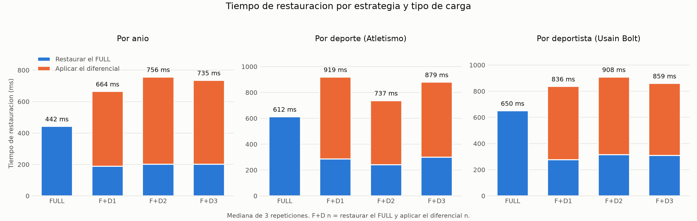
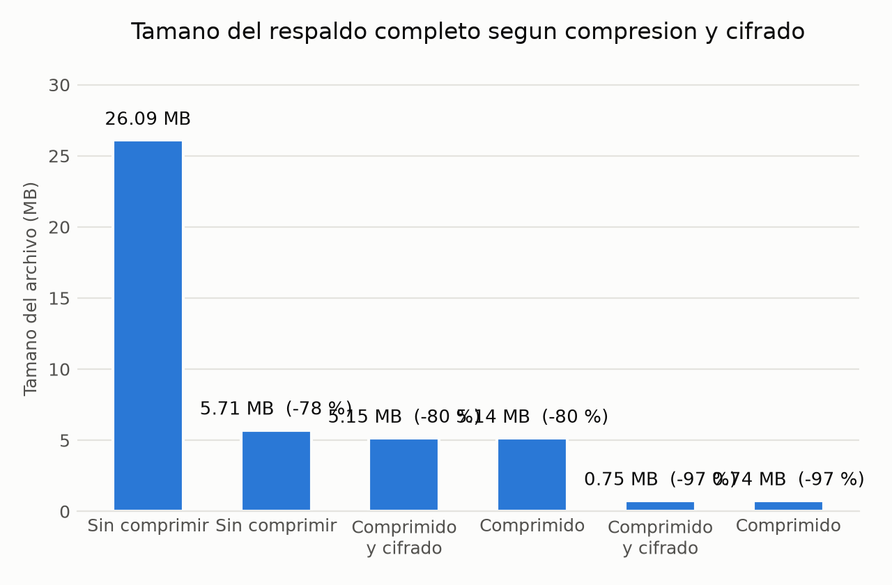

# Fase 2 - Analisis comparativo de estrategias de respaldo

Documento generado por `fase2/scripts/07_analisis/generar_analisis.py` a partir de los tiempos medidos. No se escribe ningun numero a mano.

## 1. Volumen de cada carga

| Tipo de carga | Ronda | Contenido | Atletas | Participaciones |
|---|---|---|---:|---:|
| Por anio | r1 | Rio de Janeiro 2016 | 12,305 | 15,118 |
| Por anio | r2 | Tokio 2020 | 14,316 | 28,429 |
| Por anio | r3 | Paris 2024 | 7,629 | 14,770 |
| Por deporte (Atletismo) | r1 | Atletismo - Rio de Janeiro 2016 | 2,516 | 2,765 |
| Por deporte (Atletismo) | r2 | Atletismo - Tokio 2020 | 2,834 | 4,375 |
| Por deporte (Atletismo) | r3 | Atletismo - Paris 2024 | 1,364 | 2,344 |
| Por deportista (Usain Bolt) | r1 | Usain Bolt - Atenas 2004 | 1 | 1 |
| Por deportista (Usain Bolt) | r2 | Usain Bolt - Pekin 2008 | 0 | 3 |
| Por deportista (Usain Bolt) | r3 | Usain Bolt - Londres 2012 | 0 | 3 |

## 2. Tiempos de restauracion medidos

Cada valor es la mediana de tres repeticiones. El tiempo total de la estrategia con diferencial es la suma de restaurar el FULL con `NORECOVERY` y aplicar el diferencial con `RECOVERY`.

| Tipo de carga | Estrategia | Atletas | Participaciones | FULL (ms) | Diferencial (ms) | Total (ms) |
|---|---|---:|---:|---:|---:|---:|
| Por anio | FULL | 0 | 0 | 442 | - | **442** |
| Por anio | FULL + DIFF_1 | 12,305 | 15,118 | 189 | 475 | **664** |
| Por anio | FULL + DIFF_2 | 26,621 | 43,547 | 202 | 554 | **756** |
| Por anio | FULL + DIFF_3 | 34,250 | 58,317 | 202 | 533 | **735** |
| Por deporte (Atletismo) | FULL | 0 | 0 | 612 | - | **612** |
| Por deporte (Atletismo) | FULL + DIFF_1 | 2,516 | 2,765 | 285 | 634 | **919** |
| Por deporte (Atletismo) | FULL + DIFF_2 | 5,350 | 7,140 | 241 | 496 | **737** |
| Por deporte (Atletismo) | FULL + DIFF_3 | 6,714 | 9,484 | 300 | 579 | **879** |
| Por deportista (Usain Bolt) | FULL | 0 | 0 | 650 | - | **650** |
| Por deportista (Usain Bolt) | FULL + DIFF_1 | 1 | 1 | 277 | 559 | **836** |
| Por deportista (Usain Bolt) | FULL + DIFF_2 | 1 | 4 | 314 | 594 | **908** |
| Por deportista (Usain Bolt) | FULL + DIFF_3 | 1 | 7 | 310 | 549 | **859** |

## 3. Comparacion de las dos estrategias

| Tipo de carga | Solo FULL | FULL + diferencial (promedio) | Diferencia | Sobrecosto |
|---|---:|---:|---:|---:|
| Por anio | 442 ms | 718 ms | +276 ms | +63 % |
| Por deporte (Atletismo) | 612 ms | 845 ms | +233 ms | +38 % |
| Por deportista (Usain Bolt) | 650 ms | 868 ms | +218 ms | +33 % |

## 4. Tamano de los respaldos

Los diferenciales son acumulativos: cada uno guarda todo lo que cambio desde el respaldo completo, no desde el diferencial anterior. Por eso crecen con cada carga.

| Tipo de carga | Respaldo | Tamano (MB) | Respecto del FULL |
|---|---|---:|---:|
| Por anio | FULL.bak | 5.33 | - |
| Por anio | DIFF_1.bak | 9.08 | 170 % |
| Por anio | DIFF_2.bak | 19.09 | 358 % |
| Por anio | DIFF_3.bak | 22.09 | 414 % |
| Por deporte (Atletismo) | FULL.bak | 5.40 | - |
| Por deporte (Atletismo) | DIFF_1.bak | 4.09 | 76 % |
| Por deporte (Atletismo) | DIFF_2.bak | 6.09 | 113 % |
| Por deporte (Atletismo) | DIFF_3.bak | 7.09 | 131 % |
| Por deportista (Usain Bolt) | FULL.bak | 5.33 | - |
| Por deportista (Usain Bolt) | DIFF_1.bak | 1.14 | 21 % |
| Por deportista (Usain Bolt) | DIFF_2.bak | 1.14 | 21 % |
| Por deportista (Usain Bolt) | DIFF_3.bak | 1.14 | 21 % |

## 5. Efecto de la compresion y el cifrado

## 6. Hallazgos medidos

Afirmaciones derivadas directamente de los datos de arriba.

1. La carga mayor tiene **58,317 participaciones** y la menor **7** (8,331 veces mas datos), pero restaurarlas por completo tarda **735 ms** y **859 ms** respectivamente. El tiempo no sigue al volumen.
2. Aplicar un diferencial despues del completo cuesta entre **33 % y 63 %** mas de tiempo que restaurar solo el completo.
3. La compresion reduce el archivo de **26.09 MB a 5.14 MB (80 % menos)**, y agregar cifrado AES-256 solo suma 3 KB, es decir que el cifrado es practicamente gratis en espacio.
4. En la carga **por anio**, 3 de los 3 diferenciales superan en tamano al respaldo completo que les sirve de base (5.33 MB).
5. En la carga **por deporte (atletismo)**, 2 de los 3 diferenciales superan en tamano al respaldo completo que les sirve de base (5.40 MB).
