# Documentación técnica — Respaldo y restauración de bases de datos

**Proyecto Fase 2 · Sistemas de Bases de Datos 2 · Segundo semestre 2026**
Universidad de San Carlos de Guatemala · Facultad de Ingeniería · Grupo 7

Ejecución: 4 de octubre de 2026
Motor: SQL Server 2025 Developer Edition sobre Docker

---

## 1. Resumen

Se diseñó e implementó un sistema de respaldo y restauración para tres bases de
datos construidas a partir del dataset olímpico de la Fase 1. Para cada una se
ejecutó el ciclo completo que pide el enunciado: carga inicial, respaldo
completo, tres cargas incrementales con su respaldo diferencial, eliminación de
la base y restauración desde cada punto, midiendo tiempos y validando
integridad.

En total se generaron **3 respaldos completos y 9 diferenciales**, se
realizaron **36 restauraciones cronometradas** (4 puntos × 3 repeticiones × 3
bases) y se tomaron **40 capturas de pantalla** con fecha y hora del sistema
operativo.

El hallazgo central es que, al volumen de datos manejado, **el tiempo de
restauración no depende del volumen**: una base con 58,317 participaciones y
otra con 7 se restauran en tiempos equivalentes. Lo que domina es el costo fijo
de la operación. La recomendación que se desprende de ahí está en la sección 8.

---

## 2. Metodología

### 2.1 Diseño del experimento

El enunciado define tres tipos de carga. Se construyó una base independiente
para cada uno, de modo que sus ciclos de respaldo no se interfieran:

| Base | Tipo de carga | Contenido |
|---|---|---|
| `OlimpiadasF2_Anio` | por año | todas las participaciones de Río 2016, Tokio 2020 y París 2024 |
| `OlimpiadasF2_Deporte` | por deporte | Atletismo en esas mismas tres ediciones |
| `OlimpiadasF2_Deportista` | por deportista | Usain Bolt en Atenas 2004, Pekín 2008 y Londres 2012 |

Cada base sigue la misma secuencia de cuatro cargas:

```
carga inicial (catálogos)  ──►  RESPALDO COMPLETO
      carga r1             ──►  DIFERENCIAL 1
      carga r2             ──►  DIFERENCIAL 2
      carga r3             ──►  DIFERENCIAL 3
```

**Por qué la carga inicial son los catálogos y no el primer año.** Las ocho
tablas de catálogo (deporte, disciplina, evento, NOC, sede, edición, entidad
geográfica y población) no dependen del recorte que se cargue después. Ponerlas
en la carga inicial produce exactamente un respaldo completo y tres
diferenciales, que es lo que pide el enunciado, y hace que cada diferencial
corresponda a una carga de datos real.

Los atletas se cargan junto con las participaciones de cada ronda, no todos al
inicio. Si los 167,295 atletas entraran en la carga inicial, los tres
diferenciales tendrían prácticamente el mismo tamaño y la comparación no
mostraría nada.

### 2.2 Dos decisiones que se apartan de lo literal

**Diferencial en lugar de incremental.** SQL Server no tiene respaldo
incremental. Sus tres tipos son `FULL`, `DIFFERENTIAL` y `LOG`. El incremental
en el sentido de "solo lo que cambió desde el respaldo anterior" se aproxima con
la cadena de respaldos de log, que exige modelo de recuperación `FULL` y
restaurar la cadena completa en orden. El enunciado permite elegir "dependiendo
de las limitaciones del sistema de bases de datos elegido", y aquí la limitación
es del motor.

Consecuencia práctica, que se comprobó en la ejecución: recuperar el estado de
la carga N necesita exactamente **dos archivos**, el completo y el diferencial
N. No hace falta aplicar los diferenciales intermedios.

**Atletismo en lugar de 100 metros planos femenino.** La metodología del
enunciado sugiere ese evento "por ejemplo". Al verificarlo en los datos
resultó que **no existe en París 2024**:

| Edición | Participaciones en 100 m femenino |
|---|---:|
| Río 2016 | 85 |
| Tokio 2020 | 68 |
| París 2024 | **0** |

París sí tiene atletismo (2,344 participaciones), pero ese evento concreto no
está en el dataset. Se usó el deporte completo, que cumple la letra del
requisito —la carga es *por deporte*— y cubre las tres ediciones.

### 2.3 Volumen de cada carga

| Tipo | r1 | r2 | r3 | Total participaciones |
|---|---:|---:|---:|---:|
| Por año | 15,118 | 28,429 | 14,770 | **58,317** |
| Por deporte | 2,765 | 4,375 | 2,344 | **9,484** |
| Por deportista | 1 | 3 | 3 | **7** |

La diferencia de tres órdenes de magnitud entre el mayor y el menor es
deliberada: permite observar cómo cambia el comportamiento de cada estrategia
según el volumen, en vez de comparar tres cargas equivalentes.

### 2.4 Origen de los datos

Los datos provienen de los CSV depurados de la Fase 1
(`OlimpiadasF1/data/processed/`), que contienen 167,295 atletas, 2,069 eventos
y 367,796 participaciones después del proceso de deduplicación. Un script en
Python genera los recortes de cada carga y los normaliza; la carga a la base se
hace con `BULK INSERT` desde esos archivos.

La normalización es necesaria porque los CSV de origen fueron escritos con
pandas, que convierte a flotante cualquier columna entera que tenga nulos: los
identificadores llegan como `19.0` y `BULK INSERT` los rechaza con el error
4864. Lo mismo ocurre con las columnas `BIT`, que llegan como `True`/`False`.

---

## 3. Modelo entidad-relación

Se reutiliza sin cambios el modelo físico validado en la Fase 1: diez tablas
bajo el esquema `olympics`, con sus llaves primarias, foráneas y restricciones
de dominio.

**El diagrama entidad-relación oficial del proyecto es
`OlimpiadasF1/docs/ER/ER_P1_G7-Final.pdf`**, entregado y aprobado en la Fase 1.
Esta fase no lo modifica: se adjunta ese mismo archivo.

Las diez tablas son `ENTIDAD_GEOGRAFICA`, `DEPORTE`, `NOC`, `ATLETA`, `SEDE`,
`EDICION_OLIMPICA`, `DISCIPLINA`, `EVENTO`, `POBLACION` y `PARTICIPACION`.

`PARTICIPACION` es la tabla de hechos: cada fila es un atleta compitiendo en un
evento de una edición, con su resultado y su medalla. Las nueve restantes son
dimensiones.

Mantener el mismo esquema que la Fase 1 tiene un propósito: la comparación de
estrategias se hace sobre un modelo ya validado, de modo que cualquier
diferencia observada es atribuible al respaldo y no al diseño.

---

## 4. Especificaciones técnicas del servidor

Medidas con `05_especificaciones_servidor.sql` el 2026-10-04
(captura `00_especificaciones_servidor.png`):

| Parámetro | Valor |
|---|---|
| Motor | SQL Server 17.0.4085.5 RTM |
| Edición | Enterprise Developer Edition (64-bit) |
| Colación | `SQL_Latin1_General_CP1_CI_AS` |
| Sistema operativo | Ubuntu 24.04 (contenedor Linux) |
| Arquitectura | x64 |
| CPUs visibles | 8 |
| Memoria física asignada | 6,244 MB |
| Memoria objetivo del motor | 5,394 MB |
| Disco total / disponible | 1,006.85 GB / 950.55 GB |
| Modelo de recuperación | `SIMPLE` en las tres bases |

**Sobre el modelo de recuperación.** Se eligió `SIMPLE` porque la estrategia
usa respaldos completos y diferenciales, y ninguno de los dos necesita la
cadena de log. Con `SIMPLE` el log se trunca solo y no crece sin control. Si se
quisieran respaldos de log para recuperación a un punto en el tiempo, habría
que cambiarlo a `FULL`.

**Almacenamiento persistente.** El enunciado lo exige al usar Docker. El
contenedor monta el volumen nombrado `sqlserver_data` en `/var/opt/mssql`, y
todos los respaldos se escriben bajo `/var/opt/mssql/fase2/backups/`, es decir
dentro de ese volumen. Sobreviven a que el contenedor se detenga o se recree.

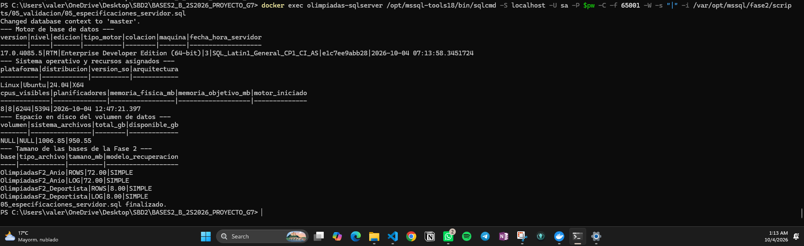

---

## 5. Plan de respaldo

### 5.1 Política implementada

| Momento | Tipo | Archivo |
|---|---|---|
| Después de la carga inicial | completo | `<BASE>_FULL.bak` |
| Después de cada carga de datos | diferencial | `<BASE>_DIFF_<n>.bak` |

Todos los respaldos se ejecutan **desde línea de comandos** con `sqlcmd`, nunca
desde una interfaz gráfica, como exige el enunciado.

Cláusulas usadas y su razón:

| Cláusula | Razón |
|---|---|
| `INIT` | sobrescribe el archivo. Sin ella SQL Server anexa un juego de respaldo más y el `.bak` crece indefinidamente, lo que además invalidaría la comparación de tamaños |
| `CHECKSUM` | verifica cada página al escribirla |
| `STATS = 25` | deja el avance registrado en el log |

Después de cada respaldo se ejecuta `RESTORE VERIFYONLY ... WITH CHECKSUM`. Un
respaldo que no se puede leer no es un respaldo, y es mejor descubrirlo en el
momento que el día que haga falta usarlo.

### 5.2 Política automatizada (alcance opcional)

La tarea programada implementa la política habitual de un servidor real:
**completo los domingos, diferencial de lunes a sábado**, a las 02:00. Verifica
cada archivo generado y conserva los últimos catorce.

### 5.3 Rutas

```
/var/opt/mssql/fase2/backups/
    <BASE>_FULL.bak              respaldos del ciclo principal
    <BASE>_DIFF_1..3.bak
    comparativa_<BASE>_*.bak     ensayo de compresión y cifrado
    automaticos/                 respaldos de la tarea programada
    certificado/                 certificado de cifrado y su llave privada
```

---

## 6. Resultados

### 6.1 Tiempos de restauración

Cada valor es la **mediana de tres repeticiones**. A esta escala una sola
medición varía demasiado para ser confiable.

| Tipo de carga | Estrategia | Participaciones | Completo | Diferencial | Total |
|---|---|---:|---:|---:|---:|
| Por año | solo completo | 0 | 442 ms | — | **442 ms** |
| Por año | completo + dif. 1 | 15,118 | 189 ms | 475 ms | **664 ms** |
| Por año | completo + dif. 2 | 43,547 | 202 ms | 554 ms | **756 ms** |
| Por año | completo + dif. 3 | 58,317 | 202 ms | 533 ms | **735 ms** |
| Por deporte | solo completo | 0 | 612 ms | — | **612 ms** |
| Por deporte | completo + dif. 1 | 2,765 | 285 ms | 634 ms | **919 ms** |
| Por deporte | completo + dif. 2 | 7,140 | 241 ms | 496 ms | **737 ms** |
| Por deporte | completo + dif. 3 | 9,484 | 300 ms | 579 ms | **879 ms** |
| Por deportista | solo completo | 0 | 650 ms | — | **650 ms** |
| Por deportista | completo + dif. 1 | 1 | 277 ms | 559 ms | **836 ms** |
| Por deportista | completo + dif. 2 | 4 | 314 ms | 594 ms | **908 ms** |
| Por deportista | completo + dif. 3 | 7 | 310 ms | 549 ms | **859 ms** |


Las tablas que imprimio cada ciclo al terminar sus mediciones:

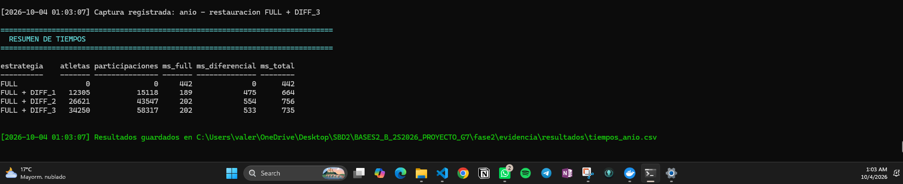

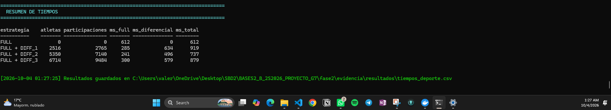

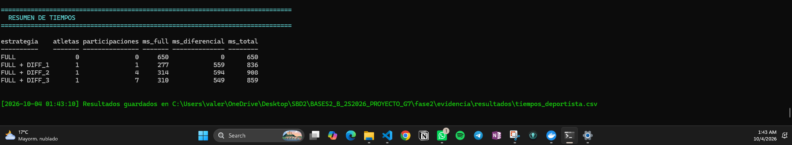

### 6.2 Comparación entre las dos estrategias

| Tipo de carga | Solo completo | Completo + diferencial | Sobrecosto |
|---|---:|---:|---:|
| Por año | 442 ms | 718 ms | **+63 %** |
| Por deporte | 612 ms | 845 ms | **+38 %** |
| Por deportista | 650 ms | 868 ms | **+33 %** |

### 6.3 Tamaño de los respaldos

| Tipo de carga | Completo | Dif. 1 | Dif. 2 | Dif. 3 |
|---|---:|---:|---:|---:|
| Por año | 5.33 MB | 9.08 MB | 19.09 MB | **22.09 MB** |
| Por deporte | 5.40 MB | 4.09 MB | 6.09 MB | 7.09 MB |
| Por deportista | 5.33 MB | 1.14 MB | 1.14 MB | 1.14 MB |

En la carga por año **los tres diferenciales superan al respaldo completo**, y
el tercero llega al 414 % de su tamaño. En la carga por deporte lo superan dos
de tres.

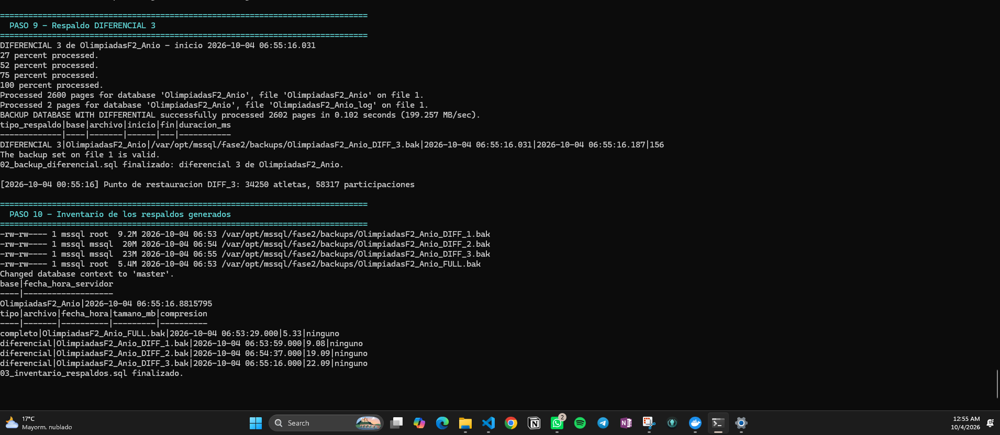

### 6.4 Fragmentación

Medida al cierre de cada tipo de carga, después de las cuatro inserciones
sucesivas:

| Tipo de carga | Índices medidos | Páginas | Fragmentación promedio | Máxima |
|---|---:|---:|---:|---:|
| Por año | 16 | 2,361 | 11.89 % | 50.00 % |
| Por deporte | 16 | 548 | 13.26 % | 60.40 % |
| Por deportista | 16 | 109 | 6.25 % | 50.00 % |

La fragmentación aparece porque cada carga inserta un lote nuevo sobre las
mismas tablas y desordena las páginas del índice agrupado. En la carga por año
el índice de `ATLETA` llegó a 42.4 % con 1,228 páginas, suficiente para
justificar un `REBUILD`. No se reorganizó ningún índice: hacerlo habría
alterado el estado que los respaldos debían capturar.

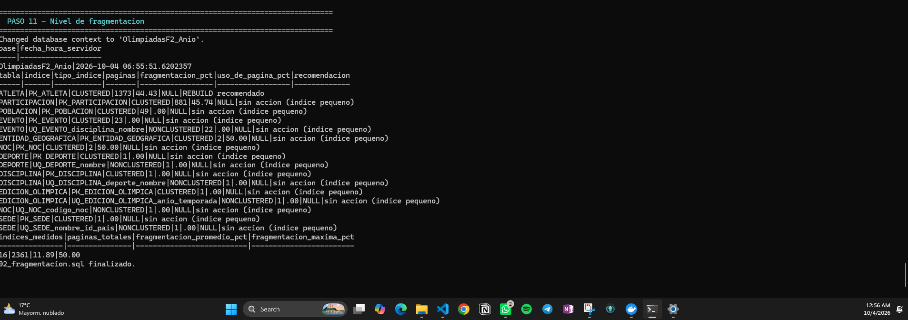

### 6.5 Compresión y cifrado

Tres versiones del mismo respaldo completo de `OlimpiadasF2_Anio`:

| Variante | Tamaño | Ahorro |
|---|---:|---:|
| Sin comprimir | 26.09 MB | — |
| Comprimido (`MS_XPRESS`) | 5.14 MB | **80 %** |
| Comprimido y cifrado (AES-256) | 5.15 MB | 80 % |


El cifrado añade 3 KB sobre el comprimido: en espacio es prácticamente gratis.

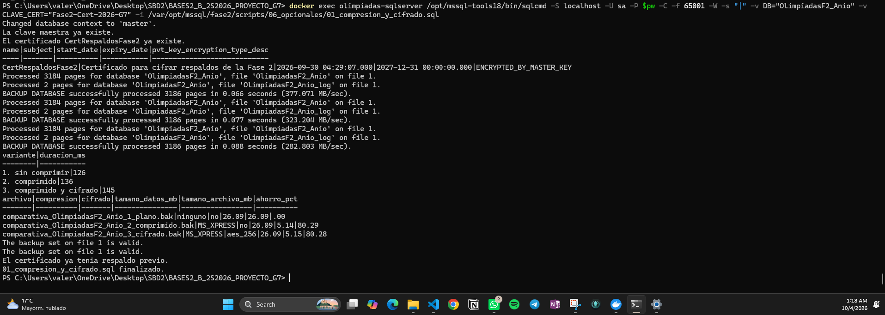

### 6.6 Validación de integridad

Las doce restauraciones se validaron automáticamente contra los conteos
registrados antes de eliminar cada base. Las doce dieron **conteos exactos y
cero filas huérfanas**, y `DBCC CHECKDB` no reportó daños en ningún caso.

La recuperabilidad quedó demostrada: restaurar el completo más el diferencial 3
devuelve exactamente el estado previo al borrado, sin pérdida de datos.

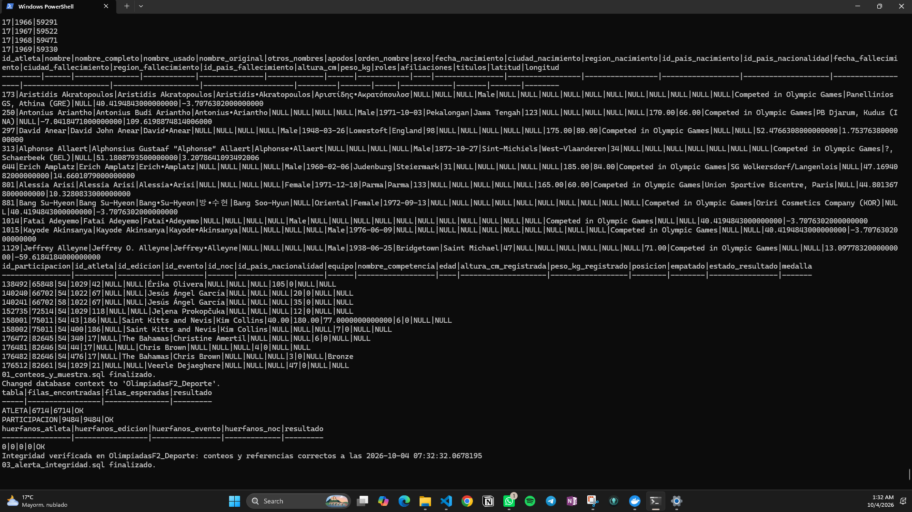

La captura muestra el contenido real de las tablas tras restaurar, los conteos
contrastados contra lo esperado y las cuatro comprobaciones de huerfanos.

---

## 7. Análisis

### 7.1 El tiempo de restauración no sigue al volumen

Es el resultado más claro del experimento y va en contra de la intuición.

| | Participaciones | Restauración completa |
|---|---:|---:|
| Por año | 58,317 | 735 ms |
| Por deportista | 7 | 859 ms |

La base más grande tiene **8,331 veces más datos** que la más pequeña y se
restaura en **menos tiempo**. La explicación es que a esta escala el tiempo lo
consume el costo fijo de la operación —crear los archivos de datos y de log,
reservar el espacio, aplicar la recuperación y poner la base en línea— y no la
transferencia de las páginas con datos. Los 22 MB del diferencial más grande se
leen en milisegundos.

Esto no significa que el volumen sea irrelevante en general: significa que el
punto de quiebre está muy por encima de los volúmenes de este proyecto. Con
bases de decenas de gigabytes la relación se invertiría y el tiempo pasaría a
estar dominado por la lectura.

### 7.2 El diferencial cuesta entre 33 % y 63 % más

Restaurar completo + diferencial siempre tarda más que restaurar solo el
completo, porque son dos operaciones de restauración en vez de una, cada una
con su propio costo fijo. El sobrecosto es menor cuanto más pequeño es el
conjunto de datos, lo que confirma lo anterior: lo que se paga es la segunda
operación, no los datos que trae.

### 7.3 Los diferenciales crecen y pueden superar al completo

En la carga por año el diferencial 3 ocupa 22.09 MB contra 5.33 MB del
completo. No es un error: los diferenciales son acumulativos y guardan todo lo
cambiado desde el completo, mientras que ese completo se tomó cuando la base
solo tenía los catálogos.

Es la señal clásica de que conviene tomar un respaldo completo nuevo. Cuando el
diferencial se acerca al tamaño del completo, se pierde la ventaja de espacio y
de tiempo que justificaba usarlo.

### 7.4 La compresión es la optimización de mejor relación costo-beneficio

Reduce el archivo un 80 % sin costo apreciable de tiempo —de hecho los
respaldos comprimidos fueron levemente más rápidos, porque se escriben menos
bytes a disco— y el cifrado encima no agrega peso. En un entorno con respaldos
diarios la diferencia entre 26 MB y 5 MB por archivo se acumula rápido.

### 7.5 Limitaciones del estudio

Conviene declararlas para que las conclusiones se lean en su contexto:

- Los volúmenes son pequeños para un escenario real de respaldos. Las
  conclusiones sobre tiempos valen para este rango y no se pueden extrapolar
  sin medir de nuevo.
- Las mediciones se hicieron en un contenedor sobre una máquina de escritorio
  con otras aplicaciones abiertas. Se mitigó repitiendo tres veces y tomando la
  mediana, pero no es un entorno aislado.
- No se midió el tiempo de respaldo con la misma rigurosidad que el de
  restauración, porque el enunciado pide comparar tiempos de restauración.
- No se probaron respaldos de log ni recuperación a un punto en el tiempo, por
  la decisión de usar modelo `SIMPLE` explicada en la sección 4.

---

## 8. Conclusiones

**1. Para el volumen de este proyecto, el respaldo completo es la estrategia
recomendada.** Restaura más rápido (442 a 650 ms contra 718 a 868 ms), necesita
un solo archivo en vez de dos, y tiene un procedimiento de recuperación más
simple y por lo tanto menos propenso a error. La ventaja del diferencial
—ahorrar tiempo y espacio al respaldar— no se materializa aquí porque el
respaldo completo ya es barato.

**2. El diferencial se justifica cuando el respaldo completo deja de ser
barato.** Su ventaja real no está en la restauración, que siempre es más lenta,
sino en el respaldo: permite respaldar varias veces al día sin volver a copiar
toda la base. Ese beneficio aparece cuando el completo tarda minutos u horas,
no milisegundos.

**3. El criterio para elegir no es el tipo de backup sino la ventana de
tiempo disponible.** Si la restauración debe ser lo más rápida posible, conviene
el completo más frecuente. Si lo crítico es no interrumpir la operación con
respaldos largos, conviene el completo semanal más diferenciales diarios, que
es justamente la política que se implementó en la tarea automatizada.

**4. La compresión debería estar activada siempre en este escenario.** 80 % de
ahorro sin costo medible de tiempo no tiene contraargumento. El cifrado también,
siempre que el certificado se respalde en un lugar distinto al de los
respaldos: sin él, los archivos cifrados son irrecuperables.

**5. Vigilar el tamaño del diferencial es parte de la política, no un
detalle.** Cuando se acerca al del completo —como ocurrió en la carga por
año— hay que tomar un completo nuevo. Sin esa regla, la estrategia se degrada
sola hasta ser peor que no tener diferenciales.

---

## 9. Evidencia

| Tipo | Ubicación | Cantidad |
|---|---|---|
| Capturas de pantalla | `fase2/evidencia/img/` | 40, todas con fecha y hora del sistema |
| Registros de ejecución | `fase2/evidencia/logs/` | uno por cada ejecución, con sello de tiempo |
| Mediciones | `fase2/evidencia/resultados/` | `tiempos_<tipo>.csv`, `estado_<tipo>.json`, `respaldos.csv` |
| Gráficas | `fase2/evidencia/img/graficas/` | 2, generadas a partir de las mediciones |
| Scripts | `fase2/scripts/` | organizados por tipo: DDL, carga, respaldo, restauración, validación, opcionales, análisis |

Todas las cifras de este documento provienen de las mediciones registradas.
Las tablas de la sección 6 y las dos gráficas las genera
`fase2/scripts/07_analisis/generar_analisis.py` leyendo los CSV de resultados;
ningún número se escribió a mano.

---

## 10. Anexo: catalogo de evidencia

Las 40 capturas tomadas durante la ejecucion, en el orden en que se
produjeron. Todas muestran la fecha y la hora del sistema operativo en la barra
de tareas, como exige el enunciado. Algunas ya aparecieron en las secciones
anteriores acompanando el analisis; aqui estan todas, completas y en orden.

### 10.1 Entorno

| Captura | Contenido |
|---|---|
| `00_especificaciones_servidor.png` | Version y edicion del motor, sistema operativo, CPU, memoria, disco y tamano de las bases |


### 10.2 Carga por anio

| # | Archivo | Contenido |
|---|---|---|
| 01 | `anio_01_carga_inicial.png` | Carga inicial: los ocho catalogos. Conteo de las diez tablas y total de filas. |
| 02 | `anio_02_carga_r1.png` | Carga r1 — Rio de Janeiro 2016. Conteos despues de insertar atletas y participaciones. |
| 03 | `anio_03_carga_r2.png` | Carga r2 — Tokio 2020. |
| 04 | `anio_04_carga_r3.png` | Carga r3 — Paris 2024. |
| 05 | `anio_05_respaldos.png` | Inventario de los cuatro respaldos: tipo, archivo, fecha y hora, y tamano. |
| 06 | `anio_06_fragmentacion.png` | Nivel de fragmentacion de los indices al cierre del tipo de carga. |
| 07 | `anio_07_restaurar_full.png` | Restauracion del respaldo completo, con el tiempo medido y la validacion. |
| 08 | `anio_08_restaurar_diff1.png` | Restauracion del completo mas el diferencial 1. |
| 09 | `anio_09_restaurar_diff2.png` | Restauracion del completo mas el diferencial 2. |
| 10 | `anio_10_restaurar_diff3.png` | Restauracion del completo mas el diferencial 3, el estado final. |
| 11 | `anio_11_resumen_tiempos.png` | Tabla comparativa de los cuatro puntos de restauracion. |
| 12 | `anio_12_muestra_tablas.png` | Contenido de ATLETA y PARTICIPACION, y distribucion por edicion olimpica. |

**01.** Carga inicial: los ocho catalogos. Conteo de las diez tablas y total de filas.

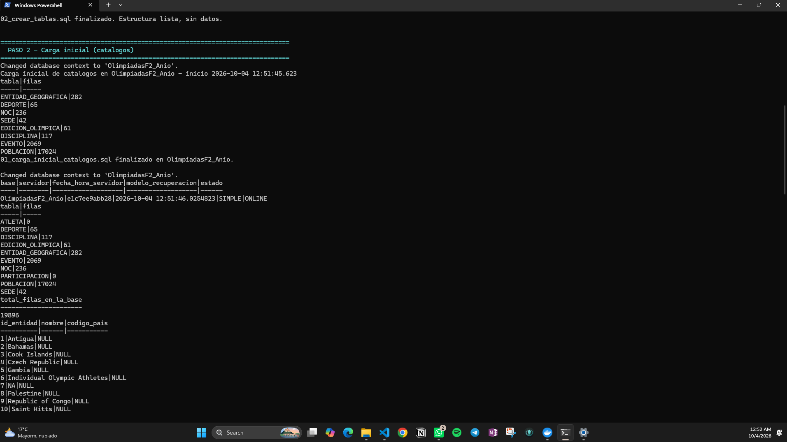

**02.** Carga r1 — Rio de Janeiro 2016. Conteos despues de insertar atletas y participaciones.

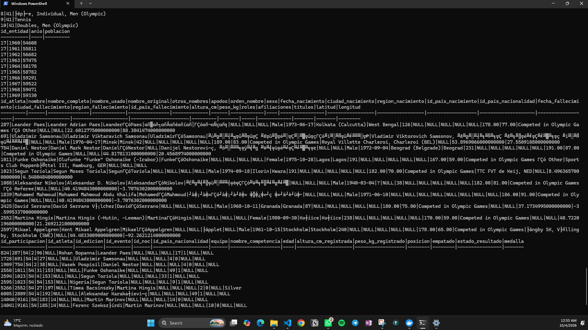

**03.** Carga r2 — Tokio 2020.

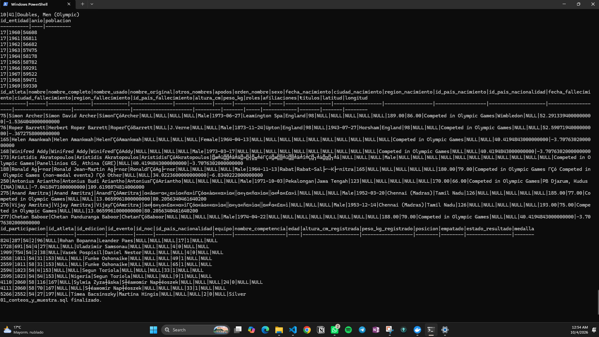

**04.** Carga r3 — Paris 2024.

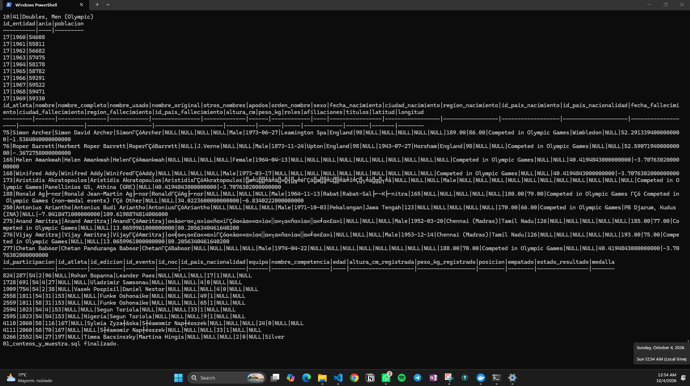

**05.** Inventario de los cuatro respaldos: tipo, archivo, fecha y hora, y tamano.


**06.** Nivel de fragmentacion de los indices al cierre del tipo de carga.


**07.** Restauracion del respaldo completo, con el tiempo medido y la validacion.

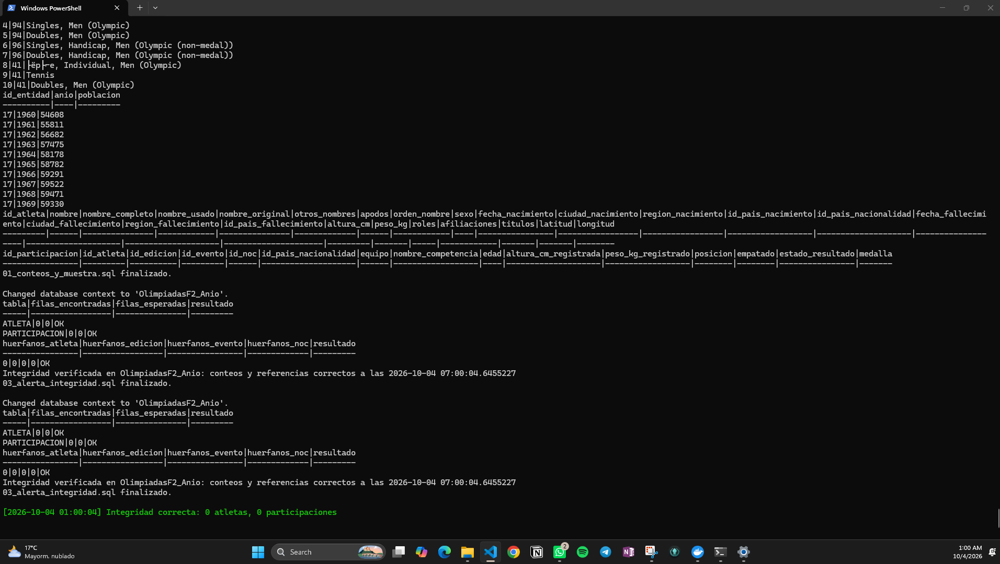

**08.** Restauracion del completo mas el diferencial 1.

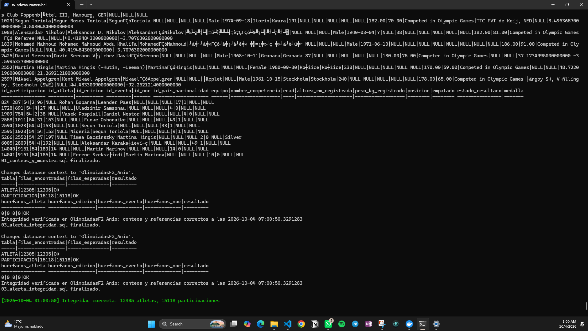

**09.** Restauracion del completo mas el diferencial 2.


**10.** Restauracion del completo mas el diferencial 3, el estado final.

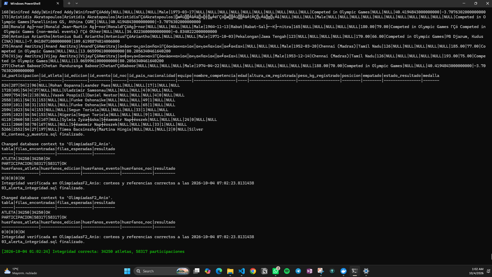

**11.** Tabla comparativa de los cuatro puntos de restauracion.


**12.** Contenido de ATLETA y PARTICIPACION, y distribucion por edicion olimpica.

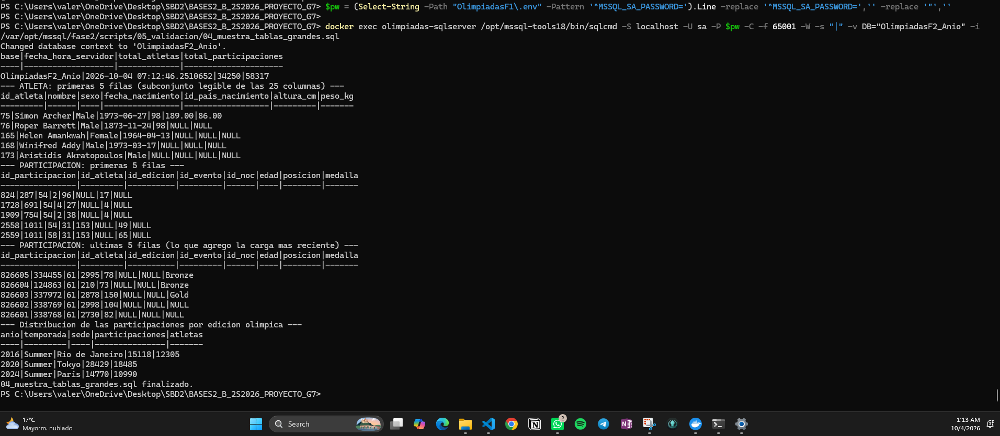


### 10.3 Carga por deporte (Atletismo)

| # | Archivo | Contenido |
|---|---|---|
| 01 | `deporte_01_carga_inicial.png` | Carga inicial: los ocho catalogos. Conteo de las diez tablas y total de filas. |
| 02 | `deporte_02_carga_r1.png` | Carga r1 — Atletismo en Rio 2016. Conteos despues de insertar atletas y participaciones. |
| 03 | `deporte_03_carga_r2.png` | Carga r2 — Atletismo en Tokio 2020. |
| 04 | `deporte_04_carga_r3.png` | Carga r3 — Atletismo en Paris 2024. |
| 05 | `deporte_05_respaldos.png` | Inventario de los cuatro respaldos: tipo, archivo, fecha y hora, y tamano. |
| 06 | `deporte_06_fragmentacion.png` | Nivel de fragmentacion de los indices al cierre del tipo de carga. |
| 07 | `deporte_07_restaurar_full.png` | Restauracion del respaldo completo, con el tiempo medido y la validacion. |
| 08 | `deporte_08_restaurar_diff1.png` | Restauracion del completo mas el diferencial 1. |
| 09 | `deporte_09_restaurar_diff2.png` | Restauracion del completo mas el diferencial 2. |
| 10 | `deporte_10_restaurar_diff3.png` | Restauracion del completo mas el diferencial 3, el estado final. |
| 11 | `deporte_11_resumen_tiempos.png` | Tabla comparativa de los cuatro puntos de restauracion. |
| 12 | `deporte_12_muestra_tablas.png` | Contenido de ATLETA y PARTICIPACION, y distribucion por edicion olimpica. |

**01.** Carga inicial: los ocho catalogos. Conteo de las diez tablas y total de filas.


**02.** Carga r1 — Atletismo en Rio 2016. Conteos despues de insertar atletas y participaciones.

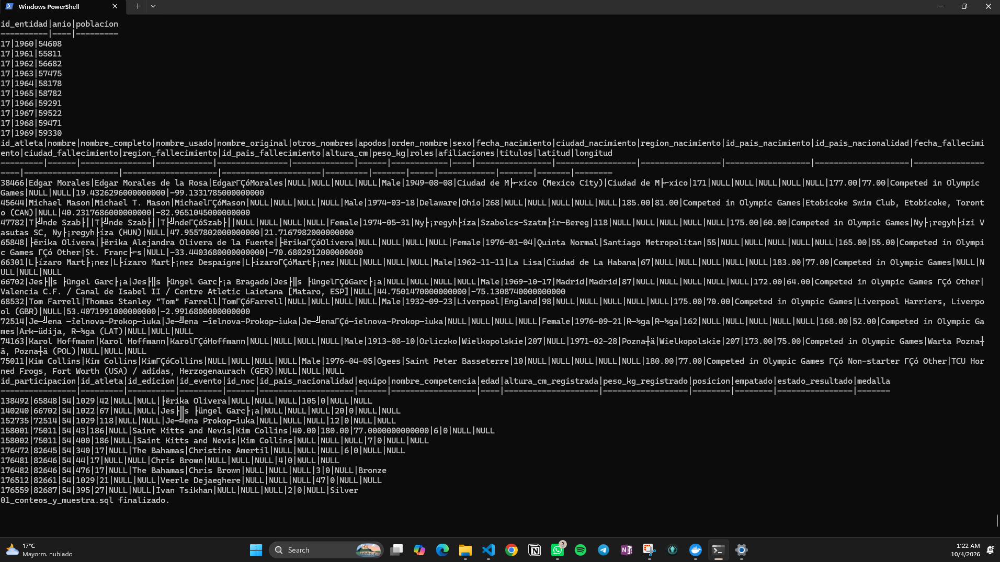

**03.** Carga r2 — Atletismo en Tokio 2020.


**04.** Carga r3 — Atletismo en Paris 2024.

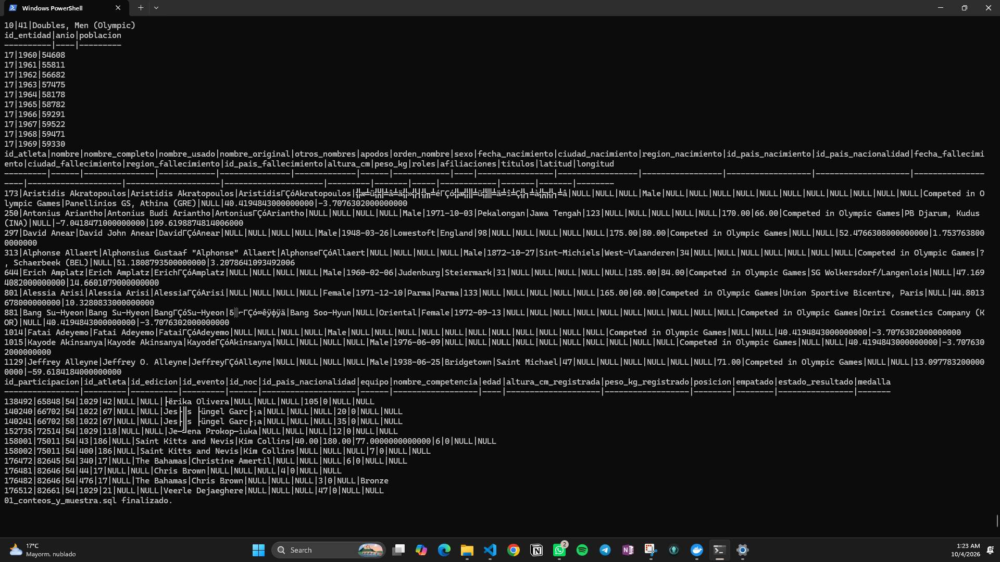

**05.** Inventario de los cuatro respaldos: tipo, archivo, fecha y hora, y tamano.


**06.** Nivel de fragmentacion de los indices al cierre del tipo de carga.

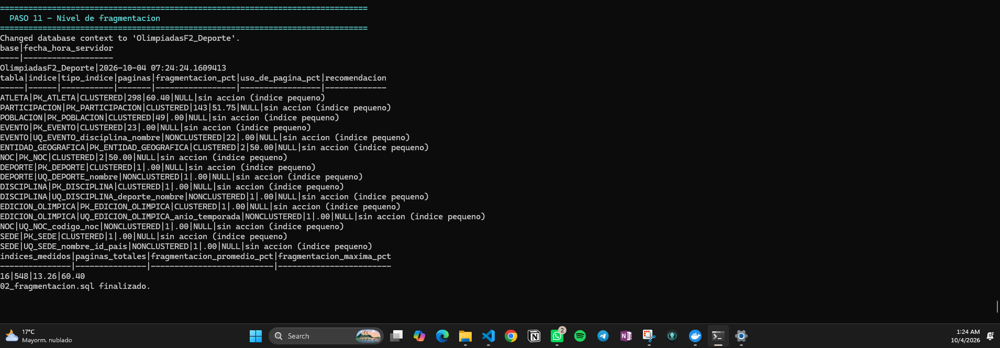

**07.** Restauracion del respaldo completo, con el tiempo medido y la validacion.

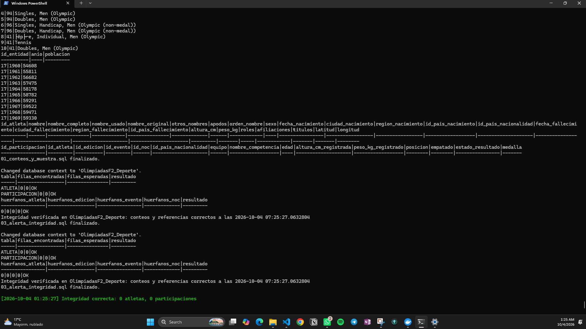

**08.** Restauracion del completo mas el diferencial 1.

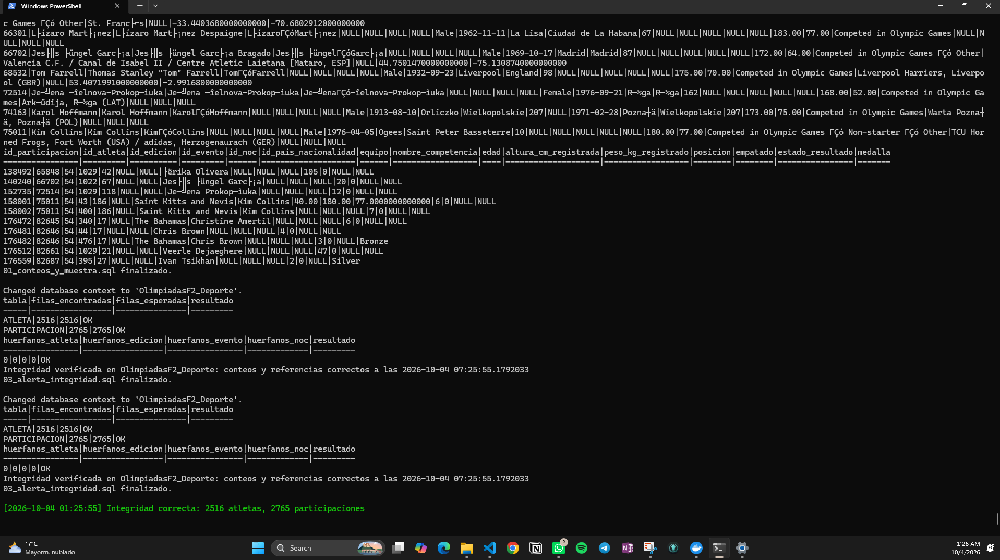

**09.** Restauracion del completo mas el diferencial 2.

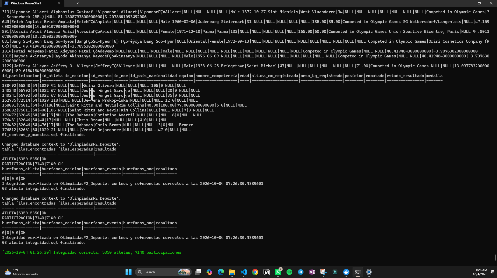

**10.** Restauracion del completo mas el diferencial 3, el estado final.


**11.** Tabla comparativa de los cuatro puntos de restauracion.


**12.** Contenido de ATLETA y PARTICIPACION, y distribucion por edicion olimpica.

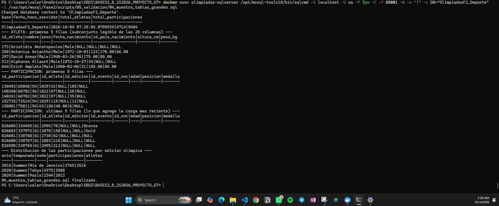


### 10.4 Carga por deportista (Usain Bolt)

| # | Archivo | Contenido |
|---|---|---|
| 01 | `deportista_01_carga_inicial.png` | Carga inicial: los ocho catalogos. Conteo de las diez tablas y total de filas. |
| 02 | `deportista_02_carga_r1.png` | Carga r1 — Bolt en Atenas 2004. Conteos despues de insertar atletas y participaciones. |
| 03 | `deportista_03_carga_r2.png` | Carga r2 — Bolt en Pekin 2008. |
| 04 | `deportista_04_carga_r3.png` | Carga r3 — Bolt en Londres 2012. |
| 05 | `deportista_05_respaldos.png` | Inventario de los cuatro respaldos: tipo, archivo, fecha y hora, y tamano. |
| 06 | `deportista_06_fragmentacion.png` | Nivel de fragmentacion de los indices al cierre del tipo de carga. |
| 07 | `deportista_07_restaurar_full.png` | Restauracion del respaldo completo, con el tiempo medido y la validacion. |
| 08 | `deportista_08_restaurar_diff1.png` | Restauracion del completo mas el diferencial 1. |
| 09 | `deportista_09_restaurar_diff2.png` | Restauracion del completo mas el diferencial 2. |
| 10 | `deportista_10_restaurar_diff3.png` | Restauracion del completo mas el diferencial 3, el estado final. |
| 11 | `deportista_11_resumen_tiempos.png` | Tabla comparativa de los cuatro puntos de restauracion. |
| 12 | `deportista_12_muestra_tablas.png` | Contenido de ATLETA y PARTICIPACION, y distribucion por edicion olimpica. |

**01.** Carga inicial: los ocho catalogos. Conteo de las diez tablas y total de filas.

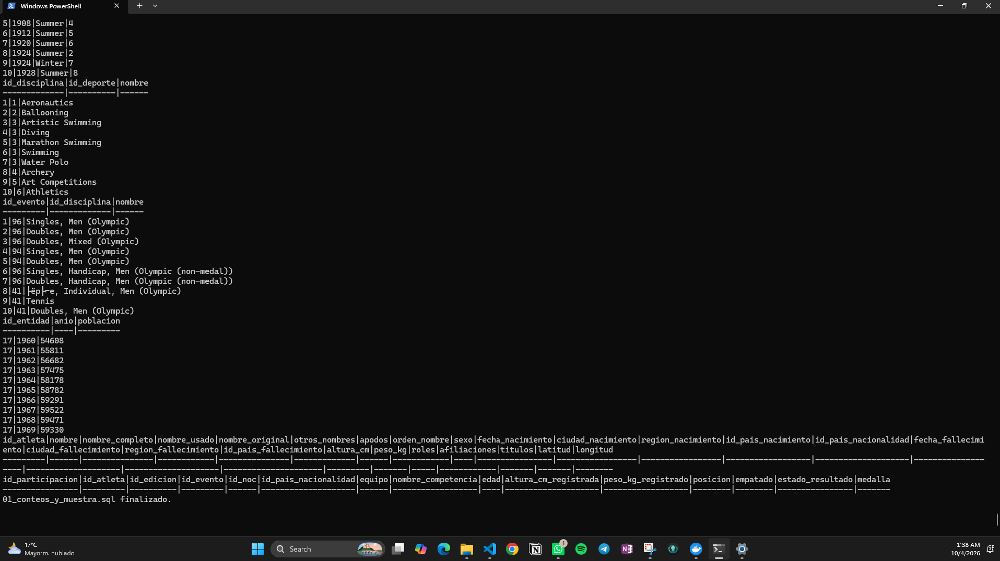

**02.** Carga r1 — Bolt en Atenas 2004. Conteos despues de insertar atletas y participaciones.

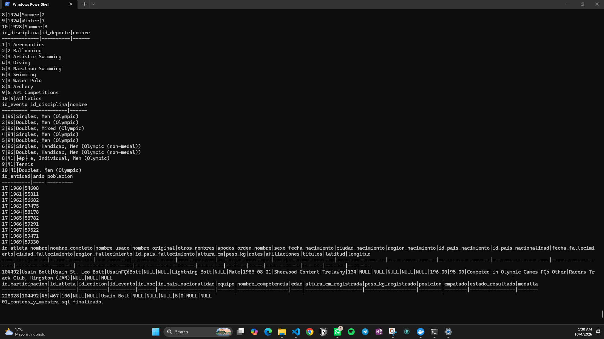

**03.** Carga r2 — Bolt en Pekin 2008.

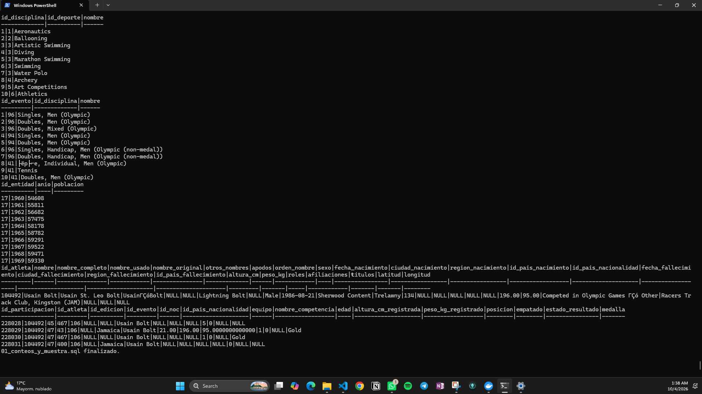

**04.** Carga r3 — Bolt en Londres 2012.

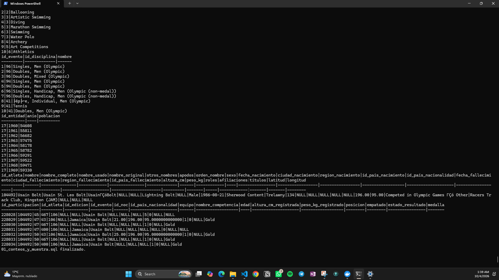

**05.** Inventario de los cuatro respaldos: tipo, archivo, fecha y hora, y tamano.

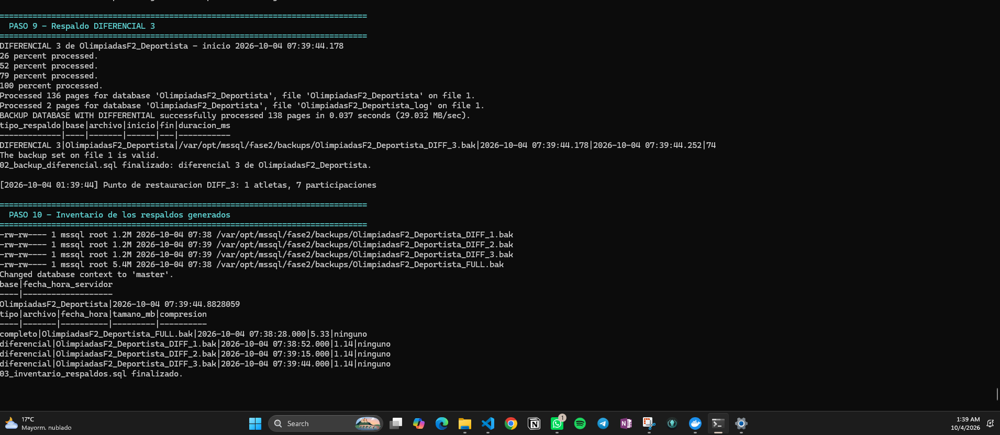

**06.** Nivel de fragmentacion de los indices al cierre del tipo de carga.

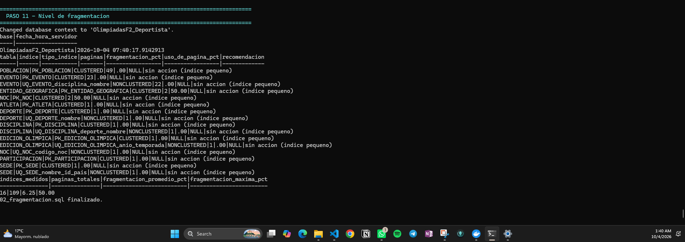

**07.** Restauracion del respaldo completo, con el tiempo medido y la validacion.

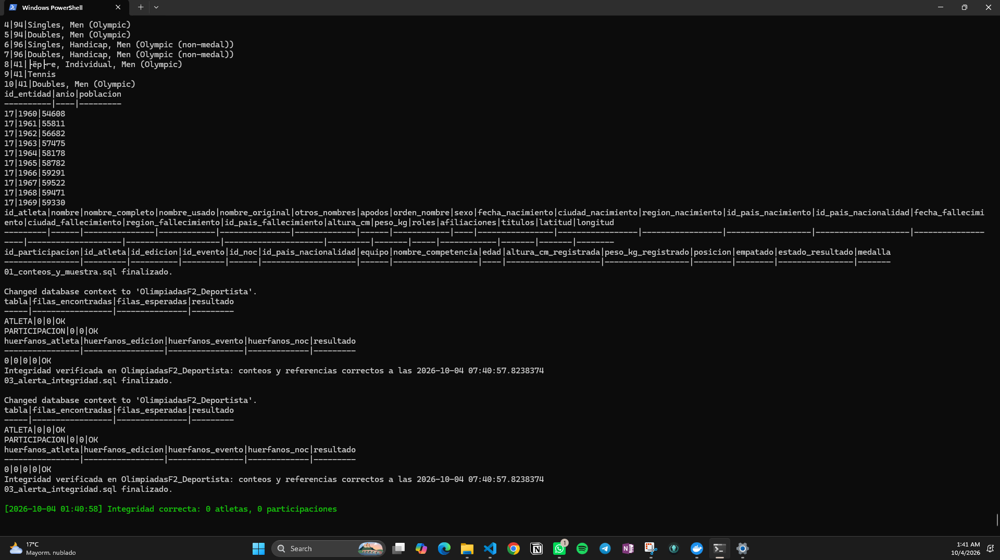

**08.** Restauracion del completo mas el diferencial 1.

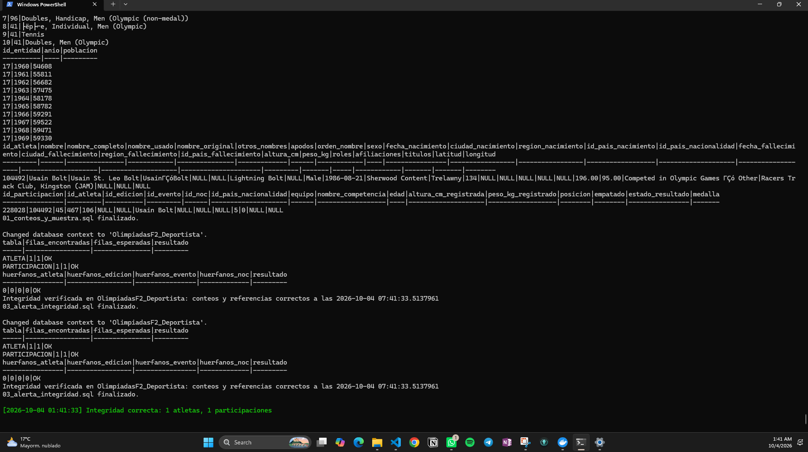

**09.** Restauracion del completo mas el diferencial 2.

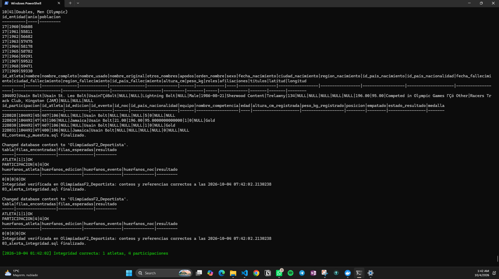

**10.** Restauracion del completo mas el diferencial 3, el estado final.

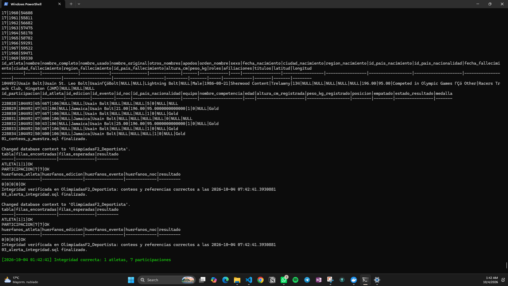

**11.** Tabla comparativa de los cuatro puntos de restauracion.


**12.** Contenido de ATLETA y PARTICIPACION, y distribucion por edicion olimpica.

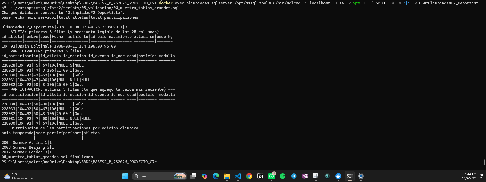


### 10.5 Alcance opcional

| Captura | Contenido |
|---|---|
| `opcional_01_compresion_cifrado.png` | Las tres variantes del mismo respaldo y el ahorro de cada una |
| `opcional_02_cron.png` | Instalacion de la tarea programada y su primera ejecucion |
| `opcional_03_bitacora_cron.png` | Bitacora acumulada de los respaldos automaticos |


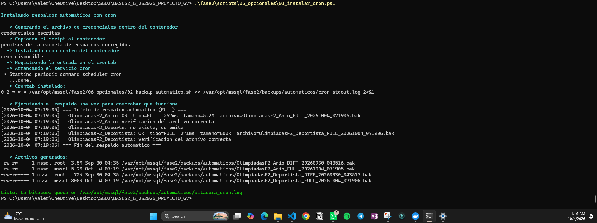

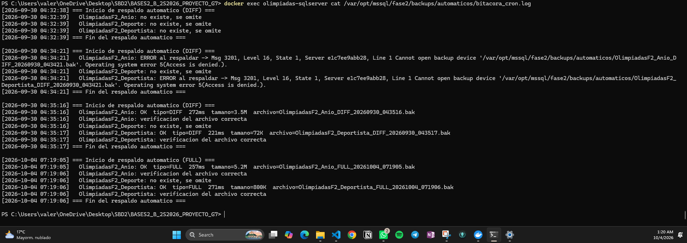

### 10.6 Graficas generadas

Ambas las produce `generar_analisis.py` a partir de los CSV de mediciones.


---

## 11. Cumplimiento del alcance

### Obligatorio

| Requisito | Estado |
|---|---|
| Base nueva con carga inicial, por cada tipo de carga | cumplido, 3 bases |
| Respaldo completo tras la carga inicial | cumplido, 3 |
| Respaldo diferencial tras cada carga siguiente | cumplido, 9 |
| Capturas de `SELECT *` y `COUNT(*)` tras cada carga | cumplido, 12 |
| Eliminación de la base completa | cumplido, antes de cada restauración |
| Restaurar el completo registrando tiempo | cumplido, con 3 repeticiones |
| Restaurar los diferenciales registrando tiempo | cumplido, 9 puntos |
| Validación de integridad tras cada restauración | cumplido, 12 de 12 correctas |
| Nivel de fragmentación al cierre de cada tipo | cumplido, 3 mediciones |
| Respaldos ejecutados desde consola | cumplido, `sqlcmd` |
| Capturas con fecha y hora del sistema operativo | cumplido, las 40 |
| Almacenamiento persistente con Docker | cumplido, volumen `sqlserver_data` |

### Opcional

| Requisito | Estado |
|---|---|
| Compresión de los archivos de respaldo | implementado y medido, 80 % de ahorro |
| Programación de respaldos automáticos con cron | implementado, con verificación y retención |
| Cifrado de los archivos de respaldo | implementado, AES-256 con certificado exportado |
| Alertas de validación de integridad posterior a la restauración | implementado, corta la ejecución con código de error |
